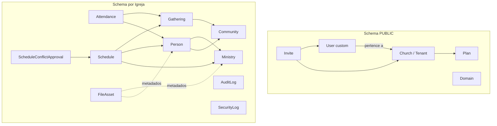
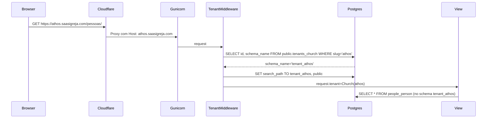
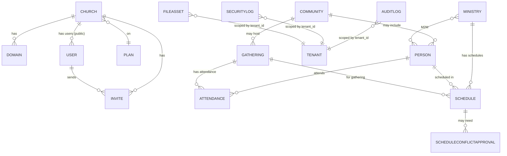
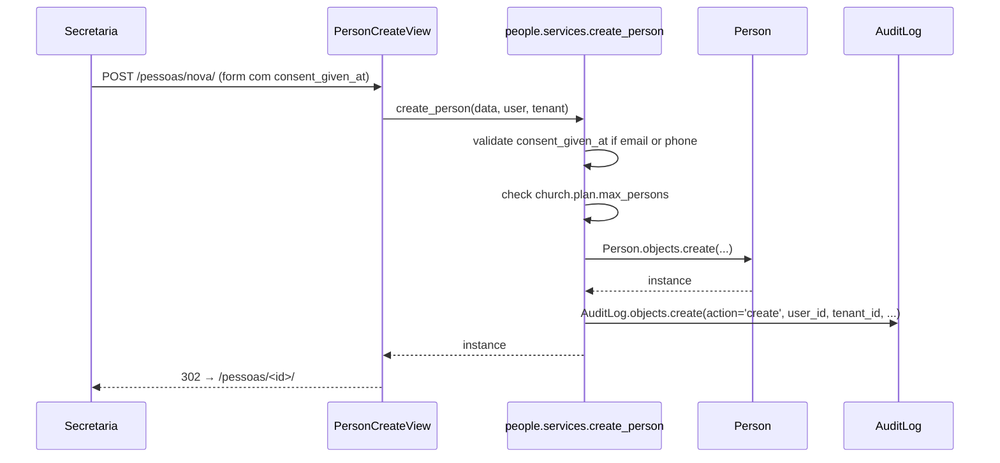
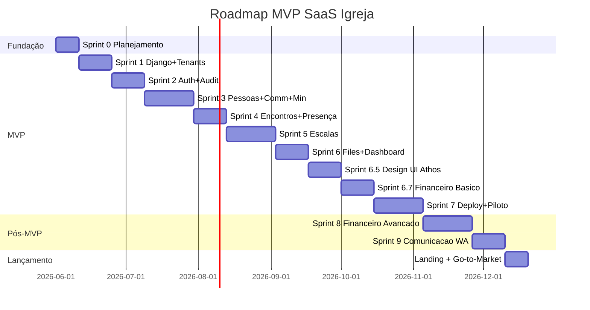

# PRD — SaaS Igreja

> **Versão:** 1.0
> **Data:** 2026-05-27
> **Status:** Aprovado para virar fonte de verdade de produto, arquitetura, escopo, backlog, testes e sprints do MVP.
> **Fonte de verdade:** Este documento. Em caso de conflito com o `01_SDD`, `02_PRD v2`, `03_Technical Spec` ou `04_MVP Scope` do Notion, prevalece a fonte mais específica e mais recente; quando o conflito não for resolvível, registrar em `OPEN_DECISIONS` e aplicar a regra mais conservadora em segurança e multi-tenancy.
> **Design system:** **marca ≠ tema** — a marca/landing é Terracota & Âmbar fixa; o **app** usa a Paleta Athos (TECH_SPEC §11) como base neutra **temável por igreja** (`Church.accent_color`/`hot_color`/`logo`). Referência de qualidade em `referencias/templates/igreja_saas_novo.html`. O design system é **consolidado na Sprint 6.5**; nenhuma tela final é construída sem consultar essa referência.
> **Marca:** o produto chama-se **Oikonos** (OD-023; de *oikonómos*, o mordomo da casa). Tagline: ***"Organize a igreja, fortaleça o ministério."*** Arquitetura verbal completa (descritor *"Mordomia, gestão e cuidado"*, sub-tagline, manifesto, campanha), história e mapeamento de dores em `docs/superpowers/specs/2026-06-05-nome-produto-design.md`. A marca só é usada no **lançamento** (pós-Sprint 9); o MVP/piloto não tem divulgação.

---

## 1. Capa, Versão, Status e Fonte de Verdade

| Campo | Valor |
|---|---|
| Produto | SaaS Igreja |
| Tipo | Plataforma web SaaS multi-tenant para gestão eclesiástica |
| Versão deste PRD | 1.0 |
| Estado | Source of truth para SDD do MVP |
| Mercado-alvo | Igrejas brasileiras de 50 a 2.000 membros |
| Piloto comercial | Igreja Athos (~350 membros, 20+ comunidades, 8+ ministérios) |
| Método de desenvolvimento | Spec Driven Development (SDD) |
| Stack oficial | Django 5.2 + HTMX + Alpine.js + TailwindCSS + PostgreSQL 15+ + django-tenants |
| Documentos vinculados | `01_SDD`, `02_PRD v2`, `03_Technical Spec`, `04_MVP Scope`, `09_Design System`, `18_Infraestrutura e Deploy`, `23_Go-to-Market` |
| Próximos documentos | `TECH_SPEC.md`, `ACCESS_MATRIX.md`, `TEST_STRATEGY.md`, `SPRINTS.md`, `OPEN_DECISIONS.md` |

### 1.1 Regras de governança (inviolável)

Aplicáveis a qualquer agente de IA, dev externo ou colaborador que opere neste repositório. Em caso de dúvida, **perguntar antes de agir**.

| ID | Regra |
|---|---|
| **G-01** | Nenhuma sprint começa sem autorização explícita do dono do projeto. |
| **G-02** | Nenhuma task é executada sem revisão prévia. Proibido pular de uma task para a próxima sem aprovação do dono. |
| **G-03** | Nenhum `git commit`, `git push`, `git merge` ou abertura de PR é feito pelo agente. **Versionamento é responsabilidade exclusiva do dono.** |
| **G-04** | Mudanças em arquivos ficam no workspace para revisão; nunca são consideradas "entregues" antes da aprovação do dono. |
| **G-05** | Qualquer decisão técnica fora do escopo da task atual exige consulta antes de implementação. |

> Violação de qualquer regra acima é tratada como bug crítico de processo. O agente que violar deve interromper o trabalho e reportar ao dono imediatamente.

---

## 2. Resumo Executivo

O SaaS Igreja é uma plataforma multi-tenant que centraliza a operação pastoral e administrativa de igrejas brasileiras, substituindo planilhas, cadernos e fluxos descentralizados de WhatsApp por uma base única, rastreável e segura. O MVP atende dois modelos de igreja — em células (comunidades) e tradicional (sem comunidades) — usando o mesmo código e nomenclatura configurável (campo `has_communities` na tenant), reduzindo custo de manutenção e curva de adoção.

O produto é construído com Django 5.2, HTMX, Alpine.js, TailwindCSS, PostgreSQL 15+ e `django-tenants` em modelo schema-per-tenant. O MVP é deliberadamente enxuto: tenant, autenticação por email, convites, papéis, auditoria, SecurityLog, Pessoas, Comunidades, Ministérios, Encontros, Presença, Escalas básicas, **Financeiro básico (lançamentos, dízimos/ofertas, saldo e dashboard — o produto nasceu de uma necessidade financeira; OD-024a/Sprint 6.7)**, Arquivos/PDFs, Dashboard mínimo e administração de usuários. Tudo o que não cabe no MVP — billing automatizado, **financeiro avançado (recibo fiscal, conciliação, relatório p/ assembleia, doação online)**, relatórios complexos em PDF, app móvel, WhatsApp automatizado em massa, alta disponibilidade de produção — é explicitamente pós-MVP.

Segurança, isolamento entre tenants, autorização backend, auditoria e LGPD são tratados como **fundação**, não acabamento. Nenhum módulo operacional pode avançar antes da base estar testada com testes automatizados de isolamento e permissões. Precificação está deliberadamente em aberto; valores históricos (R\$49, R\$99, R\$199) são tratados como hipótese e exigem estudo formal antes do lançamento comercial. O piloto Athos pode operar gratuitamente ou com cobrança manual durante a validação.

---

## 3. Diagnóstico de Maturidade do Projeto

| Dimensão | Maturidade atual | Observações críticas |
|---|---|---|
| Visão do produto | Alta | Clareza sobre nicho (igrejas BR), piloto (Athos), princípio (resolver o essencial). Risco: ambição de escopo do CPG Athos. |
| Persona e público-alvo | Média-alta | Pastores, secretarias, líderes e tesoureiros mapeados. Falta enquete formal de dor com 10–20 igrejas. |
| Escopo real do MVP | Alta | MVP enxuto e listado. Risco: pressão para adicionar financeiro, WhatsApp e relatórios cedo. |
| Fora do escopo | Alta | Lista explícita no `00_Painel` e `04_MVP Scope`. Manter disciplina. |
| Arquitetura oficial | Alta | Django + HTMX + django-tenants + Postgres decididos. 7 falhas estruturais (F1–F7) já corrigidas em revisão arquitetural v2. |
| Riscos de segurança | Média | Headers, axes, allauth e auditoria definidos. Falta threat model formal antes de beta público e definição de MFA obrigatório. |
| Riscos de multi-tenancy | Média-alta | Schema-per-tenant escolhido, `TenantRequiredMixin` mandatório, `User` em schema `public` (regra TENANT-04). Falta bateria de testes de isolamento em todas as views. |
| Autenticação e autorização | Média | `django-allauth` + `django-axes` + roles fixas. MFA aberto para beta. Matriz de permissões precisa ser extraída em `ACCESS_MATRIX.md`. |
| Dados sensíveis e LGPD | Média | `consent_given_at`, `anonymize_person()`, `AuditLog` e `privacy_policy_url` mapeados. Falta política operacional de retenção, base legal por finalidade e DPO/responsável. |
| Backup, restore e arquivos | Média | Cron diário com retenção 30 dias e offsite S3-compatible está no plano. Falta validar **restore** com teste documentado. Storage de mídia em volume `/media` no beta; produção deve ir para S3-compatible privado. |
| Testabilidade | Média | `pytest`, `pytest-django`, `pytest-cov` decididos. Falta plano de testes obrigatórios por sprint e gates de cobertura para tenant/auth/permissões. |
| Dependências e decisões abertas | Alta | Precificação, MFA obrigatório, Celery imediato vs. adiado, billing manual vs. automatizado, hospedagem definitiva (Hostinger vs. DigitalOcean) — todas explicitadas. |

**Conclusão do diagnóstico:** o projeto tem visão sólida, stack consolidada e escopo enxuto, mas precisa formalizar (a) bateria de testes de isolamento, (b) matriz de permissões por módulo/ação/papel, (c) plano operacional LGPD, (d) processo de backup com restore testado e (e) política de MFA antes do beta público.

---

## 4. Contexto e Problema

### 4.1 Realidade das igrejas brasileiras

Há aproximadamente 400 mil igrejas no Brasil. A maioria, na faixa de 50 a 2.000 membros, opera com:

- Planilhas Excel ou Google Sheets descentralizadas.
- Cadernos físicos para presença, células e contribuições.
- Grupos de WhatsApp para escalas, comunicados e mobilização de voluntários.
- Conhecimento operacional concentrado em uma ou duas pessoas (líder principal, secretária, tesoureira).
- Dificuldade em rastrear histórico, transferir responsabilidades e demonstrar transparência administrativa.

### 4.2 Dores específicas validadas

- **Líder principal sobrecarregado:** acumula gestão pastoral, administrativa, financeira e comunicacional.
- **Líderes de comunidade/célula** sem ferramenta simples para registrar presença, acompanhar visitantes e comunicar líderança principal.
- **Coordenadores de ministério** sem visão de quem está disponível para escalas e sem mecanismo de bloqueio de conflito.
- **Secretaria/tesouraria** sem trilha de auditoria, sem backup confiável e sem separação clara entre dados pessoais e operacionais.
- **Membros e voluntários** sem visibilidade sobre suas escalas, presença e comunidades.

### 4.3 Por que agora

- Adoção massiva de smartphones e WhatsApp entre lideranças pastorais (acima de 80%).
- Crescente atenção à LGPD em comunidades religiosas (dados de frequência religiosa são sensíveis).
- Ausência de solução nacional consolidada em português, neutra entre modelos celular (G12) e tradicional, acessível a igrejas pequenas e médias.
- Maturidade do ecossistema Django + HTMX + django-tenants permite construir o MVP com baixo custo e alta segurança.

---

## 5. Objetivos e Não Objetivos

### 5.1 Objetivos do MVP

1. Permitir que qualquer igreja brasileira de 50–2.000 membros se cadastre, configure seu modelo e comece a usar sem treinamento.
2. Centralizar pessoas, comunidades, ministérios, encontros, presença, escalas básicas e arquivos em uma única plataforma.
3. Garantir isolamento total entre igrejas (zero vazamento cross-tenant) com testes automatizados que provem o isolamento.
4. Atender requisitos mínimos da LGPD (consentimento, anonimização, exportação, política de privacidade, log de acesso a dados pessoais).
5. Validar o produto com a Igreja Athos em piloto controlado e estabelecer base para próximas 9 igrejas em lista de espera ou piloto.
6. Manter custo de infraestrutura compatível com bootstrapping (R\$ 690–1.800/ano de infra para o beta).

### 5.2 Não objetivos do MVP

1. Substituir ERPs ou sistemas financeiros completos.
2. Atender denominações com mais de 2.000 membros ou redes nacionais com hierarquia federativa.
3. Fornecer app móvel nativo (a interface é mobile-first em web).
4. Automatizar envio em massa por WhatsApp ou SMS no MVP.
5. Operar billing automatizado com cartão/PIX no MVP (cobrança manual é aceitável durante o beta).
6. Garantir alta disponibilidade de produção (SLA 99,9%) — durante o beta opera em VPS único com backup offsite, sem failover automático.

---

## 6. Público-Alvo e Personas

### 6.1 Persona 1 — Pastor/Líder Principal (decisor)

- Idade: 35–60 anos.
- Contexto: lidera igreja de 50–2.000 membros, acumula funções pastorais e administrativas.
- Dores: falta de visão consolidada, dependência de pessoas-chave, dificuldade de delegar com segurança.
- Objetivos: ver a igreja em uma única tela, delegar com controle, garantir continuidade.
- Critério de adoção: precisa entender o produto em menos de 10 minutos. Não tolera curva de aprendizado.

### 6.2 Persona 2 — Líder de Comunidade/Célula

- Idade: 25–50 anos.
- Contexto: lidera 5–20 pessoas em comunidade/célula. Geralmente voluntário.
- Dores: registrar presença em caderno, lembrar líder principal de visitas, controlar visitantes.
- Objetivos: registrar presença no celular em menos de 2 minutos, ver suas pessoas, sinalizar visitantes para a igreja.
- Critério de adoção: interface mobile fluida, login simples por email.

### 6.3 Persona 3 — Coordenador de Ministério

- Idade: 25–55 anos.
- Contexto: coordena ministério (louvor, infantil, recepção, mídia, etc.). Monta escalas semanais ou mensais.
- Dores: planilhas com conflitos, voluntários esquecidos, falta de aprovação centralizada de exceções.
- Objetivos: criar escala, detectar conflito automaticamente, pedir aprovação quando necessário.
- Critério de adoção: bloqueio automático de conflito e fluxo de aprovação claros.

### 6.4 Persona 4 — Secretaria / Administrativo

- Idade: 25–55 anos.
- Contexto: cuida do cadastro de pessoas, eventos e arquivos. Frequentemente é voluntária ou meio-período.
- Dores: dados sensíveis em planilhas compartilhadas, sem auditoria.
- Objetivos: cadastrar pessoas com consentimento, anexar PDFs (declarações, atestados), saber quem alterou o quê.
- Critério de adoção: formulários enxutos, auditoria visível, upload simples de PDF.
- **Papel no MVP (OD-019, 2026-06-04):** `User.Role.SECRETARY` — admin da igreja SEM financeiro. Cadastra/edita pessoas, comunidades, ministérios e escalas, e **concede acessos (com teto)** junto com o Pastor. NÃO faz financeiro (Tesoureiro) nem ações irreversíveis de LGPD (anonimizar/exportar/excluir = só Pastor).

### 6.5 Persona 5 — Tesoureiro (futuro, fora do MVP profundo)

- **Ativo no MVP** com o **financeiro básico** (Sprint 6.7, OD-024a): lançamentos, dízimos/ofertas, saldo e dashboard. O **financeiro avançado** (recibos PDF, conciliação, relatório p/ assembleia, doação online) é a **Sprint 8** (OD-024b, pós-piloto).

### 6.6 Persona 6 — Membro / Pessoa (acesso limitado)

- Idade: ampla.
- Contexto: cadastrado na igreja, pode acessar seu próprio perfil, sua comunidade, seus ministérios e seu histórico de presença.
- Status no MVP: **decisão fechada (OD-004, 2026-06-01)** — Membro existe apenas como `Person`, **sem login**. Login de Membro entra na Fase 2 se houver demanda. A role `member` permanece em `User.Role.choices` para evitar migração futura, mas nenhuma view de autoatendimento de Membro é construída no MVP.

### 6.7 Persona 7 — Platform Admin (operador da plataforma)

- Contexto: equipe interna do SaaS Igreja. Provisiona igrejas, suspende, ativa, suporta.
- Necessita: acesso administrativo restrito, com auditoria reforçada. **Não deve acessar dados pastorais** sem fluxo registrado de suporte (RISK-009).

---

## 7. Proposta de Valor

> **Centralizar a operação pastoral e administrativa de uma igreja brasileira em uma plataforma simples, segura, rastreável e adequada à rotina de igrejas de 50–2.000 membros — em português, mobile-first, com isolamento garantido entre igrejas e conformidade mínima com a LGPD.**

| Diferenciador | Como entrega |
|---|---|
| Neutralidade entre modelos celular e tradicional | Campo `has_communities` decide labels e menus; um único código atende ambos |
| Segurança por design | Schema-per-tenant via django-tenants, `TenantRequiredMixin` obrigatório, testes automatizados de isolamento, auditoria em ações sensíveis |
| Conformidade LGPD desde o MVP | `consent_given_at`, anonimização, exportação, política de privacidade por igreja, `AuditLog` |
| Custo acessível | Stack 100% open-source, VPS pequeno suficiente para beta, sem licenças pagas |
| Português e linguagem pastoral | Termos neutros (Pessoa, Comunidade, Ministério, Líder Principal configurável) |
| Mobile-first sem app nativo | HTMX + Alpine.js + Tailwind; experiência fluida no navegador do celular |

---

## 8. Escopo do MVP

### 8.1 Itens incluídos no MVP

| Categoria | Item |
|---|---|
| Fundação SDD | PRD, Tech Spec, Matriz de Acesso, Estratégia de Testes, Roadmap de Sprints |
| Multi-tenancy | `Church(TenantMixin)`, `Domain`, `TenantMiddleware`, schema-per-tenant, subdomínio resolve tenant |
| Autenticação | Login por email via `django-allauth`, sem username; password policy; account lockout via `django-axes` |
| Convites | Model `Invite` (token UUID, expiração, papel, igreja, convidado por, aceito em) |
| Papéis e permissões backend | `User.Role` (`PASTOR`, `SECRETARY`, `LEADER`, `TREASURER`, `MEMBER`); mixins customizados por papel; permissões aplicadas em views/services/querysets |
| Auditoria | `AuditLog` no schema do tenant; eventos: create, read sensível, update, delete, export, anonymize |
| SecurityLog | Log separado para eventos de segurança (login falho, lockout, mudança de papel, exportação de dados pessoais) |
| Pessoas | CRUD, status (`VISITOR`, `CONGREGANT`, `MEMBER`, `LEADER`, `INACTIVE`), consentimento LGPD, anonimização, exportação |
| Comunidades | CRUD condicional a `has_communities=True`; vínculo Pessoa → Comunidade; **vários líderes por comunidade** (`Community.leaders` M2M, OD-019) |
| Ministérios | CRUD; M2M Pessoa ↔ Ministério; **vários coordenadores por ministério** (`Ministry.coordinators` M2M, OD-019) |
| Encontros e Cultos | CRUD de `Gathering` com tipos `WORSHIP`, `COMMUNITY`, `EVENT`, `MEETING` |
| Presença | Marcação em lote via checkbox por Pessoa; `update_or_create` para evitar duplicação |
| Escalas e voluntários (versão básica) | CRUD de `Schedule` por ministério, vínculo a `Gathering`, detecção e bloqueio de conflito, aprovação de exceção por coordenador |
| Arquivos e PDFs (versão básica) | `FileAsset` com metadados, upload com validação de MIME e tamanho, download protegido por permissão, sem URL pública permanente |
| Dashboard mínimo | Total de pessoas por status, presença do último mês, comunidades/ministérios ativos — sem vazar dados de outras igrejas |
| Administração de usuários e acessos | Listar usuários, convidar, alterar papel, desativar, reenviar convite, ver último login, auditoria |
| Deploy beta | Docker + EasyPanel Free + Cloudflare Free + VPS recomendado 8GB |
| Backup e restore | PostgreSQL dump diário cron + retenção 30 dias + offsite S3-compatible; teste de restore documentado |
| Testes automatizados | Isolamento cross-tenant em todas as views autenticadas; permissões por papel; auditoria em ações sensíveis |

### 8.2 Disciplina de escopo

- Nenhum módulo operacional pode avançar antes da base (tenant, auth, permissões, auditoria, SecurityLog, testes de isolamento) estar pronta.
- Qualquer adição ao MVP exige (a) registro como decisão, (b) impacto em segurança e (c) impacto em prazo.
- O escopo do MVP é deliberadamente menor que o que o time consegue construir — sobra de capacidade entra em testes, hardening e documentação.

---

## 9. Fora do Escopo e Pós-MVP

### 9.1 Pós-MVP — Fase 2 (Sprints 5–8)

- Módulo de Escalas avançado (rotação automática, preferências, balanceamento de carga).
- Módulo Financeiro completo com alçadas de aprovação (líder → tesoureiro → pastor).
- Relatórios PDF complexos com WeasyPrint (pacote pesado pango+cairo, ~200MB no Docker).
- Dashboard avançado por ministério.

### 9.2 Pós-MVP — Fase 3 (Sprints 9–12)

- Notificações via Evolution API self-hosted (somente transacionais e pós-contato; nunca disparo em massa).
- Mapeamento de gaps de liderança.
- Dashboard avançado de saúde pastoral.

### 9.3 Explicitamente fora do escopo (sem data)

- App mobile nativo.
- WhatsApp Business Platform/Cloud API oficial (custo proibitivo para o nicho).
- Disparo em massa de mensagens.
- Integração bancária.
- Emissão de boletos e nota fiscal.
- IA generativa, LangChain, LangGraph.
- SPA (React, Vue, Next.js).
- Marketplace de igrejas.
- Cursos e discipulado em vídeo.
- Alta disponibilidade com failover automático.
- Billing automatizado com cartão/PIX no MVP (decisão de cobrança fica manual até estudo de precificação).

---

## 10. Visão dos Módulos



| Módulo | Resumo | Schema |
|---|---|---|
| Platform Admin e provisionamento | Criar, configurar, ativar, suspender, suportar igrejas/tenants | public |
| Usuários e acessos | Convites, papéis, status, último login, auditoria de acesso | public + tenant |
| Pessoas | Cadastro central com LGPD | tenant |
| Comunidades | Grupos/células habilitáveis | tenant |
| Ministérios | Departamentos, equipes | tenant |
| Encontros e presença | Cultos, reuniões, frequência | tenant |
| Escalas e voluntários | Escalas, bloqueio de conflito, aprovação de exceção | tenant |
| Arquivos e PDFs | Upload, metadados, download protegido | tenant + storage |
| Dashboard mínimo | Indicadores principais sem vazamento | tenant |
| Auditoria e SecurityLog | Trilha de ações sensíveis e eventos de segurança | tenant |

---

## 11. Requisitos Funcionais

### Convenção

ID `RF-XXX` · Título · Descrição · Ator · Prioridade (P0/P1/P2) · Módulo · Regras relacionadas · Critérios de aceite · Testes sugeridos · Sprint sugerida.

### 11.1 Fundação e provisionamento

| ID | Título | Ator | Prio | Módulo | Critério de aceite | Teste | Sprint |
|---|---|---|---|---|---|---|---|
| RF-001 | Provisionar nova igreja | Platform Admin | P0 | Tenants | Criar `Church` cria schema, `Domain`, primeiro `User` com papel `PASTOR`, e envia convite por email | `test_provision_creates_schema_and_admin` | 1 |
| RF-002 | Configurar igreja | Pastor | P0 | Tenants | Editar nome, slug, logo, `leader_title`, `has_communities`, `accent_color`, `privacy_policy_url` | `test_church_config_persists` | 2 |
| RF-003 | Suspender igreja | Platform Admin | P1 | Tenants | Marcar tenant como suspenso bloqueia acesso operacional, mantém dados | `test_suspended_church_blocks_login` | 7 |

### 11.2 Autenticação, convites e sessões

| ID | Título | Ator | Prio | Módulo | Critério de aceite | Teste | Sprint |
|---|---|---|---|---|---|---|---|
| RF-010 | Login por email | Qualquer usuário | P0 | Accounts | Login só por email; username desabilitado; senha exigida; sessão segura | `test_login_email_only` | 2 |
| RF-011 | Recuperar senha sem enumeração | Qualquer usuário | P0 | Accounts | Resposta idêntica para email existente e inexistente; token único; expira em 24h | `test_password_reset_no_enumeration` | 2 |
| RF-012 | Bloqueio por força bruta | Sistema | P0 | Accounts | 5 tentativas falhas em 15 min → lockout 15 min via `django-axes`; registrado em SecurityLog | `test_axes_lockout` | 2 |
| RF-013 | Convidar usuário | Pastor/Admin | P0 | Accounts | Criar `Invite` com token UUID, expiração 7 dias, papel obrigatório, email único por igreja | `test_invite_unique_per_church` | 2 |
| RF-014 | Aceitar convite | Convidado | P0 | Accounts | Validar token, expiração; criar `User` vinculado à igreja; marcar `accepted_at` | `test_accept_invite_creates_user` | 2 |
| RF-015 | Reenviar convite | Pastor/Admin | P1 | Accounts | Reset de expiração e novo email; mantém token ou gera novo (decisão técnica) | `test_resend_invite` | 2 |
| RF-016 | Logout | Qualquer usuário | P0 | Accounts | Encerra sessão e invalida cookies | `test_logout` | 2 |
| RF-017 | Sessão segura | Sistema | P0 | Accounts | Cookies `Secure`, `HttpOnly`, `SameSite=Lax` em produção | `test_session_cookies_flags` | 2 |
| RF-018a | MFA opt-in (TOTP) | Qualquer usuário | P0 | Accounts | Setup via `django-allauth` com QR code e 8 backup codes de uso único | `test_mfa_totp_opt_in_setup_and_login` | 2 |
| RF-018b | MFA obrigatório para Pastor e Platform Admin | Sistema | P0 | Accounts | `MFARequiredForRoleMiddleware` exige TOTP em login para `'pastor' in roles` e `PlatformAdmin` | `test_mfa_enforced_for_pastor_role` | 7 |

### 11.3 Usuários e acessos

| ID | Título | Ator | Prio | Módulo | Critério de aceite | Teste | Sprint |
|---|---|---|---|---|---|---|---|
| RF-020 | Listar usuários da igreja | Pastor/Admin | P0 | Accounts | Lista usuários com email, papel, status, último login | `test_list_users_scoped_by_church` | 2 |
| RF-021 | Alterar papel de usuário / Gestão de Acessos | Pastor, Secretário | P0 | Accounts | Concede funções (multi-role) + escopo de grupo; gera `AuditLog`+`SecurityLog`; **travas OD-019/RISK-015:** Secretário não concede `pastor` nem desativa Pastor, ninguém auto-escalona, RN-004 (último Pastor) | `test_role_change_audited`, `test_secretary_cannot_grant_pastor` | 2 |
| RF-022 | Desativar acesso | Pastor/Admin | P0 | Accounts | Marca `is_active=False`; usuário não consegue mais logar; preserva histórico | `test_deactivate_blocks_login` | 2 |
| RF-023 | Reativar acesso | Pastor/Admin | P1 | Accounts | Reverso de RF-022; gera `AuditLog` | `test_reactivate_user` | 2 |

### 11.4 Pessoas

| ID | Título | Ator | Prio | Módulo | Critério de aceite | Teste | Sprint |
|---|---|---|---|---|---|---|---|
| RF-030 | Cadastrar pessoa | Pastor, Líder, Secretaria | P0 | People | Nome obrigatório; `consent_given_at` obrigatório quando email/telefone informado; respeita limite do plano | `test_person_create_requires_consent` | 3 |
| RF-031 | Editar pessoa | Pastor, Líder responsável, Secretaria | P0 | People | Mudança em campos sensíveis gera `AuditLog` | `test_person_update_audited` | 3 |
| RF-032 | Listar pessoas | Pastor, Líder (escopo), Secretaria | P0 | People | Filtros por status, comunidade, ministério; busca por nome | `test_person_list_scoped` | 3 |
| RF-033 | Importar pessoas via CSV | Pastor/Admin | P1 | People | Importação assíncrona (Celery se ativo, ou síncrona com progress HTMX); idempotente por `import_id` | `test_csv_import_idempotent` | 3 |
| RF-034 | Anonimizar pessoa | Pastor/Admin | P0 | People | `anonymize_person()` substitui nome/email/telefone; soft delete imediato; purge físico semanal via Celery Beat | `test_anonymize_lgpd` | 3 |
| RF-035 | Exportar dados de pessoa | Pastor/Admin | P0 | People | `export_person_data()` em JSON e CSV; gera `AuditLog` com `action=export` | `test_export_person_data` | 3 |

### 11.5 Comunidades

| ID | Título | Ator | Prio | Módulo | Critério de aceite | Teste | Sprint |
|---|---|---|---|---|---|---|---|
| RF-040 | Criar comunidade | Pastor, Secretário | P0 | Communities | Só disponível se `has_communities=True`; respeita `max_communities` do plano | `test_community_respects_plan_limit` | 3 |
| RF-041 | Editar comunidade | Pastor, Secretário, Líder (sua) | P0 | Communities | Atualiza nome, **líderes (M2M, 1+)**, dia/hora; gera `AuditLog` | `test_community_update_audited` | 3 |
| RF-042 | Vincular pessoa a comunidade | Pastor, Secretário, Líder (sua) | P0 | Communities | Person.community = Community; `on_delete=SET_NULL` | `test_person_community_set_null` | 3 |

### 11.6 Ministérios

| ID | Título | Ator | Prio | Módulo | Critério de aceite | Teste | Sprint |
|---|---|---|---|---|---|---|---|
| RF-050 | Criar ministério | Pastor, Secretário | P0 | Ministries | Nome obrigatório; **coordenadores (M2M, 0+)** opcionais | `test_ministry_create` | 3 |
| RF-051 | Vincular pessoas a ministério | Pastor, Secretário, Coordenador (seu) | P0 | Ministries | M2M `Person.ministries` | `test_ministry_m2m` | 3 |

### 11.7 Encontros e Presença

| ID | Título | Ator | Prio | Módulo | Critério de aceite | Teste | Sprint |
|---|---|---|---|---|---|---|---|
| RF-060 | Criar encontro/culto | Pastor/Admin, Líder, Coordenador | P0 | Gatherings | Tipo (WORSHIP, COMMUNITY, EVENT, MEETING); data; `community` opcional | `test_gathering_create` | 4 |
| RF-061 | Marcar presença em lote | Líder, Coordenador | P0 | Gatherings | Lista pessoas elegíveis; checkbox por pessoa; `update_or_create` | `test_attendance_bulk_no_duplicate` | 4 |
| RF-062 | Editar presença | Líder, Coordenador | P0 | Gatherings | Atualiza `is_present`; gera `AuditLog` | `test_attendance_update_audited` | 4 |

### 11.8 Escalas e Voluntários

| ID | Título | Ator | Prio | Módulo | Critério de aceite | Teste | Sprint |
|---|---|---|---|---|---|---|---|
| RF-070 | Criar escala | Coordenador | P0 | Schedules | Vincular pessoa a `Gathering` em papel de voluntário; valida pertencimento ao ministério | `test_schedule_create_validates_ministry` | 5 |
| RF-071 | Detectar conflito | Sistema | P0 | Schedules | Mesma pessoa em dois `Gathering` na mesma data/hora bloqueia salvamento | `test_schedule_conflict_blocked` | 5 |
| RF-072 | Aprovar exceção de conflito | Coordenador competente | P1 | Schedules | Cria `ScheduleConflictApproval` com justificativa; libera salvamento; gera `AuditLog` | `test_schedule_exception_approval` | 5 |

### 11.8b Escalas v2 — coordenador-cêntrica (pré-7, `SPEC_ESCALAS_V2`)

| ID | Título | Ator | Prio | Módulo | Critério de aceite | Teste | Sprint |
|---|---|---|---|---|---|---|---|
| RF-111 | Escalas por evento | Coordenador, Pastor, Secretário | P1 | Schedules | Tela lista todos os `Gathering` da janela ativa (RF-116) com **pendência de escala por ministério** do coordenador; entrada principal (substitui a lista de registros) | `test_schedule_events_list_shows_pending_by_ministry` | pré-7 |
| RF-112 | Modal de escalação | Coordenador | P1 | Schedules | Clicar no evento abre modal (HTMX) com os **voluntários dos ministérios que coordena**; marcar quem serve cria `Schedule` por (pessoa, ministério, evento) reusando `create_schedule` | `test_coordinator_schedules_only_own_ministry_volunteers` | pré-7 |
| RF-113 | Sinalização "já escalado" | Coordenador | P1 | Schedules | Voluntário já escalado em outro ministério **na mesma data** aparece em **cinza** ("já escalado nessa data"); escalar mesmo assim dispara exceção (`approve_exception`/RN-021) | `test_already_scheduled_same_date_is_greyed_not_blocked` | pré-7 |
| RF-114 | Opt-out por ministério/evento | Coordenador | P1 | Schedules | "Não atuaremos nesse evento" por ministério → cria `MinistryEventOptOut` e **some a pendência** daquele par; reversível | `test_ministry_event_optout_removes_pending` | pré-7 |
| RF-115 | Pendências do coordenador | Coordenador, Pastor, Secretário | P1 | Schedules | Painel lista os eventos da janela ativa **sem escala nem opt-out** para os ministérios do coordenador (visão consolidada p/ Pastor/Sec) | `test_schedule_pending_panel` | pré-7 |
| RF-116 | Janela de pendência configurável | Sistema | P1 | Schedules | Eventos do mês corrente sempre pendentes; do mês seguinte só a partir de `Church.schedule_pending_open_day` (default 25, RN-023/OD-031) | `test_next_month_pending_only_after_open_day` | pré-7 |
| RF-117 | Cards/gráficos da tela de Escalas | Coordenador, Pastor | P2 | Schedules | Indicadores no topo (eventos pendentes, % com escala fechada, voluntários mais/menos escalados) no design Athos. **Liga no item transversal de cards/gráficos por página** | `test_schedule_dashboard_cards` | pré-7 |

### 11.9 Arquivos e PDFs

| ID | Título | Ator | Prio | Módulo | Critério de aceite | Teste | Sprint |
|---|---|---|---|---|---|---|---|
| RF-080 | Upload de arquivo | Pastor, Secretaria, Coordenador | P0 | Files | Valida MIME via `python-magic`; tamanho ≤ 10MB; tipos permitidos PDF/PNG/JPG; metadados em `FileAsset` | `test_upload_validates_mime_and_size` | 6 |
| RF-081 | Download protegido | Usuário autenticado com permissão | P0 | Files | URL temporária assinada ou view com checagem de permissão por tenant e papel; nunca link público permanente | `test_download_requires_permission` | 6 |
| RF-082 | Excluir arquivo | Pastor, Secretaria | P1 | Files | Remove arquivo e metadados; gera `AuditLog` | `test_delete_file_audited` | 6 |

### 11.10 Dashboard

| ID | Título | Ator | Prio | Módulo | Critério de aceite | Teste | Sprint |
|---|---|---|---|---|---|---|---|
| RF-090 | Dashboard do Pastor | Pastor/Admin | P0 | Dashboard | Total de pessoas por status, presença no último mês, comunidades/ministérios ativos; escopo do tenant | `test_dashboard_scoped_no_leak` | 6 |
| RF-091 | Dashboard do Líder/Coordenador | Líder, Coordenador | P1 | Dashboard | Versão simplificada limitada à sua comunidade/ministério | `test_dashboard_leader_scope` | 6 |

### 11.10b Home / Agenda / Design v2 (Sprint 6.6 — Athos v2)

| ID | Título | Ator | Prio | Módulo | Critério de aceite | Teste | Sprint |
|---|---|---|---|---|---|---|---|
| RF-102 | Calendário de agenda (→ Encontros) | Todos (escopado por papel) | P1 | Encontros | Calendário expansível marca os dias do mês com `Gathering`; troca de mês (HTMX); clicar no dia mostra os encontros do dia; escopado ao tenant. **OD-030: saiu da home (que virou o painel Oikonos) → vai para Encontros; código pronto (`HomeCalendarView`/`HomeDayView`), wiring pendente** | `test_calendar_event_days` | 6.6 |
| RF-103 | Próximas programações na home | Todos (logado) | P1 | Home | Card lista os próximos `Gathering` (futuros) ordenados por data; sem vazamento cross-tenant | `test_home_upcoming_gatherings_scope` | 6.6 |
| RF-104 | Saúde do Ministério (GAP de voluntários) | Pastor, Coordenador | P1 | Ministérios/Home | `Ministry.volunteers_needed` define a meta; card "Saúde do Ministério" mostra voluntários atuais × necessários (GAP) por ministério (OD-029) | `test_ministry_volunteer_gap` | 6.6 |
| RF-105 | Shell Athos v2 (sidebar vertical + re-skin) | Sistema | P1 | UI/Design | `app_base.html` com sidebar **vertical**; re-skin de 100% das telas na paleta Oikonos v2; tipografia Inter (corpo) + Poppins (display) + `tabular-nums`; Lighthouse mobile ≥ 90, WCAG AA, zero regressão (OD-028) | `test_base_template_renders_church_theme` + Lighthouse/axe | 6.6 |
| RF-106 | Lista de comunidades escopada por papel | Pastor, Secretário, Líder | P1 | Comunidades | A lista de Comunidades mostra todas para Pastor/Secretário e **só a(s) célula(s) que lidera** para o Líder (`SPEC_COMUNIDADES_V2`) | `test_community_list_scoped_to_leader` | pré-7 |
| RF-107 | Dias a lançar da célula | Pastor, Secretário, Líder | P1 | Comunidades | A página da célula lista os Encontros do tipo Comunidade dela com status **Pendente/Lançado** (`is_launched`) | `test_cell_pending_days_flags_launched` | pré-7 |
| RF-108 | Lançamento de presença da célula | Pastor, Secretário, Líder | P1 | Comunidades | Tela de lançamento: marca presente/falta dos membros, adiciona **visitante** (só nome), escreve a **anotação do dia** e confirma → `Attendance` + `AttendanceSession` | `test_leader_launches_cell_session` | pré-7 |
| RF-109 | Frequência da célula | Pastor, Secretário, Líder | P1 | Comunidades | Card de frequência (última reunião / média / nº de reuniões) no detalhe e resumo na lista; Pastor vê todas, Líder a sua | `cell_attendance_summary` / `cell_frequencies` | pré-7 |
| RF-110 | Criação de encontro administrativa | Pastor, Secretário | P1 | Encontros | Criar encontro = só Pastor/Secretário; o Líder **edita só a data** do encontro da sua célula (revisa a regra antiga §3.6) | `test_gathering_create_role_barrier` / `test_leader_edits_only_date_rn018` | pré-7 |

### 11.11 Backup e restore

| ID | Título | Ator | Prio | Módulo | Critério de aceite | Teste | Sprint |
|---|---|---|---|---|---|---|---|
| RF-100 | Backup diário | Sistema | P0 | Ops | Cron faz `pg_dump`; envia para storage offsite S3-compatible; retenção 30 dias | `test_backup_cron_documented` | 7 |
| RF-101 | Restore de teste documentado | Ops | P0 | Ops | Procedimento documentado restaura backup em ambiente isolado; teste mensal registrado | runbook `RESTORE.md` validado | 7 |

---

## 12. Requisitos Não Funcionais

| ID | Categoria | Descrição | Impacto | Critério verificável | Validação |
|---|---|---|---|---|---|
| RNF-001 | Segurança | Toda view autenticada usa `TenantRequiredMixin` | Crítico | Lint/Test percorre todas as views | `test_all_authenticated_views_have_tenant_mixin` |
| RNF-002 | Segurança | Cookies `Secure`, `HttpOnly`, `SameSite` em prod | Crítico | `settings/prod.py` inspecionável; resposta HTTP inspecionável | `test_cookie_flags_in_prod` |
| RNF-003 | Segurança | Headers HSTS, X-Frame, CSP, referrer-policy | Crítico | Resposta HTTP contém headers | `test_security_headers_present` |
| RNF-004 | Segurança | Senhas: mínimo 8 chars, 1 número, 1 especial, diferente do email/nome | Alto | `PasswordPolicyValidator` em `accounts/validators.py` | `test_password_policy` |
| RNF-005 | Segurança | Brute force: 5 tentativas → lockout 15 min | Alto | `django-axes` configurado | `test_axes_lockout` |
| RNF-006 | Multi-tenancy | Zero vazamento entre tenants | Crítico | Suite de testes cross-tenant em todas as views | `test_tenant_isolation_matrix` |
| RNF-007 | LGPD | `consent_given_at` obrigatório quando há dado pessoal | Crítico | Validação no `Person.save` ou form | `test_consent_required` |
| RNF-008 | LGPD | Anonimização e exportação funcionais | Crítico | Functions documentadas e testadas | `test_anonymize_and_export` |
| RNF-009 | Auditoria | `AuditLog` em create/update/delete/export/anonymize de Pessoa | Alto | Signals em `people/signals.py` | `test_person_actions_audited` |
| RNF-010 | SecurityLog | Eventos de segurança registrados separadamente | Alto | Model dedicado ou tag em `AuditLog` | `test_security_events_logged` |
| RNF-011 | Performance | Listagens com até 500 registros respondem em <500ms | Médio | Test de performance básico | `test_list_performance` |
| RNF-012 | Acessibilidade | Contraste WCAG AA, labels em todos os forms, navegação por teclado | Médio | Lighthouse ≥ 90 em accessibility | Auditoria manual + Lighthouse |
| RNF-013 | i18n | Interface 100% pt-BR; código em inglês | Médio | Revisão de templates | Revisão manual |
| RNF-014 | Disponibilidade beta | **Hostinger KVM 2 (8GB RAM, 2 vCPU, 100GB NVMe)** + Cloudflare; sem SLA garantido | Médio | Documentado em `INFRA.md` | Aceitação consciente |
| RNF-015 | Backup | `pg_dump` diário + retenção 30 dias + offsite | Crítico | Cron documentado e ativo | `test_backup_present` (smoke) |
| RNF-016 | Restore | Procedimento testável mensalmente | Crítico | Runbook documentado | Teste mensal manual registrado |
| RNF-017 | Monitoramento | Sentry com tag `tenant_id` em todos os eventos | Alto | `before_send` configurado | `test_sentry_tags_tenant` |
| RNF-018 | Storage | Arquivos sensíveis sem URL pública permanente | Crítico | Views com permissão + URLs assinadas | `test_no_permanent_public_url` |
| RNF-019 | Dependências | `pip-audit` + `safety check` no CI; sem CVEs conhecidas | Alto | Pipeline falha em CVE | CI configurado |
| RNF-020 | Mobile-first | Telas funcionais em viewport 360px | Alto | Lighthouse mobile ≥ 90 | Auditoria manual |
| RNF-021 | Performance | Toda listagem com mais de 25 registros tem paginação backend (`Paginator` ou `cursor_paginator`); proibido carregar listas completas em template | Alto | Code review + lint sugerido | `test_listings_paginated` |
| RNF-022 | Observabilidade | Endpoints `/health/` (liveness) e `/ready/` (readiness: Postgres + Redis) responsivos sem auth, retornando 200/503 | Alto | Cloudflare/EasyPanel monitora | `test_health_endpoint_returns_200`, `test_ready_endpoint_checks_postgres_and_redis` |
| RNF-023 | Recuperação de desastre | **RTO 4h, RPO 24h** para piloto/beta. Documentado em `INFRA.md` e `RESTORE.md` | Crítico | Teste mensal de restore mede tempo real | Runbook + log do teste |
| RNF-024 | Prevenção de N+1 | Toda view de listagem ou detalhe que itera FKs/M2M usa `select_related` ou `prefetch_related`; CI roda `nplusone` em test mode | Alto | `nplusone` raise em testes | `test_no_n_plus_one_in_listings` |

---

## 13. Regras de Negócio

| ID | Módulo | Regra | Motivo | Impacto | Critério de validação |
|---|---|---|---|---|---|
| RN-001 | Tenants | Cada igreja tem um schema PostgreSQL isolado | Garantia de isolamento físico-lógico de dados | Crítico | `test_two_churches_distinct_schemas` |
| RN-002 | Tenants | Igreja em modelo tradicional (`has_communities=False`) oculta menus e tipos de comunidade | Suportar dois modelos com mesmo código | Médio | `test_menu_hides_communities_when_false` |
| RN-003 | Accounts | `User.email` é único globalmente; um usuário pertence a uma única igreja. **Migração entre igrejas não é suportada** — para mudar de igreja, excluir conta e recriar via novo convite | Simplicidade do MVP; integridade de auditoria por igreja | Médio | `test_user_email_unique`, `test_no_church_migration_supported` |
| RN-003a | Accounts | `User.roles` é uma lista (ArrayField). Permissões são a **união** das permissões de cada role. Verificação sempre via `user.has_any_role(*roles)` | Atender casos como Tesoureiro + Líder simultâneos | Médio | `test_user_multi_role_union_of_permissions` |
| RN-004 | Accounts | Não é possível remover `'pastor'` do último usuário com essa role na igreja | Continuidade administrativa | Crítico | `test_cannot_remove_last_pastor` |
| RN-005 | People | `consent_given_at` é obrigatório quando email ou telefone está preenchido | LGPD | Crítico | `test_consent_required_when_pii` |
| RN-006 | People | Anonimização é soft delete (marca INACTIVE + substitui PII); purge físico semanal | Auditoria e LGPD | Alto | `test_anonymize_soft_then_purge` |
| RN-007 | People | FKs para Person usam `on_delete=SET_NULL` | Preserva histórico de presença/escalas mesmo após anonimização | Alto | `test_person_fk_set_null` |
| RN-008 | Tenants/Plan | Criar Person verifica `church.plan.max_persons` antes de salvar | Enforcement de limites comerciais | Alto | `test_plan_limit_enforced` |
| RN-009 | Gatherings | `Attendance` é único por `(person, gathering)` via `update_or_create` | Evitar duplicação | Crítico | `test_attendance_unique` |
| RN-010 | Gatherings | Se `has_communities=False`, tipo `COMMUNITY` é ocultado no formulário | Coerência com modelo da igreja | Médio | `test_gathering_type_hidden_when_no_communities` |
| RN-011 | Schedules | Pessoa não pode ser escalada em dois `Gathering` simultâneos sem aprovação de exceção | Evitar conflito operacional | Alto | `test_schedule_conflict_blocked` |
| RN-012 | Files | Apenas tipos PDF/PNG/JPG ≤ 10MB no MVP | Reduzir superfície de ataque | Alto | `test_file_type_size_validation` |
| RN-013 | Files | Download exige autenticação + permissão por papel/tenant; sem URL pública permanente | Confidencialidade | Crítico | `test_file_download_authz` |
| RN-014 | AuditLog | `AuditLog` vive no schema do tenant; usa `tenant_id CharField` e `user_id IntegerField` (sem FK cross-schema) | Regra TENANT-04 | Crítico | `test_auditlog_no_cross_schema_fk` |
| RN-015 | Platform Admin | Acesso de Platform Admin a dados de uma igreja exige fluxo registrado de suporte (`SupportAccess` ou equivalente) | Privacidade pastoral (RISK-009) | Alto | `test_platform_admin_access_requires_support_log` |
| RN-016 | Anotação por sessão | A anotação do dia é **por reunião** (`AttendanceSession` 1:1 com o `Gathering`), não por pessoa; guarda nota + `confirmed_by`/`confirmed_at` (user_id, TENANT-04) | Comunidades v2 (DM-2) | Médio | `test_launch_session_upserts_one_per_gathering` |
| RN-017 | Visitante pelo líder | Visitante adicionado no lançamento vira `Person` status `VISITOR` na célula; criá-lo é permitido ao Líder (≠ adicionar membro) | Comunidades v2 (DM-1) | Médio | `test_launch_session_creates_visitor` |
| RN-018 | Criar encontro = admin | Criar `Gathering` é só Pastor/Secretário; o Líder edita só a `date` de encontros da sua célula (view + service + form) | Comunidades v2 | Médio | `test_leader_cannot_create_gathering_rn018` |
| RN-019 | Membro da célula = admin | Vincular/desvincular membro (`Person.community`) é só Pastor/Secretário; o campo some do form da pessoa para o Líder | Comunidades v2 | Médio | `test_leader_cannot_change_person_community_rn019` |
| RN-020 | Escala coordenador-cêntrica | O coordenador só escala **voluntários dos ministérios que coordena** (`ministries__coordinators__user_id`) e só nesses ministérios; reusa `ScopedToMinistryMixin` (P-ARQ-08) | Escalas v2 | Alto | `test_coordinator_schedules_only_own_ministry_volunteers` |
| RN-021 | Conflito de data = cinza, não trava | Voluntário já escalado em outro ministério na mesma data é sinalizado (cinza) mas escalável via **exceção aprovada** (`detect_conflict` + `approve_exception` → `ScheduleConflictApproval` + SecurityLog); mantém RN-011 | Escalas v2 | Alto | `test_schedule_despite_conflict_requires_exception_approval` |
| RN-022 | Opt-out por ministério/evento | `MinistryEventOptOut` único por `(ministry, gathering)`, marcado pelo **coordenador** daquele ministério (`marked_by_id`); Pastor/Sec podem remover. Enquanto existir, o par não é pendência e some do modal | Escalas v2 | Médio | `test_optout_unique_per_pair` / `test_optout_removable_by_pastor` |
| RN-023 | Gatilho de pendência configurável | `Church.schedule_pending_open_day` (PositiveSmallInt, default 25, faixa 1–28): evento do mês `m+1` só entra na janela ativa quando `hoje.day >=` esse valor; mês corrente sempre na janela (OD-031) | Escalas v2 | Médio | `test_open_day_is_configurable_per_church` |

---

## 14. Multi-Tenancy e Isolamento de Dados

### 14.1 Modelo

Schema-per-tenant via `django-tenants`. Cada igreja tem um schema PostgreSQL isolado. O `TenantMiddleware` resolve o tenant pelo subdomínio (`igreja-a.saasigreja.com`) **uma única vez** por request e define o `search_path` do PostgreSQL.

### 14.2 Schemas

**`public`** (dados de plataforma)

- `Church` (TenantMixin)
- `Domain` (django-tenants)
- `Plan`
- `User` (custom, email login)
- `Invite`
- `PlatformAdmin` ou equivalente
- Tabelas de provisionamento, status, configuração

**`tenant_<slug>`** (dados operacionais por igreja)

- `Person`
- `Community`
- `Ministry`
- `Gathering`
- `Attendance`
- `Schedule`
- `ScheduleConflictApproval`
- `FileAsset`
- `AuditLog`
- `SecurityLog`

### 14.3 Regras críticas de isolamento

| ID | Regra |
|---|---|
| TENANT-01 | Schema-per-tenant via `django-tenants`. Nenhum tenant compartilha tabela operacional. |
| TENANT-02 | SSL wildcard `*.saasigreja.com` via Cloudflare. Nenhum tenant sem HTTPS. |
| TENANT-03 | Dois modelos, um código. `has_communities` controla menus/labels. |
| TENANT-04 | `User` é model público. Models dentro do tenant não referenciam `User` por FK; usam `user_id IntegerField`. |
| TENANT-05 | Toda view autenticada usa `TenantRequiredMixin`. Django Admin padrão é proibido em produção. |
| TENANT-06 | Testes automatizados percorrem todas as views autenticadas com dois tenants distintos e validam ausência de vazamento. |
| TENANT-07 | Logs não contêm PII desnecessária. Sentry tem `before_send` que remove email/telefone. |

### 14.4 Fluxo de resolução de tenant



---

## 15. Autenticação, Convites e Sessões

### 15.1 Login

- Provedor: `django-allauth`.
- `USERNAME_FIELD = 'email'`; campo `username` removido do `AbstractUser`.
- Backend: `EmailBackend` customizado em `accounts/backends.py`.
- Recuperação de senha: token de uso único, expiração 24h, mensagem idêntica para email existente/inexistente.

### 15.2 Convites

- Model `Invite` em `apps/accounts/models.py`:
  - `church FK → Church (public)`
  - `email EmailField`
  - `roles ArrayField(CharField(choices=User.Role.choices))` — múltiplas roles atribuíveis em um convite
  - `token UUIDField(unique=True)`
  - `invited_by FK → User`
  - `expires_at DateTimeField` (default +7 dias)
  - `accepted_at DateTimeField(null=True)`
  - `unique_together = ('church', 'email')`
- Fluxo de aceite: usuário acessa `/convite/<uuid:token>/`, define senha, é vinculado à igreja com as roles do convite.
- Email transacional: **Brevo free tier (300/dia)** via `django-anymail` (OD-012).

### 15.3 Sessões e cookies (produção)

```
SECURE_SSL_REDIRECT = True
SECURE_HSTS_SECONDS = 31536000
SECURE_HSTS_INCLUDE_SUBDOMAINS = True
SECURE_HSTS_PRELOAD = True
SESSION_COOKIE_SECURE = True
SESSION_COOKIE_HTTPONLY = True
SESSION_COOKIE_SAMESITE = 'Lax'
CSRF_COOKIE_SECURE = True
CSRF_COOKIE_HTTPONLY = True
SECURE_BROWSER_XSS_FILTER = True
SECURE_CONTENT_TYPE_NOSNIFF = True
SECURE_REFERRER_POLICY = 'strict-origin-when-cross-origin'
X_FRAME_OPTIONS = 'DENY'
```

### 15.4 MFA (decisão OD-002: split)

- Provedor: `django-allauth` (TOTP) com backup codes.
- **Sprint 2 — opt-in:** qualquer usuário pode habilitar MFA TOTP em sua conta. Setup com QR code + 8 backup codes de uso único.
- **Sprint 7 — enforcement obrigatório:** middleware `MFARequiredForRoleMiddleware` exige MFA para:
  - Usuários com `'pastor' in roles`
  - `PlatformAdmin` (também exigido para conceder `SupportAccess`)
- Usuários com MFA exigido logam sem MFA configurado → redireciona para setup. Com MFA configurado → exige TOTP.
- Outros papéis (`leader`, `treasurer`, `member`) não exigem MFA no MVP.

---

## 16. Autorização e Matriz de Permissões

### 16.1 Papéis

`User.roles` é uma lista (ArrayField). Permissões são a **união** das permissões de cada role (RN-003a).

| Papel | Escopo | Notas |
|---|---|---|
| Platform Admin | Plataforma | Model separado (`PlatformAdmin`); MFA obrigatório; não acessa tenant sem `SupportAccess` ativo (RN-015) |
| Pastor / Admin da Igreja (`pastor` in roles) | Tenant | Acesso total dentro da igreja; MFA obrigatório a partir Sprint 7 |
| Líder de Comunidade (`leader` in roles) | Tenant, escopo da comunidade | CRUD limitado às suas pessoas e encontros via `ScopedToCommunityMixin` |
| Coordenador de Ministério (`leader` in roles) | Tenant, escopo do ministério | Gerencia escalas/voluntários via `ScopedToMinistryMixin` |
| Tesoureiro (`treasurer` in roles) | Tenant, escopo financeiro | **Ativo no MVP** (financeiro básico, Sprint 6.7); avançado na Sprint 8 (OD-024); pode ser combinado com `leader` |
| Voluntário | Tenant, escopo individual | Pessoa com `Schedule`; **sem login dedicado**. Acessa as próprias escalas/próximos encontros **read-only via magic-link** (token assinado, sem conta/senha/MFA) — **OD-022**. Distinto do Membro geral (sem acesso) |
| Membro / Pessoa (`member` in roles) | Tenant, escopo individual | OD-004 (fechada): **sem login no MVP**; existe apenas como `Person`. Login de Membro fica para a Fase 2 |

**Multi-role:** um usuário pode ter `roles=['treasurer', 'leader']` e acumula permissões dos dois. Pastor sempre domina (adicionar outras roles a Pastor é redundante).

### 16.2 Matriz resumida (extrair detalhada em `ACCESS_MATRIX.md`)

| Ação \ Papel | Platform Admin | Pastor | Líder Com. | Coord. Min. | Tesoureiro | Voluntário | Membro |
|---|---|---|---|---|---|---|---|
| Provisionar igreja | ✅ | ❌ | ❌ | ❌ | ❌ | ❌ | ❌ |
| Configurar igreja | ❌ (sem support log) | ✅ | ❌ | ❌ | ❌ | ❌ | ❌ |
| Convidar usuário | ❌ | ✅ | ❌ | ❌ | ❌ | ❌ | ❌ |
| Alterar papel | ❌ | ✅ | ❌ | ❌ | ❌ | ❌ | ❌ |
| CRUD Pessoa | ❌ | ✅ | ✅ (sua comunidade) | ❌ | ❌ | ❌ | ❌ |
| Anonimizar Pessoa | ❌ | ✅ | ❌ | ❌ | ❌ | ❌ | ❌ |
| Exportar dados de Pessoa | ❌ | ✅ | ❌ | ❌ | ❌ | ❌ | ❌ |
| CRUD Comunidade | ❌ | ✅ | ✅ (sua) | ❌ | ❌ | ❌ | ❌ |
| CRUD Ministério | ❌ | ✅ | ❌ | ✅ (seu) | ❌ | ❌ | ❌ |
| Criar Encontro | ❌ | ✅ | ✅ (sua comunidade) | ✅ (seu ministério) | ❌ | ❌ | ❌ |
| Marcar Presença | ❌ | ✅ | ✅ (sua comunidade) | ✅ (seu ministério) | ❌ | ❌ | ❌ |
| Criar Escala | ❌ | ✅ | ❌ | ✅ (seu ministério) | ❌ | ❌ | ❌ |
| Aprovar exceção de escala | ❌ | ✅ | ❌ | ✅ (seu ministério) | ❌ | ❌ | ❌ |
| Upload de arquivo | ❌ | ✅ | ✅ (sua comunidade) | ✅ (seu ministério) | ✅ (financeiro) | ❌ | ❌ |
| Download de arquivo | ❌ | ✅ | ✅ (autorizado) | ✅ (autorizado) | ✅ (financeiro) | ✅ (próprio) | ✅ (próprio, se autorizado) |
| Dashboard completo | ❌ | ✅ | ❌ | ❌ | ❌ | ❌ | ❌ |
| Dashboard simplificado | ❌ | ✅ | ✅ | ✅ | ❌ | ❌ | ❌ |

### 16.3 Implementação

- Mixins customizados em `apps/core/mixins.py`:
  - `RoleRequiredMixin` (base) com `required_roles: tuple[str, ...]`.
  - `PastorRequiredMixin`, `LeaderOrPastorMixin`, `TreasurerOrPastorMixin` (herdam de `RoleRequiredMixin`).
  - `ScopedToCommunityMixin`, `ScopedToMinistryMixin` (filtram queryset por vínculo).
  - `PlatformAdminWithSupportAccessMixin` (bloqueia Platform Admin sem `SupportAccess` ativo).
- Verificação sempre via `user.has_any_role('pastor', 'leader')`, nunca `user.role == ...`.
- Permissões aplicadas em **três camadas**: view, service e queryset. Frontend (menu) apenas espelha; nunca é a barreira de segurança.
- `django-guardian` permanece opcional para pós-MVP se permissões por objeto se tornarem necessárias.

---

## 17. Segurança, LGPD, Auditoria e SecurityLog

### 17.1 Princípios

- Segurança é **fundação**, não acabamento.
- LGPD é tratada desde o cadastro de Person.
- Permissão de menu nunca é segurança. Toda barreira efetiva é backend.
- Threat model formal antes do beta público.

### 17.2 LGPD — mapa operacional

| Requisito legal | Implementação |
|---|---|
| Base legal e consentimento | `Person.consent_given_at`; campo obrigatório quando há PII |
| Finalidade | Documentada em `PRIVACY_POLICY.md` e exibida em `Church.privacy_policy_url` |
| Minimização | Apenas campos necessários no MVP (nome, email opcional, telefone opcional, data nascimento opcional, status) |
| Direito de exclusão | `anonymize_person()` — soft delete + purge físico semanal |
| Direito de portabilidade | `export_person_data()` em JSON + CSV |
| Trilha de auditoria | `AuditLog` com actions create/read/update/delete/export/anonymize |
| Política de privacidade | `Church.privacy_policy_url` obrigatório; link no rodapé |
| Responsável (DPO) | **Decisão aberta** — definir antes do beta público |
| Retenção | Soft delete 30 dias + purge físico; backups por 30 dias |
| Incidentes | Procedimento de notificação documentado em `INCIDENT_RESPONSE.md` (pós-MVP) |

### 17.3 AuditLog

- Vive no schema do tenant.
- Campos: `user_id IntegerField`, `tenant_id CharField`, `action`, `model_name`, `object_id`, `object_repr`, `changes JSONField`, `ip_address`, `created_at`.
- Sem FK cross-schema (regra TENANT-04, falha F2 corrigida).
- Indexes em `(tenant_id, action)` e `(tenant_id, model_name, object_id)`.

### 17.4 SecurityLog

- Modelo dedicado ou flag em `AuditLog` (decisão técnica em Tech Spec).
- Eventos obrigatórios:
  - Login bem-sucedido
  - Login falho
  - Lockout (`django-axes`)
  - Reset de senha solicitado
  - Reset de senha concluído
  - Mudança de papel de usuário
  - Desativação/reativação de usuário
  - Exportação de dados de Pessoa
  - Anonimização de Pessoa
  - Acesso de Platform Admin a tenant (com `SupportAccess`)
  - Upload/download de arquivo sensível

### 17.5 Threat model (escopo mínimo antes do beta)

- Atacante externo tentando enumerar contas.
- Atacante externo tentando força bruta.
- Usuário autenticado tentando acessar outra igreja (vazamento cross-tenant).
- Usuário autenticado com papel baixo tentando ações de papel alto.
- Atacante tentando upload de arquivo malicioso (XSS via SVG, executável disfarçado de PDF).
- Atacante tentando IDOR via manipulação de URL.
- Vazamento de PII via Sentry, logs ou backup.

---

## 18. Modelo de Dados Conceitual



### 18.1 Entidades principais

| Entidade | Schema | Notas |
|---|---|---|
| Church | public | TenantMixin; campos: name, slug, leader_title, has_communities, accent_color, hot_color, logo, plan, privacy_policy_url, created_at |
| Plan | public | name (PK), max_persons, max_communities, price_monthly |
| User | public | AbstractUser sem username; email único; `roles ArrayField` (multi-role com união); `has_any_role()` / `has_all_roles()` |
| Invite | public | UUID token, expires_at, `roles ArrayField`, unique(church, email) |
| PlatformAdmin | public | OneToOne com User; MFA obrigatório |
| SupportAccess | public | admin, church, justification, expires_at (4h); habilita Platform Admin a acessar tenant |
| Domain | public | django-tenants padrão |
| Person | tenant | name, email, phone, birth_date, status, community, ministries M2M, consent_given_at, notes |
| Community | tenant | name, leader (FK Person SET_NULL related_name=communities_led), meeting_day, meeting_time, is_active |
| Ministry | tenant | name, coordinator (FK Person SET_NULL related_name=ministries_led), is_active |
| Gathering | tenant | gathering_type (WORSHIP/COMMUNITY/EVENT/MEETING), title, date, community (nullable), description |
| Attendance | tenant | person FK, gathering FK, is_present; unique(person, gathering) |
| Schedule | tenant | ministry FK, person FK, gathering FK, role/notes |
| ScheduleConflictApproval | tenant | schedule FK, approved_by_id IntegerField, justification, approved_at |
| FileAsset | tenant | filename, mime_type, size_bytes, storage_path, uploaded_by_id, related_model, related_object_id |
| AuditLog | tenant | user_id, tenant_id, action, model_name, object_id, object_repr, changes JSON, ip_address, created_at |
| SecurityLog | tenant | user_id, tenant_id, event_type, payload JSON, ip_address, created_at |

---

## 19. Arquitetura Técnica e Decisões de Stack

### 19.1 Stack oficial

| Camada | Tecnologia | Por quê |
|---|---|---|
| Backend | Django 5.2 | ORM maduro, admin, CSRF/XSS de fábrica, comunidade BR |
| Frontend | HTMX + Alpine.js + TailwindCSS | SSR rápido, pouco JS, sem SPA |
| ORM | Django ORM | Nativo |
| Banco | PostgreSQL 15+ | Requisito de schema-per-tenant |
| Multi-tenancy | django-tenants | Schema-per-tenant |
| Auth | django-allauth (email login) | Maduro, suporta MFA TOTP |
| Brute force | django-axes | Account lockout |
| Testes | pytest + pytest-django + pytest-cov | Padrão Django |
| Lint/format | Ruff + Black | Velocidade e consistência |
| Package manager | uv | Velocidade vs. pip |
| Monitoramento | Sentry | Tag por tenant, `before_send` sanitiza PII |
| Async | Redis + Celery + Celery Beat | **Decisão OD-003: incluído desde MVP**. Justifica purge LGPD, importação CSV, emails |
| PDF (opcional) | WeasyPrint | Pós-MVP; ~200MB no Docker |
| Storage de mídia | Cloudflare R2 (S3-compatible) via `django-storages` | **Decisão OD-003a/OD-007: R2 desde Sprint 6**. Evita migração futura; free tier 10GB; zero egress |
| Deploy | Docker + EasyPanel Free + Cloudflare Free | Bootstrapped |
| VPS | Hostinger KVM 2 (8GB) ou DigitalOcean 4GB | Decisão aberta |

### 19.2 Stack proibida

- SQLite (incompatível com `django-tenants`).
- Next.js, React SPA, Vue SPA, Prisma, Auth.js, FastAPI, SQLAlchemy.
- WhatsApp Business Platform/Cloud API oficial (custo).
- LangChain, LangGraph (fora do escopo do MVP).
- Prometheus, Grafana (monitoramento via Sentry no MVP).
- Stripe (billing manual no MVP).

### 19.3 Princípios arquiteturais

| ID | Princípio |
|---|---|
| P-ARQ-01 | App-per-Bounded-Context (`core`, `accounts`, `tenants`, `people`, `communities`, `ministries`, `gatherings`, `schedules`, `files`, `dashboard`) |
| P-ARQ-02 | Todo model herda de `BaseModel(created_at, updated_at)` abstrato |
| P-ARQ-03 | Login por email desde a primeira migração (sem trocar User depois) |
| P-ARQ-04 | Service Layer leve para fluxos com >1 efeito; CBVs delegam para services |
| P-ARQ-05 | Multi-tenant via `django-tenants` com `TenantRequiredMixin` em toda view autenticada |
| P-ARQ-06 | Signals em `signals.py` por app, conectados em `apps.py` |
| P-ARQ-07 | Status com `TextChoices`, nunca booleanos compostos |
| P-ARQ-08 | Permissões em três camadas: view, service, queryset |
| P-ARQ-09 | Prevenção de N+1: toda listagem/detalhe que toca FK ou M2M usa `select_related` / `prefetch_related`. `nplusone` ligado em testes. |

### 19.4 Estrutura de diretórios (resumida)

```
saas_igreja/
├── compose/
│   ├── django/Dockerfile
│   ├── celery/Dockerfile
│   └── production.yml
├── docker-compose.yml
├── pyproject.toml
├── tailwind.config.js
├── package.json
├── referencias/templates/igreja_saas_novo.html
├── PRD.md
├── TECH_SPEC.md
├── ACCESS_MATRIX.md
├── TEST_STRATEGY.md
├── SPRINTS.md
├── OPEN_DECISIONS.md
├── core/
│   ├── settings/{base,dev,prod}.py
│   ├── celery.py
│   └── urls.py
└── apps/
    ├── core/          # BaseModel, mixins, middleware, AuditLog, SecurityLog
    ├── accounts/      # User, Invite, validators, allauth
    ├── tenants/       # Church, Plan, Domain, TenantMiddleware
    ├── people/        # Person + LGPD services
    ├── communities/
    ├── ministries/
    ├── gatherings/    # Gathering, Attendance
    ├── schedules/     # Schedule, ScheduleConflictApproval
    ├── files/         # FileAsset, upload/download seguros
    └── dashboard/
```

---

## 20. Arquivos, PDFs, Storage, Backup e Restore

### 20.1 Regras de arquivos

| Regra | Detalhe |
|---|---|
| Metadata no banco | `FileAsset` no tenant: filename, mime, tamanho, path, uploaded_by_id |
| Arquivo em storage | **Cloudflare R2 (S3-compatible) desde MVP** via `django-storages`. Bucket privado |
| Path scheme | `{tenant_schema}/{model}/{object_id}/{filename}` (evita colisão e simplifica auditoria) |
| Validação | MIME via `python-magic`; tamanho ≤ 10MB; extensão dentro de PDF/PNG/JPG |
| Sanitização | SVG não permitido no MVP (vetor de XSS) |
| Download | View autenticada + checagem de permissão; URL temporária assinada R2 (TTL 60s) ou streaming pela view |
| Sem URL pública | Nenhum arquivo sensível com link permanente |
| Auditoria | Upload, download e exclusão registrados em `AuditLog` |

### 20.2 Backup

- `pg_dump` diário via cron.
- Retenção 30 dias.
- **Offsite em Cloudflare R2** (mesma conta do storage de mídia; bucket separado `saas-igreja-backups`).
- Criptografia em trânsito (HTTPS) e em repouso (R2 oferece nativamente).
- Backup de mídia separado do backup de banco (buckets distintos).

### 20.3 Restore

- Procedimento documentado em `RESTORE.md` (runbook).
- Teste mensal em ambiente isolado.
- Critério: restaurar banco + mídia, validar smoke test (login, ver 1 pessoa, ver 1 encontro).
- Resultado do teste registrado em log operacional.

### 20.4 RTO e RPO (baseline beta)

| Métrica | Meta beta | Definição |
|---|---|---|
| **RTO** (Recovery Time Objective) | 4 horas | Tempo máximo entre incidente e sistema operacional |
| **RPO** (Recovery Point Objective) | 24 horas | Perda máxima de dados aceitável (limitada pela frequência do `pg_dump` diário) |

**Implicações:**
- Backup diário às 03:00 (horário BR) cobre RPO de 24h.
- RTO de 4h exige runbook claro, credenciais R2 acessíveis e VPS de contingência conhecido.
- Para reduzir RPO no futuro: WAL archiving contínuo (PITR via `wal-e` ou `pgBackRest`) — registrar como gatilho pós-MVP.
- Para reduzir RTO: VPS warm standby — gatilho quando passar de 50 igrejas.

### 20.5 Validação automatizada de backup (pós-Sprint 7)

- Cron de backup roda `pg_restore --list` no dump gerado e falha se o manifest não bater.
- Alerta no Sentry se 2 backups consecutivos falharem.

---

## 21. Fluxos Principais do Usuário

| # | Fluxo | Ator | Sprint | Resumo |
|---|---|---|---|---|
| 1 | Provisionar nova igreja | Platform Admin | 1 | Criar `Church` → schema → primeiro `Invite` para Pastor |
| 2 | Criar primeiro pastor/admin | Pastor | 1 | Aceita convite, define senha, login |
| 3 | Convidar usuário | Pastor | 2 | Email + papel → `Invite` com token |
| 4 | Aceitar convite | Convidado | 2 | Acessa `/convite/<token>/`, define senha |
| 5 | Login por email | Qualquer | 2 | `django-allauth` |
| 6 | Recuperar senha | Qualquer | 2 | Token único, sem enumeração |
| 7 | Alterar papel | Pastor | 2 | Auditoria + SecurityLog |
| 8 | Desativar acesso | Pastor | 2 | `is_active=False` + auditoria |
| 9 | Cadastrar pessoa | Pastor/Líder/Secretaria | 3 | Form com consentimento LGPD |
| 10 | Anonimizar pessoa | Pastor | 3 | Soft delete + purge semanal |
| 11 | Exportar dados de pessoa | Pastor | 3 | JSON + CSV + AuditLog |
| 12 | Criar comunidade | Pastor | 3 | Verifica `has_communities` |
| 13 | Criar ministério | Pastor | 3 | CRUD básico |
| 14 | Criar encontro/culto | Pastor/Líder/Coordenador | 4 | Tipo + data + comunidade opcional |
| 15 | Registrar presença | Líder/Coordenador | 4 | Checkbox em lote, `update_or_create` |
| 16 | Cadastrar voluntário | Coordenador | 5 | Pessoa + ministério |
| 17 | Criar escala | Coordenador | 5 | Pessoa + ministério + gathering |
| 18 | Detectar conflito | Sistema | 5 | Bloqueio automático |
| 19 | Aprovar exceção | Coordenador | 5 | Justificativa + aprovação + auditoria |
| 20 | Upload de PDF | Pastor/Secretaria/Coordenador | 6 | Validação MIME + tamanho |
| 21 | Download protegido | Usuário autorizado | 6 | Permissão por tenant + papel |
| 22 | Backup diário | Sistema | 7 | Cron + offsite |
| 23 | Restore de teste | Ops | 7 | Mensal, runbook |

### 21.1 Exemplo de sequência: Cadastrar Pessoa com consentimento



---

## 22. UX, Design System e Telas Esperadas

### 22.1 Design System

- Referência viva: `referencias/templates/igreja_saas_novo.html` (padrão de qualidade do app) + `referencias/` (direção da marca). Implementação consolidada na **Sprint 6.5**.
- Paleta Athos (app, base neutra temável por igreja): `#7C3F06` (accent), `#5A2D04` (accent-2), `#FF9C1A` (hot), `#EFE7DA` (bg), `#F6F0E5` (bg-soft), `#FFF` (paper), `#161412` (ink), `#2A2522` (ink-2), `#6F6557` (muted).
- Tipografia: Inter (body), Montserrat (display), Instrument Serif (destaques).
- Cores customizáveis por tenant via `Church.accent_color` e `Church.hot_color` injetadas em CSS variables.
- TailwindCSS configurado em `tailwind.config.js` com tokens Athos.

### 22.2 Princípios de UX

- Interface simples, pastoral, confiável, administrativa.
- Mobile-first (viewport mínimo 360px).
- Estados vazios claros com chamada para ação.
- Feedback explícito de sucesso, erro, loading, confirmação.
- Acessibilidade WCAG AA (contraste, labels, navegação por teclado).
- Confirmação para ações destrutivas (anonimizar pessoa, excluir arquivo, alterar papel).
- Nenhuma cor hardcoded em template; sempre via tokens.
- Componentes reutilizáveis em `templates/components/`: navbar, sidebar, modal, table, card, badge, pagination, form.

### 22.3 Telas mínimas do MVP

| Tela | Sprint | Notas |
|---|---|---|
| Landing pública | pós-piloto | Schema `public`; go-to-market (após validar com Athos); marca Terracota & Âmbar |
| Cadastro de igreja (self-service) | pós-piloto | Só se a aquisição deixar de ser convite direto; hoje signup público fechado. No MVP, tenant é provisionado por `create_church` |
| Login | 2 | Email + senha; link de recuperação |
| Recuperação de senha | 2 | Sem enumeração |
| Aceitar convite | 2 | Define senha + termo |
| Lista de usuários e acessos | 2 | Filtros, convidar, mudar papel |
| Dashboard Pastor | 6 | Indicadores principais |
| Dashboard Líder/Coordenador | 6 | Versão simplificada |
| CRUD Pessoa (lista, detalhe, criar, editar) | 3 | Com filtros e busca |
| CRUD Comunidade | 3 | Condicional a `has_communities` |
| CRUD Ministério | 3 | |
| CRUD Encontro | 4 | |
| Marcar presença em lote | 4 | Checkbox por pessoa |
| Cadastro de voluntário | 5 | |
| Criar escala | 5 | Com detecção de conflito |
| Aprovar exceção de escala | 5 | Modal com justificativa |
| Upload de arquivo | 6 | Drag & drop opcional |
| Lista de arquivos | 6 | Com download protegido |
| Configurações da igreja | 2 | Logo, paleta, `privacy_policy_url`, `leader_title` |

---

## 23. Critérios de Aceite por Módulo

Notação: `CA-XXX` · Requisito relacionado · Cenário (Dado / Quando / Então) · Observação.

### 23.1 Tenants

| ID | Req | Cenário |
|---|---|---|
| CA-001 | RF-001 | **Dado** Platform Admin autenticado, **quando** cria igreja "Athos" com slug "athos", **então** schema `tenant_athos` é criado e Pastor recebe convite por email |
| CA-002 | RF-002 | **Dado** Pastor autenticado em `athos.saasigreja.com`, **quando** altera `has_communities=False`, **então** menu de Comunidades é ocultado |

### 23.2 Autenticação

| ID | Req | Cenário |
|---|---|---|
| CA-010 | RF-010 | **Dado** usuário com email válido, **quando** loga com senha correta, **então** acessa dashboard |
| CA-011 | RF-011 | **Dado** email cadastrado e email inexistente, **quando** solicito recuperação para ambos, **então** mensagens e tempos de resposta são idênticos |
| CA-012 | RF-012 | **Dado** usuário tentando logar 5 vezes com senha errada em <15min, **quando** tenta a 6ª vez, **então** é bloqueado por 15 min e evento aparece em SecurityLog |
| CA-013 | RF-013 | **Dado** Pastor cria convite para email@x.com com papel LEADER, **quando** tenta criar novo convite para o mesmo email na mesma igreja, **então** sistema rejeita por `unique_together` |
| CA-014 | RF-014 | **Dado** convite válido não expirado, **quando** convidado define senha, **então** `User` é criado vinculado à igreja e `accepted_at` é preenchido |

### 23.3 Multi-tenancy

| ID | Req | Cenário |
|---|---|---|
| CA-020 | RNF-006 | **Dado** usuários da Igreja A e da Igreja B, **quando** A tenta acessar URL com ID de pessoa de B, **então** recebe 404 (nunca 403 com dado vazado) |
| CA-021 | RN-001 | **Dado** duas igrejas, **quando** inspeciono `pg_namespace`, **então** vejo dois schemas distintos `tenant_<slug>` |

### 23.4 Pessoas e LGPD

| ID | Req | Cenário |
|---|---|---|
| CA-030 | RF-030, RN-005 | **Dado** form de Pessoa com email preenchido, **quando** tento salvar sem `consent_given_at`, **então** form rejeita com mensagem clara |
| CA-031 | RF-034, RN-006 | **Dado** Pessoa com presença e escalas, **quando** Pastor anonimiza, **então** nome/email/telefone são substituídos, status=INACTIVE, presença e escalas mantêm FK com `SET_NULL` |
| CA-032 | RF-035 | **Dado** Pastor solicita exportação de Pessoa, **quando** download conclui, **então** arquivo contém todos os dados pessoais em JSON+CSV e `AuditLog` registra `action=export` |

### 23.5 Encontros e Presença

| ID | Req | Cenário |
|---|---|---|
| CA-040 | RF-061, RN-009 | **Dado** Encontro existente, **quando** marco presença de Pessoa X duas vezes, **então** sistema usa `update_or_create` e não há duplicação |

### 23.6 Escalas

| ID | Req | Cenário |
|---|---|---|
| CA-050 | RF-071, RN-011 | **Dado** Pessoa X escalada em Encontro 1 sábado 19h, **quando** Coordenador tenta escalar X em Encontro 2 sábado 19h, **então** sistema bloqueia com mensagem de conflito |
| CA-051 | RF-072 | **Dado** conflito detectado, **quando** Coordenador competente registra justificativa e aprova exceção, **então** escala é salva e `ScheduleConflictApproval` é criada |

### 23.7 Arquivos

| ID | Req | Cenário |
|---|---|---|
| CA-060 | RF-080, RN-012 | **Dado** upload de arquivo `.exe` renomeado para `.pdf`, **quando** sistema valida MIME via `python-magic`, **então** rejeita com mensagem |
| CA-061 | RF-081, RN-013 | **Dado** usuário sem permissão acessa URL direta de download, **então** recebe 404 |

### 23.8 Dashboard

| ID | Req | Cenário |
|---|---|---|
| CA-070 | RF-090 | **Dado** Igreja A com 100 pessoas e Igreja B com 50, **quando** Pastor de A acessa dashboard, **então** vê apenas 100 |

### 23.9 Backup e Restore

| ID | Req | Cenário |
|---|---|---|
| CA-080 | RF-100 | **Dado** cron de backup configurado, **quando** rodo o job, **então** dump aparece em storage offsite e log registra sucesso |
| CA-081 | RF-101 | **Dado** runbook `RESTORE.md`, **quando** restauro em ambiente isolado, **então** smoke test passa em <15min |

---

## 24. Estratégia de Testes

### 24.1 Frameworks

- `pytest`
- `pytest-django`
- `pytest-cov`
- `factory_boy` (opcional) ou fixtures do `pytest-django`
- `pip-audit` + `safety check` no CI

### 24.2 Camadas

| Camada | Cobertura esperada | Notas |
|---|---|---|
| Unit (services, validators) | Alta | Pura, rápida, isolada |
| Integration (views + ORM com banco) | Alta | Usa `pytest.mark.django_db` |
| Tenant isolation | 100% das views autenticadas | Bateria dedicada |
| Permission | 100% das views por papel | Bateria dedicada |
| Smoke (deploy) | Login + 1 CRUD de cada módulo | Pós-deploy |
| Performance | Listagens com 500 registros < 500ms | Mínimo |

### 24.3 Testes obrigatórios

| Categoria | Teste |
|---|---|
| Tenant isolation | `test_tenant_isolation_matrix` percorre todas as views autenticadas com dois tenants |
| Permissões | `test_permissions_matrix` percorre cada par (papel, ação) e valida 200/403/404 esperado |
| Login | `test_login_email_only`, `test_login_wrong_password`, `test_login_inactive_user` |
| Convites | `test_invite_unique_per_church`, `test_accept_invite_creates_user`, `test_invite_expires` |
| Recuperação de senha | `test_password_reset_no_enumeration`, `test_password_reset_token_expires` |
| Auditoria | `test_person_actions_audited`, `test_role_change_audited`, `test_anonymize_audited` |
| SecurityLog | `test_axes_lockout_logged`, `test_login_failure_logged`, `test_role_change_security_logged` |
| Escalas | `test_schedule_conflict_blocked`, `test_schedule_exception_approval` |
| Arquivos | `test_upload_validates_mime_and_size`, `test_download_requires_permission`, `test_no_permanent_public_url` |
| Dashboard | `test_dashboard_scoped_no_leak`, `test_dashboard_leader_scope` |
| Backup | `test_backup_present` (smoke) |
| Restore | Manual mensal, registrado em log operacional |

### 24.4 Gates de cobertura

- Apps `tenants`, `accounts`, `core` (mixins, AuditLog, SecurityLog), `files`: **cobertura mínima 90%**.
- Apps `people`, `communities`, `ministries`, `gatherings`, `schedules`: **cobertura mínima 80%**.
- Apps `dashboard`: **cobertura mínima 70%**.
- Pipeline CI falha se cobertura cair abaixo do gate.

### 24.5 Definição de "sprint pronta"

Uma sprint só é considerada pronta quando:

1. Todos os testes da sprint passam.
2. Testes de tenant isolation aplicáveis passam.
3. Testes de permissões aplicáveis passam.
4. Auditoria das ações sensíveis está ativa e testada.
5. `pip-audit` + `safety check` sem CVEs novas.
6. Lighthouse mobile ≥ 90 nas telas tocadas.
7. Documentação atualizada (matriz, decisões, riscos).

---

## 25. Roadmap de Sprints

### Sprint 0 — Planejamento e Fundação SDD

- **Objetivo:** PRD, Tech Spec, Matriz de Acesso, Estratégia de Testes e Sprints alinhados.
- **Entregáveis:** `PRD.md`, `TECH_SPEC.md`, `ACCESS_MATRIX.md`, `TEST_STRATEGY.md`, `SPRINTS.md`, `OPEN_DECISIONS.md`.
- **Critério de conclusão:** Documentação aprovada como source of truth; backlog inicial criado.
- **Dependências:** Decisões abertas mapeadas.
- **Riscos:** Escopo crescer no papel — mitigar com revisão semanal.

### Sprint 1 — Fundação Django + PostgreSQL + django-tenants

- **Objetivo:** projeto Django operacional com PostgreSQL e django-tenants funcionando em dev e em VPS beta.
- **Escopo:** estrutura de apps; `BaseModel`; `Church(TenantMixin)`, `Domain`, `Plan`; `User(AbstractUser)` com email login; `TenantMiddleware`. _(Design base do app e landing pública **não** entram aqui — relocados em 2026-06-05: design do app → Sprint 6.5; landing → frente pós-piloto.)_
- **Tarefas principais:** scaffold Django, settings split, allauth básico, criação de tenant via management command, subdomínio resolvendo schema.
- **Dependências:** Sprint 0 concluída.
- **Riscos:** SQLite em dev (proibido — AP-13).
- **Entregáveis:** projeto rodando localmente via Docker Compose; deploy do esqueleto no VPS beta.
- **Critério de conclusão:** Criar 2 tenants em ambiente local, acessar cada subdomínio, ver dados isolados.
- **Testes mínimos:** `test_two_churches_distinct_schemas`, `test_tenant_middleware_resolves`.

### Sprint 2 — Autenticação, Convites, Autorização, Auditoria, SecurityLog

- **Objetivo:** fundação de segurança e identidade pronta.
- **Escopo:** allauth login por email, password policy, axes lockout, `Invite`, fluxo de aceite, listar/desativar/alterar papel; `AuditLog`, `SecurityLog`; mixins de permissão; headers de segurança em prod.
- **Dependências:** Sprint 1.
- **Riscos:** convite vazar token em log — sanitização obrigatória.
- **Entregáveis:** convidar usuário, aceitar, login, logout, recuperar senha sem enumeração, alterar papel, desativar.
- **Critério de conclusão:** Bateria completa de testes de auth e permissões passando.
- **Testes mínimos:** RF-010 a RF-022; CA-010 a CA-014; `test_tenant_isolation_matrix` (versão inicial).

### Sprint 3 — Pessoas, Comunidades, Ministérios

- **Objetivo:** primeiro CRUD operacional com LGPD desde o nascimento.
- **Escopo:** `Person`, `Community`, `Ministry`; consent_given_at; anonymize_person; export_person_data; import CSV (síncrono ou Celery); enforcement de plano.
- **Dependências:** Sprint 2.
- **Riscos:** PII em logs; importação CSV travar request.
- **Entregáveis:** CRUDs completos; importação CSV; anonimização e exportação; testes LGPD.
- **Critério de conclusão:** Athos consegue cadastrar 100+ pessoas em dev.
- **Testes mínimos:** RF-030 a RF-035; RF-040 a RF-051; CA-030 a CA-032.

### Sprint 4 — Encontros, Cultos, Presença

- **Objetivo:** registrar presença em lote sem duplicação e com auditoria.
- **Escopo:** `Gathering`, `Attendance` com `update_or_create`; marcação em lote por checkbox; integração com Community e Ministry.
- **Dependências:** Sprint 3.
- **Riscos:** UX confuso na marcação em lote — testar com líder real.
- **Entregáveis:** CRUD de Gathering; tela de presença por checkbox; testes de unicidade.
- **Critério de conclusão:** Líder de comunidade marca presença pelo celular em <2 min.
- **Testes mínimos:** RF-060 a RF-062; CA-040.

### Sprint 5 — Escalas e Voluntários com Bloqueio de Conflito

- **Objetivo:** escalas básicas com detecção e aprovação de exceção.
- **Escopo:** `Schedule`, `ScheduleConflictApproval`; detecção de conflito por data/hora; fluxo de aprovação.
- **Dependências:** Sprints 3 e 4.
- **Riscos:** regra de conflito mal especificada; coordenador "competente" precisa ser definido (mesmo ministério).
- **Entregáveis:** CRUD de Schedule com bloqueio; tela de aprovação de exceção.
- **Critério de conclusão:** Coordenador monta escala mensal sem conflito não detectado.
- **Testes mínimos:** RF-070 a RF-072; CA-050, CA-051.

### Sprint 6 — Arquivos/PDFs, Dashboard Mínimo, Permissões de Mídia

- **Objetivo:** upload/download seguro de arquivos e dashboard básico.
- **Escopo:** `FileAsset`, validação MIME/tamanho, download protegido, dashboard Pastor e Líder/Coordenador.
- **Dependências:** Sprints 2 e 3.
- **Riscos:** URL pública vazando arquivo sensível; dashboard cruzando tenant.
- **Entregáveis:** upload, lista e download de arquivos com permissão; dashboards funcionais.
- **Critério de conclusão:** Pentest manual em URLs de download; dashboard sem vazamento.
- **Testes mínimos:** RF-080 a RF-090; CA-060, CA-061, CA-070.

### Sprint 6.5 — Design System & Experiência (UI Athos)

- **Objetivo:** dar identidade visual e UX (emoção + beleza, acolhimento) às telas funcionais, **antes do Piloto Athos**. Mobile-first nos papéis operacionais (Líder/Coordenador/voluntário); desktop **e** mobile nos administrativos (Pastor/Secretário/Tesoureiro).
- **Escopo:** `base.html` + Tailwind **compilado** + design system; **tema por igreja** (`Church.accent_color`/`hot_color`/`logo` como CSS vars sobre base neutra); biblioteca de componentes; estilizar **100% das telas**; **magic-link read-only do voluntário escalado** (OD-022); QA visual (Playwright), acessibilidade WCAG AA, Lighthouse mobile ≥ 90.
- **Dependências:** Sprints 1–6. **Sem dependência de infra** (corre em paralelo ao provisionamento da Sprint 7).
- **Riscos:** estilização quebrar fluxos HTMX/Alpine testados; CDN do Tailwind derrubar Lighthouse; over-design atrasar o piloto.
- **Entregáveis:** app com identidade Athos, mobile-first, acessível, performático; voluntário escalado vê as próprias escalas via magic-link.
- **Critério de conclusão:** 100% das telas no design system; Lighthouse mobile ≥ 90; WCAG AA; fluxos HTMX/Alpine verdes (zero regressão); **aprovação visual do dono**.
- **Detalhe operacional:** ver `docs/SPRINTS.md` (princípios DS-01..08, matriz persona × dispositivo, 6 blocos). Marca ≠ tema (OD da direção Terracota & Âmbar) e acesso do voluntário (OD-022).

### Sprint 6.6 — Athos v2 (Design v2 + Home nova · OD-028)

- **Objetivo:** evoluir o shell para **sidebar vertical** + re-skin de todas as telas (Athos v2) e construir a **home nova** (calendário de agenda + próximas programações + card "Saúde do Ministério"), **antes** da 6.7 — para o Financeiro nascer no layout definitivo, sem retrabalho.
- **Escopo:** **F7** (shell sidebar vertical + re-skin + paleta Oikonos v2 + tipografia Inter/Poppins/`tabular-nums`) · **F4** (calendário/agenda na home, fonte `Gathering.date`) · **F5 parcial** (`Ministry.volunteers_needed` + card GAP). RF-102..105. **Fora:** F2 (renomear Células/Departamentos), F3 (presets de paleta), F6 (convite WhatsApp).
- **Dependências:** Sprints 1–6 + 6.5. Sem dependência de infra.
- **Critério:** sidebar vertical + re-skin v2 em 100% das telas; home com calendário/programações/Saúde do Ministério escopados; Lighthouse mobile ≥ 90; WCAG AA; suíte verde (zero regressão); aprovação visual do dono.
- **Decisões:** OD-028 (posicionamento Design v2 = antes da 6.7), OD-029 (Saúde do Ministério = GAP de voluntários). Referência visual: `referencias/templates/igreja_saas_personalizado.html`.

### Sprint 6.7 — Financeiro Básico (MVP · OD-024a)

- **Objetivo:** tesouraria básica **dentro do MVP** — o produto **nasceu de uma necessidade financeira**; o piloto Athos entra com financeiro.
- **Escopo:** `apps/finance` — lançamentos (entrada/saída + categorias), dízimos/ofertas (FK opcional a `Person`, SET_NULL/LGPD), saldo/totais, **página Financeiro + Dashboard** (KPIs, saldo, por categoria), export CSV; **ativa o papel `treasurer`**.
- **Dependências:** Sprints 1–6 + 6.5. **Depois** da 6.5 (Design), **antes** da 7 (Piloto).
- **Critério:** Tesoureiro lança/categoriza/vê saldo+dashboard/exporta; escopado e auditado; matrizes verdes.
- **Fora (→ Sprint 8):** recibos PDF, conciliação, relatório p/ assembleia, doação online.

### Sprint 7 — Deploy Beta, Backup, Restore, Hardening, Piloto Athos

- **Objetivo:** entrar em produção controlada com piloto Athos.
- **Escopo:** Docker prod, EasyPanel Free, Cloudflare, Sentry com tags de tenant, backup cron, runbook de restore, threat model formal, decisão de MFA, smoke tests.
- **Dependências:** Sprints 1–6.
- **Riscos:** restore não testado; MFA não obrigatório para Pastor; Sentry vazando PII.
- **Entregáveis:** ambiente beta com Athos rodando; backup funcionando; restore testado.
- **Critério de conclusão:** Athos com 100+ pessoas cadastradas; 0 vazamentos cross-tenant; restore validado.
- **Testes mínimos:** RF-100, RF-101; CA-080, CA-081; smoke completo.

### Sprint 8 — Financeiro Avançado (pós-piloto · OD-024b)

- **Objetivo:** completar a tesouraria sobre o **financeiro básico** já entregue na Sprint 6.7. **Depois** do piloto.
- **Escopo:** **recibos PDF**, **conciliação** bancária, **relatório contábil para assembleia**, fechamento mensal, **doação online** (giving — exige decisão de gateway: Pix/Mercado Pago/Asaas; Stripe proibido), relatórios complexos.
- **Dependências:** Sprints 1–7 + 6.7. **Riscos:** escopo grande; LGPD; gateway de pagamento; carga de VPS (OD-006).
- **Critério:** recibo/conciliação/relatório p/ assembleia funcionais; (doação online se o gateway for decidido).

### Sprint 9 — Comunicação / WhatsApp via Evolution API (pós-piloto · OD-025)

- **Objetivo:** mensagens **transacionais opt-in** via WhatsApp (canal #1 da igreja BR, **DOR #5**).
- **Escopo:** `apps/messaging` — `MessageTemplate`/`MessageLog`/`Consent`; integração **Evolution API** self-hosted (sessão por tenant, fila Celery); lembrete de escala, confirmação, recibo. **Business Cloud API oficial fora.**
- **Dependências:** Sprints 1–8. **Riscos (OD-025):** ToS/ban, LGPD (consentimento+opt-out), infra (sessão por tenant + VPS), reliability. **Sem disparo em massa.**
- **Critério:** lembrete enviado com consentimento; opt-out funciona; auditado.

> **Lançamento público** (landing + slogan completo) vem **depois da Sprint 9** — quando o produto já tem design + financeiro + WhatsApp. O **MVP/piloto não tem divulgação de marca**.

### 25.1 Gate de segurança entre sprints

> Nenhuma sprint operacional (3 em diante) pode ser marcada como pronta sem `test_tenant_isolation_matrix` e `test_permissions_matrix` aplicáveis passando.

### 25.2 Visualização



---

## 26. Matriz de Rastreabilidade

| Requisito | Módulo | Critério de aceite | Teste sugerido | Sprint | Risco relacionado |
|---|---|---|---|---|---|
| RF-001 | Tenants | CA-001 | `test_provision_creates_schema_and_admin` | 1 | RISK-001 |
| RF-002 | Tenants | CA-002 | `test_church_config_persists` | 2 | — |
| RF-010 | Accounts | CA-010 | `test_login_email_only` | 2 | RISK-002 |
| RF-011 | Accounts | CA-011 | `test_password_reset_no_enumeration` | 2 | RISK-002 |
| RF-012 | Accounts | CA-012 | `test_axes_lockout` | 2 | RISK-002 |
| RF-013 | Accounts | CA-013 | `test_invite_unique_per_church` | 2 | — |
| RF-014 | Accounts | CA-014 | `test_accept_invite_creates_user` | 2 | — |
| RF-018a | Accounts | — | `test_mfa_totp_opt_in_setup_and_login` | 2 | RISK-013 |
| RF-018b | Accounts | — | `test_mfa_enforced_for_pastor_role` | 7 | RISK-013 |
| — | Accounts | — | `test_user_multi_role_union_of_permissions` | 2 | RISK-002 |
| — | Accounts | — | `test_no_church_migration_supported` | 2 | — |
| — | Accounts | — | `test_platform_admin_blocked_without_support_access` | 2 | RISK-009 |
| — | Files | — | `test_r2_path_isolated_per_tenant` | 6 | RISK-001 |
| — | Files | — | `test_signed_url_expires_in_60s` | 6 | RISK-005 |
| RF-020 | Accounts | — | `test_list_users_scoped_by_church` | 2 | RISK-001 |
| RF-021 | Accounts | — | `test_role_change_audited` | 2 | RISK-004 |
| RF-022 | Accounts | — | `test_deactivate_blocks_login` | 2 | RISK-002 |
| RF-030 | People | CA-030 | `test_person_create_requires_consent` | 3 | RISK-005 (LGPD) |
| RF-033 | People | — | `test_csv_import_idempotent` | 3 | — |
| RF-034 | People | CA-031 | `test_anonymize_lgpd` | 3 | RISK-005 (LGPD) |
| RF-035 | People | CA-032 | `test_export_person_data` | 3 | RISK-005 (LGPD) |
| RF-060 | Gatherings | — | `test_gathering_create` | 4 | — |
| RF-061 | Gatherings | CA-040 | `test_attendance_bulk_no_duplicate` | 4 | — |
| RF-070 | Schedules | — | `test_schedule_create_validates_ministry` | 5 | — |
| RF-071 | Schedules | CA-050 | `test_schedule_conflict_blocked` | 5 | — |
| RF-072 | Schedules | CA-051 | `test_schedule_exception_approval` | 5 | RISK-004 |
| RF-080 | Files | CA-060 | `test_upload_validates_mime_and_size` | 6 | RISK-005 |
| RF-081 | Files | CA-061 | `test_download_requires_permission` | 6 | RISK-005 |
| RF-090 | Dashboard | CA-070 | `test_dashboard_scoped_no_leak` | 6 | RISK-001 |
| RF-100 | Ops | CA-080 | `test_backup_cron_documented` | 7 | RISK-006 |
| RF-101 | Ops | CA-081 | Runbook `RESTORE.md` | 7 | RISK-006 |
| RNF-001 | Plataforma | — | `test_all_authenticated_views_have_tenant_mixin` | 1–7 | RISK-001 |
| RNF-006 | Plataforma | CA-020 | `test_tenant_isolation_matrix` | 1–7 | RISK-001 |
| RNF-018 | Files | — | `test_no_permanent_public_url` | 6 | RISK-005 |

> **Regra:** todo requisito crítico (P0) tem teste sugerido e sprint atribuída. Lacuna nesta matriz bloqueia conclusão de sprint.

---

## 27. Riscos, Mitigação e Gates de Segurança

| ID | Risco | Impacto | Probabilidade | Severidade | Mitigação | Teste/Validação | Sprint |
|---|---|---|---|---|---|---|---|
| RISK-001 | Vazamento cross-tenant | Crítico | Média | **Crítica** | `TenantRequiredMixin` em toda view; testes automatizados de isolamento em todas as views; AP-09; auditoria de revisão de PR | `test_tenant_isolation_matrix` | 1–7 |
| RISK-002 | Permissões inconsistentes entre views, queries e services | Alto | Média | **Alta** | Permissões em três camadas; matriz `ACCESS_MATRIX.md`; testes de matriz por papel | `test_permissions_matrix` | 2–7 |
| RISK-003 | Falta de testes de isolamento | Crítico | Baixa (com gate) | **Crítica** | Gate de sprint: nenhuma sprint pronta sem testes | Pipeline CI | 1–7 |
| RISK-004 | Auditoria insuficiente em ações sensíveis | Alto | Média | **Alta** | `AuditLog` + `SecurityLog`; signals em `apps/<x>/signals.py`; teste por ação | `test_*_audited` | 2–5 |
| RISK-005 | Upload/download público de arquivos sensíveis | Alto | Média | **Alta** | Validação MIME/tamanho; download autenticado; storage privado; sem URL pública permanente | `test_download_requires_permission`, `test_no_permanent_public_url` | 6 |
| RISK-006 | Backup sem restore testado | Alto | Alta (se não trabalhar) | **Alta** | Runbook `RESTORE.md` + teste mensal documentado | Teste mensal manual | 7 |
| RISK-007 | Beta em notebook sem plano de recuperação | Médio | Baixa | **Média** | Beta vai para VPS desde Sprint 1; nada de notebook em prod | Documentação `INFRA.md` | 1 |
| RISK-008 | Precificação ilimitada barata sem estudo | Alto comercial | Alta | **Alta** | Precificação reaberta; valores históricos como hipótese; estudo formal antes do lançamento comercial | Decisão registrada | Pós-MVP |
| RISK-009 | Platform Admin acessando dados pastorais sem fluxo registrado | Alto (privacidade) | Média | **Alta** | Model `SupportAccess` (4h expiry); `PlatformAdminWithSupportAccessMixin`; MFA obrigatório no `PlatformAdmin`; auditoria de toda ação | `test_platform_admin_blocked_without_support_access` | 2 |
| RISK-010 | Escopo grande demais atrasando MVP | Médio | Alta | **Alta** | Disciplina de escopo; tudo fora do MVP entra em pós-MVP; revisão semanal | Acompanhamento de backlog | Sprints 0–7 |
| RISK-011 | LGPD: dados pessoais sem consentimento | Crítico jurídico | Baixa (com regra) | **Alta** | `consent_given_at` obrigatório; anonimização; exportação; política por igreja | `test_consent_required`, `test_anonymize_lgpd` | 3 |
| RISK-012 | Sentry vazando PII | Médio | Média | **Média** | `before_send` sanitiza email/telefone; tags `tenant_id` | `test_sentry_no_pii` | 7 |
| RISK-013 | MFA não obrigatório para perfis críticos antes de produção pública | Alto | Baixa (com plano) | **Média** | OD-002 fechada: opt-in disponível na Sprint 2; enforcement obrigatório via middleware na Sprint 7 para `pastor` e `PlatformAdmin` | `test_mfa_enforced_for_pastor_role`, `test_mfa_enforced_for_platform_admin` | 2 + 7 |
| RISK-014 | VPS subdimensionado com 10+ igrejas | Médio | Média | **Média** | VPS 8GB desde início; Sentry para monitorar; plano de escala para 16GB ou banco gerenciado | Monitoramento Sentry + CPU/RAM | 7 |
| RISK-015 | Escalonamento de privilégio via Gestão de Acessos | Alto (segurança) | Baixa (com travas) | **Média** | OD-019: Secretário não concede `pastor` nem desativa Pastor; sem auto-escalonamento; concessão escopada ao tenant e auditada (`role_change`); RN-004; MFA do Secretário na Sprint 7 | `test_secretary_cannot_grant_pastor`, `test_no_self_role_escalation` | 3 + 7 |

### 27.1 Gates de segurança

| Gate | Quando | Critério |
|---|---|---|
| Gate 1 — Fundação | Fim Sprint 2 | Tenant + auth + permissões + auditoria + SecurityLog + testes passando |
| Gate 2 — LGPD | Fim Sprint 3 | Consentimento, anonimização, exportação, política — funcionais e testados |
| Gate 3 — Arquivos | Fim Sprint 6 | Nenhum download público; MIME validado; auditoria de upload/download |
| Gate 4 — Produção beta | Fim Sprint 7 | Backup diário + restore testado + threat model + MFA enforcement ativo para `pastor` e `PlatformAdmin` + smoke tests verdes |

---

## 28. Métricas de Sucesso do MVP

### 28.1 Métricas técnicas (Gate de Fase 2)

| Métrica | Meta MVP |
|---|---|
| Vazamentos cross-tenant em testes | 0 |
| Cobertura `tenants`/`accounts`/`core`/`files` | ≥ 90% |
| Cobertura módulos operacionais | ≥ 80% |
| Views autenticadas sem `TenantRequiredMixin` | 0 |
| Lighthouse mobile (telas principais) | ≥ 90 |
| Tempo de resposta listagem ≤ 500 registros | < 500ms |
| CVEs conhecidas em dependências | 0 |
| Backup diário com sucesso | ≥ 95% nos últimos 30 dias |
| Restore documentado e testado | Mensal |

### 28.2 Métricas de produto (Gate de Fase 4)

| Métrica | Meta no primeiro mês de lançamento |
|---|---|
| Igrejas cadastradas ou em piloto/lista de espera | 10 |
| Pessoas cadastradas no piloto Athos | ≥ 100 |
| Comunidades ativas no piloto | ≥ 5 |
| Encontros com presença registrada nos últimos 30 dias | ≥ 20 |
| NPS de pastores/líderes (pesquisa) | ≥ 40 |
| Churn mensal | < 2% |
| Tempo médio de cadastro de pessoa por secretaria | < 1 min |
| Tempo médio de marcação de presença em lote | < 2 min |

> **Nota comercial:** Receita recorrente só será projetada após estudo formal de precificação (RISK-008).

---

## 29. Decisões Abertas

### 29.1 Decisões fechadas (2026-05-27)

| ID | Decisão | Resultado |
|---|---|---|
| OD-002 | MFA obrigatório | Split: opt-in Sprint 2; enforcement obrigatório Sprint 7 (`pastor`/`PlatformAdmin`) |
| OD-003 | Celery + Redis no MVP | Incluído desde Sprint 1 |
| OD-004 | Membro/Pessoa tem login no MVP | Não — Membro existe apenas como `Person`, sem login. Login de Membro fica para a Fase 2 (fechada 2026-06-01) |
| OD-017 | Política de exclusão de tenant (Church) | Igreja não é hard-deletável no MVP — apenas suspensa (RF-003). Exclusão definitiva fica para pós-MVP (fechada 2026-06-01) |
| OD-018 | Camada canônica de enforcement LGPD (`consent_given_at`) | Validação na camada de service (`create_person`/`import_csv`), espelhada no form (fechada 2026-06-01) |
| OD-019 | Modelo de papéis e Gestão de Acessos | Papel `secretary` (admin sem financeiro); `leader` unificado; M2M `Community.leaders`/`Ministry.coordinators`; Gestão de Acessos concede funções+escopo (Pastor+Secretário); travas RISK-015 (fechada 2026-06-04) |
| OD-020 | `on_delete` de `Attendance.person` | `SET_NULL` (alinha RN-007); corrige `TECH_SPEC §5.6` que trazia `CASCADE` (fechada 2026-06-05) |
| OD-003a | Storage de mídia | Cloudflare R2 (S3-compatible) desde Sprint 6 |
| OD-006 | VPS definitivo | Hostinger KVM 2 (8GB RAM, 2 vCPU, 100GB NVMe) |
| OD-007 | Storage offsite | Cloudflare R2 (mesma conta do storage de mídia) |
| OD-012 | Email transacional | Brevo free tier (300/dia) via `django-anymail` |
| OD-021 | Download de arquivo (Sprint 6) | Streaming pela view autenticada (não URL assinada R2); sem link público permanente (fechada 2026-06-05) |
| OD-022 | Acesso do voluntário escalado | Magic-link read-only sem conta (não login, não MFA), exclusivo de quem tem `Schedule`; Membro geral (OD-004) segue sem acesso (fechada 2026-06-05) |
| OD-023 | Nome do produto | **Oikonos** (marca) + CasaIgreja (reserva/descritivo); substitui placeholder "Comunhão"; registro de domínio + INPI pendentes do dono (2026-06-05) |
| OD-024 | Módulo Financeiro (básico MVP + avançado) | **Básico no MVP — Sprint 6.7** (lançamentos/dízimos/saldo/dashboard/CSV + Tesoureiro ativo); **avançado — Sprint 8** (recibos PDF/conciliação/relatório/doação online). Produto nasceu de necessidade financeira (2026-06-05) |
| OD-025 | Comunicação WhatsApp | Via **Evolution API** self-hosted (transacional/opt-in); Business Cloud API oficial fora; **pós-piloto, Sprint 9**; riscos ToS/ban/LGPD documentados (2026-06-05) |
| RN-MULTI-ROLE | Multi-role por usuário | `User.roles ArrayField`, permissões viram união |
| RN-NO-CHURCH-MIGRATION | Migração entre igrejas | Não suportada — excluir conta e recriar |

### 29.2 Decisões ainda abertas

| ID | Decisão | Status | Owner | Prazo sugerido | Impacto se não decidir |
|---|---|---|---|---|---|
| OD-001 | Precificação final (valores e limites por plano) | Em aberto | Produto + Finanças | Antes do lançamento comercial | Bloqueio de cobrança automatizada e GTM |
| OD-005 | DPO/responsável LGPD | Em aberto | Jurídico | Antes do beta público | Risco regulatório |
| OD-008 | OAuth2 Google opcional no MVP | Em aberto | Produto | Sprint 2 | Pode atrasar Sprint 2 |
| OD-009 | Billing manual: planilha vs. Notion vs. ferramenta dedicada | Em aberto | Produto | Antes do segundo cliente pago | Operacional |
| OD-010 | Estratégia de retenção de logs (`AuditLog`, `SecurityLog`) | Em aberto | Segurança + LGPD | Sprint 7 | Crescimento descontrolado de tabela |
| OD-011 | Política de notificação de incidentes LGPD | Em aberto | Segurança + Jurídico | Antes do beta público | Risco regulatório |
| OD-013 | Templates de privacidade por igreja: gerar a partir de modelo vs. exigir upload | Em aberto | Produto + Jurídico | Sprint 2 | UX de onboarding |
| OD-014 | Confirmação dupla por email antes de anonimização | Em aberto | Produto + Segurança | Sprint 3 | Operação irreversível |

> Detalhes completos em [`docs/OPEN_DECISIONS.md`](docs/OPEN_DECISIONS.md). Decisões abertas são revisadas ao fim de cada sprint.

---

## 30. Anexos e Próximos Documentos Recomendados

### 30.1 Documentos a extrair como arquivos próprios

| Documento | Conteúdo | Quando criar |
|---|---|---|
| `TECH_SPEC.md` | Decisões técnicas detalhadas, modelos completos, sequência de deploys, configurações de produção | Sprint 0 |
| `ACCESS_MATRIX.md` | Matriz detalhada por módulo × ação × papel × tenant scope | Sprint 0 |
| `TEST_STRATEGY.md` | Plano de testes por sprint, fixtures, factories, convenções | Sprint 0 |
| `SPRINTS.md` | Detalhamento operacional por sprint (escopo, tarefas, riscos, entregáveis, critérios) | Sprint 0 |
| `OPEN_DECISIONS.md` | Tracking ativo das decisões abertas com histórico | Sprint 0 |
| `PRIVACY_POLICY.md` | Política de privacidade modelo (texto base por igreja) | Sprint 2 |
| `INCIDENT_RESPONSE.md` | Procedimento de notificação LGPD e incidentes de segurança | Sprint 7 |
| `RESTORE.md` | Runbook de restauração de backup | Sprint 7 |
| `INFRA.md` | Topologia de produção: VPS, EasyPanel, Cloudflare, storage offsite | Sprint 1 |
| `THREAT_MODEL.md` | Threat model formal antes do beta público | Sprint 7 |

### 30.2 Referências externas

- Notion `00_SaaS Igreja — Painel do Projeto`
- Notion `01_SDD — Direção e Método de Trabalho`
- Notion `02_PRD — SaaS Igreja v2 Source of Truth`
- Notion `03_Technical Spec — Arquitetura Oficial`
- Notion `04_MVP Scope — Escopo Enxuto`
- Notion `09_Design System — Prompt e Referência Visual`
- Notion `18_Infraestrutura e Deploy`
- Notion `23_Go-to-Market e Landing Page`
- `referencias/templates/igreja_saas_novo.html` (referência de qualidade do app; design system consolidado na Sprint 6.5)

### 30.3 Próximos passos imediatos

1. Validar este PRD com líder principal do produto e Tech Lead.
2. Extrair `TECH_SPEC.md`, `ACCESS_MATRIX.md`, `TEST_STRATEGY.md`, `SPRINTS.md`, `OPEN_DECISIONS.md` como arquivos próprios.
3. Decisões críticas de infra/stack já fechadas (OD-002, OD-003, OD-003a, OD-006, OD-007, OD-012). Próximas a endereçar: OD-004 (login Membro), OD-008 (OAuth Google) e OD-013 (template de privacidade) na Sprint 2.
4. Iniciar Sprint 1 com Definition of Ready aplicado: fundação Django + PostgreSQL + django-tenants. _(Design do app → Sprint 6.5; landing pública → frente pós-piloto.)_
5. Manter este PRD como source of truth; toda mudança de escopo, decisão técnica ou risco é refletida aqui primeiro, no Notion depois.

---

> **Fim do PRD.** Este documento é vivo. Mudanças relevantes devem incrementar a versão e registrar o motivo no topo.
