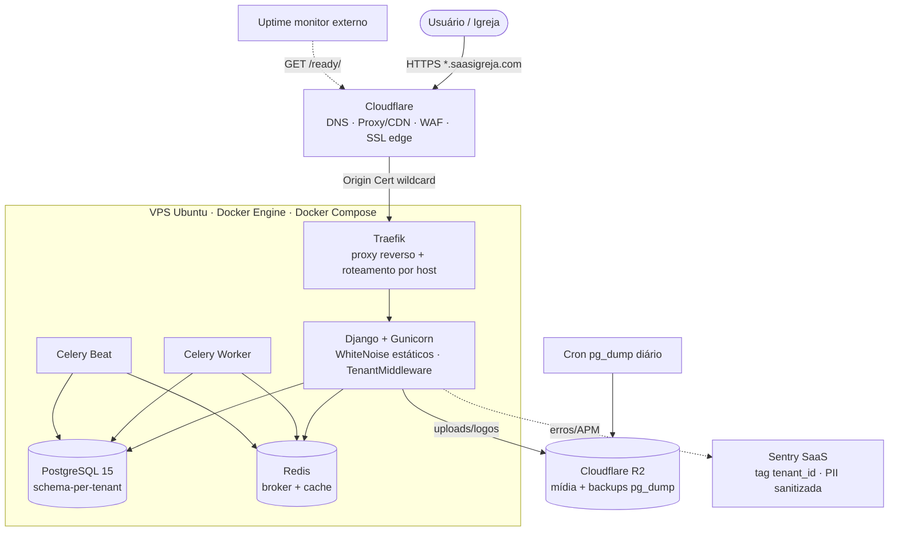

# DEPLOY.md — Arquitetura de deploy do SaaS Igreja (Oikonos)

> Base da **Sprint 7** (deploy/piloto). Decisões em `OPEN_DECISIONS.md` (OD-006 VPS/orquestração,
> OD-003a/007 R2, OD-012 e-mail, OD-015 CI). Stack oficial em `TECH_SPEC.md`.
> **Status:** especificação (nada provisionado ainda — requer G-01 pra iniciar a Sprint 7).

---

## 1. Princípios

- **Bootstrapped / 1 VPS**: tudo numa caixa só (Django + Postgres + Redis + Celery), barato e simples.
- **Multi-tenant schema-per-tenant** (`django-tenants`): cada igreja = 1 schema; roteia por **subdomínio** (`igreja.saasigreja.com`).
- **Estado portátil**: mídia no **Cloudflare R2** (fora do disco) + banco com **dump diário no R2** → migrar de VPS é trivial.
- **Sem painel proprietário**: **Docker Compose + Traefik** (reúso do padrão que o dono já opera; mais leve de RAM; versionado). EasyPanel descartado (OD-006 rev.).
- **Observabilidade externa**: **Sentry** (erros/APM) — 0 RAM no VPS. Prometheus/Grafana **fora** (proibidos; só em escala multi-servidor).

## 2. Topologia

> ⚠️ **Disponibilidade — 1 VPS NÃO é alta disponibilidade (HA).** Tudo numa caixa só = **ponto único de falha**: se o VPS cair ou o Postgres corromper, o serviço fica **fora até restaurar**. A mitigação é **backup diário no R2 + migração rápida** (RPO 24h, §7), **não** redundância. **HA real** (≥2 nós + Postgres gerenciado/replicado) é **pós-escala**, fora do MVP. Não prometer "alta disponibilidade" ao cliente no piloto — prometer **recuperação rápida**.

## 3. Componentes

| Camada | Tecnologia | Notas |
|---|---|---|
| Borda | **Cloudflare** (free) | DNS, proxy laranja, CDN, WAF básico, **SSL no edge**. Registro **wildcard `*.saasigreja.com`** (cobre `athos.saasigreja.com` no Universal SSL grátis). |
| SSL origem | **Cloudflare Origin Certificate** (grátis, wildcard, 15 anos) | Traefik usa o origin cert; **sem Let's Encrypt por subdomínio** (mata o problema do wildcard multi-tenant). |
| Proxy | **Traefik** (container) | Termina TLS (origin cert), roteia por host `*.saasigreja.com` → container Django. Load balancer se um dia houver réplicas. |
| App | **Django + Gunicorn** (container) | `TenantMiddleware` resolve subdomínio → `SET search_path`. **WhiteNoise** serve estáticos (dispensa Nginx). |
| Banco | **PostgreSQL 15** (container, volume) | Obrigatório 15 (schema-per-tenant). Volume persistente. |
| Fila/cache | **Redis 7** (container) | Broker do Celery + cache. |
| Async | **Celery Worker + Celery Beat** (containers) | Worker = importação CSV, anonimização, e-mail; Beat = purge LGPD semanal, `pg_dump` (ou cron do host). |
| Mídia | **Cloudflare R2** (`django-storages`) | Uploads/logos **nunca no disco do VPS** (OD-003a). Egress grátis. |
| E-mail | **Brevo** (`django-anymail`) | Free 300/dia (OD-012). |
| Observabilidade | **Sentry** + **uptime monitor** + painel VPS/Cloudflare | Sentry = erros/APM; uptime (UptimeRobot/BetterStack free) bate `/ready/`; infra via painel do provedor. |
| CI/CD | **GitHub Actions** (OD-015) | lint+test+security; build/push imagem; deploy (pull + `compose up -d` via SSH) na branch de release. |

> **Nginx:** removido do desenho de referência (SCSI). Traefik + Cloudflare + WhiteNoise cobrem proxy/CDN/estáticos. (Confirmar se o setup de origem usava Nginx só p/ estáticos — aqui não precisa.)

## 4. Multi-tenancy no deploy (o ponto crítico)

1. **Cloudflare**: registro DNS **`*.saasigreja.com`** (proxied) → IP do VPS. `saasigreja.com` (apex) = landing/admin público.
2. **SSL**: Universal SSL cobre `*.saasigreja.com` no edge; **Origin Cert wildcard** protege Cloudflare↔VPS. Sem cert por tenant.
3. **Traefik**: uma regra `Host(`{subdomain}.saasigreja.com`)` → serviço Django (todos os tenants no mesmo container).
4. **Django**: `TenantMiddleware` (django-tenants) lê o Host → `SET search_path TO tenant_<slug>, public`. Schema `public` = `Church`/`User`/`Domain`/`Plan`/`PlatformAdmin`.
5. **Provisionar tenant**: `manage.py create_church <slug>` cria schema + Domain + Pastor inicial (já existe).

## 5. Ambientes

| Ambiente | Onde | Pra quê |
|---|---|---|
| **Dev** | Local (`docker compose up` + `runserver`); caseiro Ubuntu + cloudflared p/ teste rápido | Desenvolvimento / smoke test (uptime residencial não serve pra piloto real). |
| **Piloto** | **Contabo VPS 10** (já paga, always-on) — **cravado** | Athos validar por algumas semanas. |
| **Produção (lançamento)** | **Hostinger KVM 2** (→ KVM 4 ao escalar) | Igrejas pagantes. |

> 📈 **Caminho de escala horizontal (futuro, não-MVP).** O Traefik já atua como **load balancer**: quando o uso pedir, sobe-se **réplicas do container Django** e o Traefik balanceia — **sem trocar de arquitetura** (Redis já externaliza fila/cache; sessões no banco/Redis). **Atenção:** réplicas no **mesmo** VPS dão concorrência, **não HA** (caem juntas). HA de verdade = **2+ VPS + Postgres gerenciado/replicado** — só ao escalar (mesmo gatilho do KVM 4 / §10).

## 6. Migração Contabo → Hostinger (baixo atrito)

Possível **porque o estado é portátil**:
1. Provisionar Hostinger: Docker + Compose + Traefik + mesmo `compose.yml`/env.
2. **Mesma versão Postgres 15** e **mesmo `SECRET_KEY`** (senão invalida sessões e magic-links do voluntário).
3. **Mídia não migra** — os dois apontam pro **mesmo bucket R2**.
4. `pg_dump` (full, todos os schemas) na origem → `pg_restore` no destino (ou restaurar o backup mais recente do R2).
5. **Cloudflare**: repontar `*.saasigreja.com` pro IP novo. Propaga em minutos.
6. Reemitir/instalar Origin Cert no Traefik novo. Validar `/ready/`.
- **Downtime** da virada: minutos (dump final → restore → flip DNS).

## 7. Backup & Restore (RNF-016 · Sprint 7)

- **Backup**: cron diário `pg_dump` (full, todos os schemas) → **R2** (`saas-igreja-backups`), retenção **30 dias**.
- **Validação**: `pg_restore --list` + restore mensal de teste em ambiente isolado.
- **Baseline**: **RTO 4h / RPO 24h** (OD-016) — limitado pelo dump diário.
- Runbook detalhado: `docs/RESTORE.md` (a criar na Sprint 7).

## 8. Observabilidade

- **Sentry** (app): captura exceções + traces; **tag `tenant_id`**; `before_send` **sanitiza PII** (LGPD). Alerta de erro por e-mail.
- **Uptime monitor** externo (free): `GET /ready/` (verifica Postgres+Redis) e `/health/` (liveness). Alerta se cair.
- **Infra** (CPU/RAM/disco): painel do VPS (Hostinger/Contabo) + Cloudflare Analytics. Sem Prometheus/Grafana.

## 9. Segurança (hardening — Sprint 7)

- HTTPS only (HSTS), cookies `Secure`/`HttpOnly`/`SameSite`, headers (CSP, X-Frame, referrer) — já em `prod.py`.
- **MFA obrigatório** p/ `pastor`/Secretário/PlatformAdmin (enforce na Sprint 7).
- `django-axes` (lockout), upload validado por `python-magic` (sem SVG, ≤10MB), R2 privado.
- Secrets só via **env** (nunca no git): `SECRET_KEY`, DB, R2 keys, Brevo key, Sentry DSN.
- **Trancar a origem à Cloudflare (hardening obrigatório):** impedir que batam **direto no IP do VPS**, furando WAF/rate-limit/SSL da borda. Opções (escolher uma):
  - **Cloudflare Tunnel** (`cloudflared`, já usado no caseiro) — esconde o IP 100%, dispensa abrir portas. Vira dependência (se o daemon cai, o site cai). **Recomendado** (o dono já domina).
  - **Authenticated Origin Pulls** + firewall aceitando **só os IPs da Cloudflare** nas portas 80/443.
  - ⚠️ **Sempre manter um acesso de emergência** (SSH direto, porta separada) pra não se **auto-trancar** se a config da Cloudflare falhar.
- Pen test manual contra o R2 real + isolamento cross-tenant (`test_tenant_isolation_matrix` já cobre o app).

## 10. Custo (estimado)

| | Piloto | Lançamento (KVM 2) |
|---|---|---|
| VPS | ~R\$ 0 (Contabo já paga / caseiro) | ~R\$ 40–55/mês |
| Domínio | ~R\$ 4–6/mês | ~R\$ 4–6/mês |
| Cloudflare / R2 / Brevo / Sentry / GitHub Actions / Traefik | R\$ 0 (free tier) | R\$ 0 (free tier) |
| **Total** | **~R\$ 0 + domínio** | **~R\$ 45–60/mês** |

Gatilhos de upgrade (→ KVM 4 / serviços pagos): >10–15 igrejas com uso pesado, CPU/RAM > 70% sustentado, ou Sprint 8/9 (Financeiro avançado / Evolution API).

## 11. Checklist da Sprint 7 (resumo — detalhe em `SPRINTS.md`)

- [ ] `Dockerfile` multi-stage + `compose.yml` de produção (Django/Gunicorn, Postgres 15, Redis, Celery worker, Celery beat, Traefik).
- [ ] Traefik com Origin Cert wildcard + roteamento por host.
- [ ] Cloudflare: DNS `*.saasigreja.com`, Origin Cert, regras de cache/segurança.
- [ ] **Trancar origem à Cloudflare** (Cloudflare Tunnel **ou** Authenticated Origin Pulls + firewall só-IPs-CF) + **SSH de emergência** (anti-lockout) — §9.
- [ ] R2 buckets (`media` + `backups`) + env no `prod.py`.
- [ ] Cron `pg_dump` → R2 + `RESTORE.md` + teste de restore.
- [ ] Sentry DSN + `before_send` PII + uptime monitor em `/ready/`.
- [ ] MFA enforce (pastor/secretário/platform admin) + headers/cookies seguros.
- [ ] GitHub Actions: pipeline de deploy (SSH pull + `compose up -d`).
- [ ] Provisionar tenant Athos em produção + smoke test + piloto.
