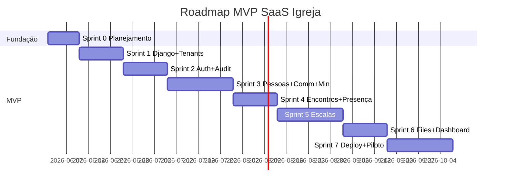

# SPRINTS — SaaS Igreja

> **Versão:** 1.0
> **Data:** 2026-05-27
> **Método:** Spec Driven Development (SDD).

Detalhamento operacional das 8 sprints do MVP. Cada task tem checkbox `[ ]`. Marcar `[x]` quando concluída.

## Regras de execução

### Governança (inviolável)

- **Nenhuma sprint começa sem autorização explícita do dono do projeto.**
- **Nenhuma task é executada sem revisão prévia.** O agente/dev nunca pula de uma task para a próxima sem o dono ter revisado e autorizado a anterior.
- **Nenhum `git commit` ou `git push` é feito pelo agente/dev externo.** Commits e pushes são feitos exclusivamente pelo dono do projeto.
- Mudanças em arquivos durante uma sprint ficam no workspace para revisão; o dono decide quando e como versionar.

### Disciplina de tasks

- Tasks são pequenas o suficiente para serem executadas, testadas e revisadas com clareza.
- Nenhuma sprint operacional (3+) fecha sem testes de tenant isolation e permissões aplicáveis (gate de segurança).
- Mudança de escopo é registrada em [`OPEN_DECISIONS.md`](OPEN_DECISIONS.md) antes de virar task.
- Definition of Done por sprint: ver [`TEST_STRATEGY.md`](TEST_STRATEGY.md) seção 9.

## Legenda

- `[ ]` task pendente
- `[x]` task concluída
- `(P0)` prioridade obrigatória; `(P1)` desejável; `(P2)` opcional

---

## Sprint 0 — Planejamento e Fundação SDD

**Objetivo:** PRD, Tech Spec, Matriz de Acesso, Estratégia de Testes e Sprints alinhados.
**Duração estimada:** 10 dias.
**Dependências:** Nenhuma.
**Riscos:** Escopo crescer no papel. Mitigação: revisão semanal.

### Tasks

#### Documentação

- [x] (P0) Criar `PRD.md` na raiz como source of truth
- [x] (P0) Criar `docs/TECH_SPEC.md` com stack, modelos, princípios
- [x] (P0) Criar `docs/ACCESS_MATRIX.md` com matriz detalhada de permissões
- [x] (P0) Criar `docs/TEST_STRATEGY.md` com estratégia de testes
- [x] (P0) Criar `docs/SPRINTS.md` com plano de sprints
- [x] (P0) Criar `docs/OPEN_DECISIONS.md` com decisões em aberto
- [x] (P0) Criar `docs/README.md` como índice da documentação
- [ ] (P0) Validar PRD com líder principal do produto
- [ ] (P0) Validar Tech Spec com Tech Lead

#### Decisões críticas

- [x] (P0) Decidir OD-002 — MFA → **split: opt-in Sprint 2, enforcement Sprint 7**
- [x] (P0) Decidir OD-003 — Celery → **Celery + Redis no MVP desde Sprint 1**
- [x] (P0) Decidir OD-003a/OD-007 — Storage → **Cloudflare R2 desde Sprint 6**
- [x] (P0) Decidir OD-006 — VPS → **Hostinger KVM 2 (8GB, 2 vCPU, 100GB NVMe)**
- [x] (P0) Decidir OD-012 — Email → **Brevo free tier (300/dia) via `django-anymail`**
- [ ] (P1) Decidir OD-004 — Membro/Pessoa tem login no MVP

#### Backlog

- [ ] (P0) Transcrever requisitos do PRD em backlog inicial (RF-001..101 como issues)
- [ ] (P0) Vincular cada issue a sua sprint sugerida e papel responsável

#### Fundação operacional

- [ ] (P0) Definir RTO 4h e RPO 24h como baseline e documentar em `PRD §20.4` e futuro `INFRA.md`
- [ ] (P0) Decidir e documentar plataforma de CI/CD: **GitHub Actions** (default)
- [ ] (P0) Criar template `.github/workflows/ci.yml` (Ruff, Black, pip-audit, safety, pytest com Postgres+Redis service containers)
- [ ] (P0) Threat model v1 (versão simples, ~1 página): atacantes considerados, superfície de ataque, mitigações principais. Vai para `docs/THREAT_MODEL.md`. Refinado na Sprint 7

### Critério de conclusão da Sprint 0

- [ ] Documentação aprovada como source of truth
- [ ] Backlog inicial criado com RFs vinculados a sprints
- [x] Decisões críticas de infra/stack fechadas (OD-002, OD-003, OD-003a, OD-006, OD-007, OD-012)
- [ ] RTO 4h / RPO 24h definidos e documentados (PRD §20.4)
- [ ] CI/CD decidido (GitHub Actions) e template `.github/workflows/ci.yml` esboçado
- [ ] `THREAT_MODEL.md` v1 (1 página) publicado

---

## Sprint 1 — Fundação Django + PostgreSQL + django-tenants

**Objetivo:** projeto Django operacional com PostgreSQL e django-tenants em dev e VPS beta.
**Duração estimada:** 14 dias.
**Dependências:** Sprint 0.
**Riscos:** SQLite em dev (proibido — AP-13). Subdomínio não resolvendo em ambiente local.

### Tasks

#### Scaffold do projeto

- [ ] (P0) `uv init` e configurar `pyproject.toml` com Django 5.2, django-tenants, allauth, axes, sentry-sdk, psycopg2-binary, redis, celery, weasyprint, python-decouple
- [ ] (P0) Configurar Ruff e Black em `pyproject.toml`
- [ ] (P0) Criar `docker-compose.yml` para dev (PostgreSQL 15 + Redis)
- [ ] (P0) Criar `compose/django/Dockerfile` multi-stage
- [ ] (P0) Criar estrutura `apps/` com apps vazias (`core`, `accounts`, `tenants`, `people`, `communities`, `ministries`, `gatherings`, `schedules`, `files`, `dashboard`)
- [ ] (P0) Configurar `core/settings/{base,dev,prod}.py` com split
- [ ] (P0) Configurar `.env.example` e adicionar `.env` em `.gitignore`

#### Models de fundação

- [ ] (P0) Criar `apps/core/models.py` com `BaseModel` abstrato
- [ ] (P0) Criar `apps/accounts/models.py` com `User(AbstractUser)`, `USERNAME_FIELD='email'`, `UserManager`, `roles ArrayField`, métodos `has_any_role`/`has_all_roles`, `Invite` (com `roles ArrayField`), `PlatformAdmin`, `SupportAccess`
- [ ] (P0) Criar `apps/accounts/backends.py` com `EmailBackend`
- [ ] (P0) Criar `apps/tenants/models.py` com `Church(TenantMixin)`, `Plan`, `Domain`
- [ ] (P0) Configurar `django-tenants` em `settings/base.py` (`SHARED_APPS`, `TENANT_APPS`, `DATABASE_ROUTERS`)
- [ ] (P0) Primeiro `migrate` no schema public

#### Multi-tenancy

- [ ] (P0) Criar `apps/tenants/middleware.py` com `TenantMiddleware` (resolve subdomain → schema)
- [ ] (P0) Configurar wildcard subdomain em hosts locais (`*.localhost`) ou usar `django-hosts`
- [ ] (P0) Criar management command `create_church` para provisionar tenant em dev
- [ ] (P0) Criar `apps/core/mixins.py` com `TenantRequiredMixin` (re-export do django-tenants)

#### Landing pública

- [ ] (P0) Criar template `base.html` com layout sidebar + header + content usando paleta Athos
- [ ] (P0) Configurar TailwindCSS via `tailwind.config.js` com tokens Athos
- [ ] (P0) Criar landing page pública no schema `public` (`/`, `/sobre`, `/cadastro-igreja`)
- [ ] (P1) Form de cadastro de igreja (slug, leader_title, has_communities, paleta)

#### Observabilidade

- [ ] (P0) Criar endpoints `/health/` (liveness, sempre 200) e `/ready/` (readiness: Postgres + Redis, 200/503) em `apps/core/views.py`
- [ ] (P0) Registrar rotas no schema `public` (sem subdomínio de tenant)
- [ ] (P0) Configurar EasyPanel/Cloudflare para monitorar `/ready/`

#### Performance baseline

- [ ] (P0) Adicionar `nplusone` em `requirements-dev.txt` e configurar `raise_in_dev=True` no `settings/dev.py`
- [ ] (P0) Adicionar `django-debug-toolbar` em dev (sem afetar prod)
- [ ] (P0) Documentar princípio P-ARQ-09 (N+1) em `docs/TECH_SPEC.md` (já registrado)

### Testes mínimos da Sprint 1

- [ ] (P0) `test_two_churches_distinct_schemas` (cria 2 tenants, verifica schemas distintos)
- [ ] (P0) `test_tenant_middleware_resolves_by_subdomain`
- [ ] (P0) `test_user_email_unique`
- [ ] (P0) `test_baseModel_created_updated_at`
- [ ] (P0) `test_health_endpoint_returns_200`
- [ ] (P0) `test_ready_endpoint_returns_200_when_pg_and_redis_ok`
- [ ] (P0) `test_ready_endpoint_returns_503_when_pg_down`
- [ ] (P0) `test_ready_endpoint_returns_503_when_redis_down`

### Critério de conclusão da Sprint 1

- [ ] Projeto roda localmente via `docker-compose up`
- [ ] Criar 2 tenants em ambiente local funciona via management command
- [ ] Acessar cada subdomínio retorna dados isolados
- [ ] Deploy do esqueleto no VPS beta com Cloudflare wildcard SSL
- [ ] `/health/` e `/ready/` respondendo corretamente em prod
- [ ] CI rodando no GitHub Actions (Ruff, Black, pytest, pip-audit) e bloqueando merge se falhar
- [ ] `nplusone` ligado em dev — qualquer N+1 quebra o teste
- [ ] `THREAT_MODEL.md` v1 publicado

---

## Sprint 2 — Autenticação, Convites, Autorização, Auditoria, SecurityLog

**Objetivo:** fundação de segurança e identidade pronta.
**Duração estimada:** 14 dias.
**Dependências:** Sprint 1.
**Riscos:** Convite vazar token em log; CSRF/headers mal configurados em prod; matriz de permissões incompleta.

### Tasks

#### Autenticação

- [ ] (P0) Configurar `django-allauth` para login por email (sem username)
- [ ] (P0) Criar `apps/accounts/validators.py` com `PasswordPolicyValidator` (8+ chars, 1 número, 1 especial, diferente do email/nome)
- [ ] (P0) Configurar `django-axes` (5 tentativas → lockout 15 min)
- [ ] (P0) Implementar fluxo de recuperação de senha sem enumeração (mensagem e tempo idênticos)
- [ ] (P0) Configurar cookies seguros em `prod.py` (`SECURE_*`, `SESSION_COOKIE_*`, `CSRF_COOKIE_*`)
- [ ] (P0) Configurar headers de segurança (HSTS, X-Frame-Options, CSP, referrer-policy)

#### MFA opt-in (decisão OD-002)

- [ ] (P0) Habilitar `django-allauth` MFA TOTP (opt-in) — fluxo de setup com QR code
- [ ] (P0) Gerar backup codes (8 códigos de uso único)
- [ ] (P0) View de gerenciamento de MFA na conta do usuário (ativar, desativar, regerar backup codes)
- [ ] (P0) Templates seguindo design system

#### Convites

- [ ] (P0) Criar `apps/accounts/services.py` com `create_invite` (aceita lista de `roles`), `accept_invite`, `resend_invite`, `cancel_invite`
- [ ] (P0) Criar views e templates para envio e aceite de convite (UI permite selecionar múltiplas roles)
- [ ] (P0) Garantir `unique_together=('church', 'email')` em `Invite`
- [ ] (P0) Implementar expiração de 7 dias e token UUID
- [ ] (P0) Configurar envio de email via **Brevo free tier** + `django-anymail[brevo]` (OD-012). DKIM/SPF configurados no DNS Cloudflare

#### Autorização (multi-role)

- [ ] (P0) Implementar `RoleRequiredMixin` base em `apps/core/mixins.py`
- [ ] (P0) Implementar `PastorRequiredMixin`, `LeaderOrPastorMixin`, `TreasurerOrPastorMixin` herdando de `RoleRequiredMixin`
- [ ] (P0) Implementar `ScopedToCommunityMixin`, `ScopedToMinistryMixin` usando `has_any_role('pastor')` para curto-circuitar
- [ ] (P0) Criar service `change_roles` (plural) com validação de "último Pastor" — rejeita se remoção deixaria igreja sem nenhum user com `'pastor' in roles` (RN-004)
- [ ] (P0) Criar service `deactivate_user` e `reactivate_user`
- [ ] (P0) View de listagem de usuários e acessos (`/configuracoes/usuarios/`) exibe roles como chips

#### Platform Admin e SupportAccess (RISK-009)

- [ ] (P0) Implementar `PlatformAdminWithSupportAccessMixin` em `apps/core/mixins.py`
- [ ] (P0) Criar service `grant_support_access` (admin, church, justification) → cria `SupportAccess` com `expires_at = now + 4h` + `SecurityLog`
- [ ] (P0) Criar service `revoke_support_access` → marca `ended_at` + `SecurityLog`
- [ ] (P0) Middleware/dispatch bloqueia Platform Admin em tenant sem `SupportAccess` ativo
- [ ] (P0) Toda request de Platform Admin durante `SupportAccess` ativo gera `SecurityLog` (event_type=`platform_admin_access`)
- [ ] (P0) View de admin de plataforma para conceder e revogar `SupportAccess`
- [ ] (P0) `PlatformAdmin` exige MFA habilitado para conceder `SupportAccess` (gate de segurança)

#### Auditoria e SecurityLog

- [ ] (P0) Criar `apps/core/models.py` com `AuditLog` (tenant_id CharField, user_id IntegerField, sem FK cross-schema)
- [ ] (P0) Criar `apps/core/models.py` com `SecurityLog` (event_type, payload JSON, ip_address)
- [ ] (P0) Implementar `AuditLogMixin` para signals automáticos em `post_save`/`post_delete`
- [ ] (P0) Disparar `SecurityLog` em: login success/failure, lockout, password reset, role change, user deactivated/reactivated, mfa_enabled, mfa_disabled, support_access_granted, support_access_revoked, platform_admin_access
- [ ] (P0) Configurar Sentry com `before_send` que sanitiza PII

#### TenantAdminMixin

- [ ] (P0) Criar `apps/core/admin.py` com `TenantAdminMixin` que proíbe acesso ao admin padrão em produção
- [ ] (P0) Aplicar `TenantAdminMixin` em todos os `ModelAdmin`

### Testes mínimos da Sprint 2

- [ ] (P0) `test_login_email_only`
- [ ] (P0) `test_login_wrong_password_does_not_leak_user_existence`
- [ ] (P0) `test_password_reset_no_enumeration`
- [ ] (P0) `test_password_reset_token_expires_24h`
- [ ] (P0) `test_axes_lockout_after_5_failures`
- [ ] (P0) `test_axes_lockout_logged_in_security_log`
- [ ] (P0) `test_password_policy_min_8_chars`
- [ ] (P0) `test_password_cannot_be_email_or_name`
- [ ] (P0) `test_session_cookies_secure_httponly_samesite`
- [ ] (P0) `test_security_headers_present_in_prod`
- [ ] (P0) `test_invite_unique_per_church`
- [ ] (P0) `test_accept_invite_creates_user_and_marks_accepted_at`
- [ ] (P0) `test_invite_expires_after_7_days`
- [ ] (P0) `test_invite_token_single_use`
- [ ] (P0) `test_resend_invite_renews_expiration`
- [ ] (P0) `test_role_change_audited_and_security_logged`
- [ ] (P0) `test_user_multi_role_union_of_permissions` (treasurer+leader tem ambos)
- [ ] (P0) `test_has_any_role_and_has_all_roles`
- [ ] (P0) `test_cannot_remove_last_pastor` (validação considera multi-role)
- [ ] (P0) `test_mfa_totp_opt_in_setup_and_login`
- [ ] (P0) `test_mfa_backup_codes_single_use`
- [ ] (P0) `test_platform_admin_blocked_without_support_access`
- [ ] (P0) `test_grant_support_access_creates_4h_window_and_security_log`
- [ ] (P0) `test_support_access_expired_auto_blocks`
- [ ] (P0) `test_revoke_support_access_blocks_immediately`
- [ ] (P0) `test_deactivate_blocks_login`
- [ ] (P0) `test_list_users_scoped_by_church`
- [ ] (P0) `test_auditlog_no_cross_schema_fk`
- [ ] (P0) `test_auditlog_scoped_by_tenant_id`
- [ ] (P0) `test_tenant_isolation_matrix` (versão inicial nas views já existentes)
- [ ] (P0) `test_permissions_matrix` (versão inicial para Pastor vs Leader vs Member)

### Critério de conclusão da Sprint 2

- [ ] Bateria de testes de auth, convites, autorização, auditoria, MFA e SupportAccess passando
- [ ] `pip-audit` e `safety check` sem CVEs
- [ ] Cobertura de `accounts`, `core` e `tenants` ≥ 90%
- [ ] Pastor consegue: convidar (com múltiplas roles), aceitar, listar, alterar roles, desativar usuário
- [ ] Multi-role funcional (treasurer+leader testado)
- [ ] MFA opt-in disponível e testado
- [ ] Platform Admin bloqueado sem SupportAccess; com SupportAccess audita toda ação
- [ ] Tentativas de força bruta bloqueadas e auditadas

---

## Sprint 3 — Pessoas, Comunidades, Ministérios

**Objetivo:** primeiro CRUD operacional com LGPD desde o nascimento.
**Duração estimada:** 21 dias.
**Dependências:** Sprint 2.
**Riscos:** PII em logs; importação CSV travar request; enforcement de plano esquecido.

### Tasks

#### Pessoas

- [ ] (P0) Criar `apps/people/models.py` com `Person` (status TextChoices, `consent_given_at`)
- [ ] (P0) Criar `apps/people/services.py` com `create_person` (verifica plano e consent)
- [ ] (P0) Criar `apps/people/services.py` com `update_person`, `change_status`
- [ ] (P0) Criar `apps/people/services.py` com `anonymize_person` (soft delete + substitui PII)
- [ ] (P0) Criar `apps/people/services.py` com `export_person_data` (JSON + CSV)
- [ ] (P0) Criar Celery Beat job semanal `purge_anonymized_persons` (purge físico após 30 dias)
- [ ] (P0) Criar `apps/people/signals.py` com `AuditLog` em create/update/delete/export/anonymize
- [ ] (P0) CRUD CBV: `PersonListView`, `PersonDetailView`, `PersonCreateView`, `PersonUpdateView` com mixins
- [ ] (P0) Form de Pessoa com `consent_given_at` obrigatório quando email/telefone preenchidos
- [ ] (P0) Filtros (status, comunidade, ministério) e busca por nome em `PersonListView`
- [ ] (P1) Importação CSV (síncrona com progress HTMX ou Celery — depende de OD-003)
- [ ] (P0) View e fluxo de anonimização com confirmação dupla (OD-014)
- [ ] (P0) View e download de exportação de dados de Pessoa

#### Comunidades

- [ ] (P0) Criar `apps/communities/models.py` com `Community`
- [ ] (P0) CRUD CBV com mixins (`PastorRequiredMixin` ou `LeaderOrPastorMixin` + `ScopedToCommunityMixin`)
- [ ] (P0) Esconder menu/criação quando `Church.has_communities=False`
- [ ] (P0) Service verifica `church.plan.max_communities` antes de criar
- [ ] (P0) `apps/communities/signals.py` com `AuditLog`
- [ ] (P0) Vincular Pessoa → Comunidade (FK `SET_NULL`)

#### Ministérios

- [ ] (P0) Criar `apps/ministries/models.py` com `Ministry`
- [ ] (P0) CRUD CBV com mixins
- [ ] (P0) `apps/ministries/signals.py` com `AuditLog`
- [ ] (P0) M2M Pessoa ↔ Ministério via form

### Testes mínimos da Sprint 3

- [ ] (P0) `test_person_create_requires_consent_when_email_or_phone`
- [ ] (P0) `test_person_create_respects_plan_max_persons`
- [ ] (P0) `test_anonymize_person_replaces_pii_and_sets_inactive`
- [ ] (P0) `test_anonymize_person_audited`
- [ ] (P0) `test_export_person_data_returns_json_and_csv`
- [ ] (P0) `test_export_person_data_audited`
- [ ] (P0) `test_person_fk_set_null_after_anonymize`
- [ ] (P1) `test_celery_beat_purge_after_30_days`
- [ ] (P0) `test_person_actions_audited` (create, update, delete)
- [ ] (P0) `test_community_respects_plan_limit`
- [ ] (P0) `test_community_hidden_when_has_communities_false`
- [ ] (P0) `test_community_update_audited`
- [ ] (P0) `test_ministry_create`
- [ ] (P0) `test_ministry_m2m_with_person`
- [ ] (P0) `test_leader_sees_only_own_community_persons` (escopo)
- [ ] (P0) `test_tenant_isolation_matrix` (atualizado para novas views)
- [ ] (P0) `test_permissions_matrix` (atualizado para novas views)
- [ ] (P1) `test_csv_import_idempotent`

### Critério de conclusão da Sprint 3

- [ ] Pastor consegue cadastrar, editar, anonimizar e exportar Pessoa
- [ ] Líder consegue gerenciar Pessoas da sua comunidade
- [ ] Comunidades e Ministérios criados, editados e vinculados
- [ ] LGPD funcional (consentimento, anonimização, exportação)
- [ ] Athos consegue cadastrar 100+ pessoas em dev sem erros
- [ ] Cobertura de `people` ≥ 80%; `communities` e `ministries` ≥ 80%

---

## Sprint 4 — Encontros, Cultos, Presença

**Objetivo:** registrar presença em lote sem duplicação e com auditoria.
**Duração estimada:** 14 dias.
**Dependências:** Sprint 3.
**Riscos:** UX confuso na marcação em lote (testar com líder real); duplicação de Attendance.

### Tasks

#### Gathering

- [ ] (P0) Criar `apps/gatherings/models.py` com `Gathering` (Type TextChoices: WORSHIP, COMMUNITY, EVENT, MEETING)
- [ ] (P0) Esconder tipo COMMUNITY no form quando `Church.has_communities=False` (RN-010)
- [ ] (P0) CRUD CBV: `GatheringListView`, `GatheringDetailView`, `GatheringCreateView`, `GatheringUpdateView`
- [ ] (P0) Aplicar mixins de papel e escopo (Pastor cria qualquer tipo; Líder cria COMMUNITY da sua; Coordenador cria EVENT/MEETING)
- [ ] (P0) `apps/gatherings/signals.py` com `AuditLog` em create/update/delete

#### Attendance

- [ ] (P0) Criar `apps/gatherings/models.py` com `Attendance` (unique `(person, gathering)`)
- [ ] (P0) Criar `apps/gatherings/services.py` com `mark_attendance_bulk` usando `update_or_create`
- [ ] (P0) View de marcação em lote (checkbox por Pessoa elegível)
- [ ] (P0) Pessoas elegíveis: se `gathering.community` definido, apenas membros da comunidade; caso contrário, todas as Pessoas da igreja com status ≠ INACTIVE
- [ ] (P0) Auditoria de cada alteração de presença

### Testes mínimos da Sprint 4

- [ ] (P0) `test_gathering_create`
- [ ] (P0) `test_gathering_type_hidden_when_no_communities`
- [ ] (P0) `test_attendance_bulk_no_duplicate` (chamar 2× cria 1 registro)
- [ ] (P0) `test_attendance_update_audited`
- [ ] (P0) `test_leader_marks_attendance_only_in_own_community`
- [ ] (P0) `test_coordinator_marks_attendance_only_in_own_ministry_events`
- [ ] (P0) `test_tenant_isolation_matrix` (atualizado)
- [ ] (P0) `test_permissions_matrix` (atualizado)

### Critério de conclusão da Sprint 4

- [ ] Pastor, Líder e Coordenador conseguem criar encontros conforme seu escopo
- [ ] Líder marca presença em lote pelo celular em <2 min (validar com usuário real)
- [ ] Zero duplicação de Attendance
- [ ] Cobertura de `gatherings` ≥ 80%

---

## Sprint 5 — Escalas e Voluntários com Bloqueio de Conflito

**Objetivo:** escalas básicas com detecção e aprovação de exceção.
**Duração estimada:** 21 dias.
**Dependências:** Sprints 3 e 4.
**Riscos:** Regra de conflito mal especificada; "coordenador competente" ambíguo; UX de aprovação confusa.

### Tasks

#### Schedule

- [ ] (P0) Criar `apps/schedules/models.py` com `Schedule` (ministry, person, gathering, role, notes)
- [ ] (P0) Criar `apps/schedules/models.py` com `ScheduleConflictApproval` (schedule, approved_by_id, justification, approved_at)
- [ ] (P0) Criar `apps/schedules/services.py` com `create_schedule` (valida que person pertence ao ministry via M2M)
- [ ] (P0) Criar `apps/schedules/services.py` com `detect_conflict` (mesma pessoa em outro Gathering na mesma data/hora)
- [ ] (P0) Criar `apps/schedules/services.py` com `approve_exception` (registra `ScheduleConflictApproval`)
- [ ] (P0) `apps/schedules/signals.py` com `AuditLog` e `SecurityLog` em aprovação de exceção
- [ ] (P0) CRUD CBV com mixins (Coordenador escala apenas no seu ministério; Pastor escala em qualquer)
- [ ] (P0) View de aprovação de exceção com form de justificativa
- [ ] (P0) "Coordenador competente": `User` cujo `Person` é `coordinator` do `Schedule.ministry`

### Testes mínimos da Sprint 5

- [ ] (P0) `test_schedule_create_validates_ministry_membership`
- [ ] (P0) `test_schedule_conflict_blocked`
- [ ] (P0) `test_schedule_exception_requires_competent_coordinator`
- [ ] (P0) `test_schedule_exception_creates_approval_and_audits`
- [ ] (P0) `test_schedule_exception_security_logged`
- [ ] (P0) `test_coordinator_sees_only_own_ministry_schedules`
- [ ] (P0) `test_tenant_isolation_matrix` (atualizado)
- [ ] (P0) `test_permissions_matrix` (atualizado)

### Critério de conclusão da Sprint 5

- [ ] Coordenador monta escala mensal sem conflito não detectado
- [ ] Conflitos são bloqueados e exigem aprovação explícita
- [ ] Aprovações são registradas com justificativa e auditadas
- [ ] Cobertura de `schedules` ≥ 80%

---

## Sprint 6 — Arquivos/PDFs, Dashboard Mínimo, Permissões de Mídia

**Objetivo:** upload/download seguro de arquivos e dashboard básico.
**Duração estimada:** 14 dias.
**Dependências:** Sprints 2 e 3.
**Riscos:** URL pública vazando arquivo sensível; dashboard cruzando tenant; SVG XSS.

### Tasks

#### Storage (Cloudflare R2 — decisão OD-003a/OD-007)

- [ ] (P0) Adicionar `django-storages[s3]` em `pyproject.toml`
- [ ] (P0) Configurar bucket R2 `saas-igreja-media` em conta Cloudflare
- [ ] (P0) Configurar `DEFAULT_FILE_STORAGE` no `prod.py` apontando para R2
- [ ] (P0) Configurar `MEDIA_URL` e credenciais R2 via `python-decouple`
- [ ] (P0) Em dev: opção A (mock local com `FileSystemStorage`) ou opção B (bucket R2 separado `saas-igreja-dev`). Decidir e documentar.
- [ ] (P0) Path scheme por tenant: `{tenant_schema}/{model}/{object_id}/{filename}` (evita colisões cross-tenant)

#### FileAsset

- [ ] (P0) Criar `apps/files/models.py` com `FileAsset` (metadados + storage_path)
- [ ] (P0) Criar `apps/core/validators.py` com `MagicValidator` (valida MIME via `python-magic`)
- [ ] (P0) Criar `apps/files/services.py` com `upload_file` (valida MIME, tamanho ≤10MB, tipos PDF/PNG/JPG; faz upload no R2)
- [ ] (P0) Rejeitar SVG (vetor XSS)
- [ ] (P0) Criar view de download autenticada com checagem de permissão por tenant + papel — gera URL temporária assinada R2 (TTL 60s) ou faz streaming pela view
- [ ] (P0) `apps/files/signals.py` com `AuditLog` em upload/download/delete
- [ ] (P0) `SecurityLog` para upload/download de arquivos sensíveis
- [ ] (P0) View de listagem de arquivos com filtros por contexto (Person, Community, Ministry)
- [ ] (P1) View de exclusão de arquivo (apenas Pastor/Secretaria)

#### Dashboard

- [ ] (P0) Criar `apps/dashboard/services.py` com `church_metrics` (totais por status, presença último mês, comunidades/ministérios ativos)
- [ ] (P0) Criar `apps/dashboard/views.py` com `DashboardPastorView` (acesso completo)
- [ ] (P0) Criar `apps/dashboard/views.py` com `DashboardLeaderView` (escopo da comunidade)
- [ ] (P0) Criar `apps/dashboard/views.py` com `DashboardCoordinatorView` (escopo do ministério)
- [ ] (P1) Charts simples com Chart.js (sem biblioteca paga)
- [ ] (P0) Templates respeitando design system

### Testes mínimos da Sprint 6

- [ ] (P0) `test_upload_validates_mime_via_magic`
- [ ] (P0) `test_upload_rejects_file_above_10mb`
- [ ] (P0) `test_upload_rejects_svg`
- [ ] (P0) `test_download_requires_permission`
- [ ] (P0) `test_download_unauthorized_returns_404`
- [ ] (P0) `test_no_permanent_public_url`
- [ ] (P0) `test_delete_file_audited`
- [ ] (P0) `test_file_upload_security_logged`
- [ ] (P0) `test_r2_path_isolated_per_tenant` (upload em tenant A não vaza em tenant B)
- [ ] (P0) `test_signed_url_expires_in_60s`
- [ ] (P0) `test_dashboard_scoped_no_leak`
- [ ] (P0) `test_dashboard_leader_sees_only_own_community`
- [ ] (P0) `test_dashboard_coordinator_sees_only_own_ministry`
- [ ] (P0) `test_tenant_isolation_matrix` (atualizado)
- [ ] (P0) `test_permissions_matrix` (atualizado)

### Critério de conclusão da Sprint 6

- [ ] Upload de PDF/PNG/JPG funcional com validação de MIME e tamanho
- [ ] Download exige permissão; nenhum link público permanente
- [ ] Pentest manual em URLs de download sem vazamento
- [ ] Dashboards funcionais com escopo correto
- [ ] Cobertura de `files` ≥ 90%; `dashboard` ≥ 70%

---

## Sprint 7 — Deploy Beta, Backup, Restore, Hardening, Piloto Athos

**Objetivo:** entrar em produção controlada com piloto Athos.
**Duração estimada:** 21 dias.
**Dependências:** Sprints 1–6.
**Riscos:** Restore não testado; MFA não obrigatório para Pastor; Sentry vazando PII; VPS subdimensionado.

### Tasks

#### Deploy

- [ ] (P0) Provisionar Hostinger KVM 2 (OD-006) e instalar EasyPanel Free
- [ ] (P0) Configurar Cloudflare Free com SSL wildcard `*.saasigreja.com`
- [ ] (P0) Configurar `compose/production.yml` com Gunicorn + Celery + Redis + Postgres + Sentry
- [ ] (P0) Configurar variáveis de ambiente em EasyPanel (sem secrets no repo)
- [ ] (P0) Deploy inicial e smoke test (criar tenant, login, criar pessoa)

#### Backup e Restore

- [ ] (P0) Configurar cron diário com `pg_dump` no VPS
- [ ] (P0) Configurar upload offsite para storage S3-compatible (OD-007: Cloudflare R2 ou Backblaze B2)
- [ ] (P0) Configurar retenção de 30 dias com rotação automática
- [ ] (P0) Criar `docs/RESTORE.md` com runbook detalhado
- [ ] (P0) Realizar primeiro teste de restore em ambiente isolado
- [ ] (P0) Registrar resultado do teste em log operacional
- [ ] (P0) Backup separado para volume `/media`

#### Hardening

- [ ] (P0) Threat model formal (`docs/THREAT_MODEL.md`)
- [ ] (P0) Implementar `MFARequiredForRoleMiddleware` que força MFA para usuários com `'pastor' in roles` e para `PlatformAdmin` (login sem MFA configurado → redireciona para setup; login com MFA configurado → exige TOTP)
- [ ] (P0) Comunicar Pastors ativos sobre MFA obrigatório (gracias period de 7 dias se houver usuários existentes)
- [ ] (P0) Configurar Sentry com `before_send` que sanitiza email/telefone
- [ ] (P0) Configurar Sentry com tag `tenant_id` em todos os eventos
- [ ] (P0) Verificar headers de segurança em produção (HSTS, X-Frame, CSP)
- [ ] (P0) Verificar cookies em produção (Secure, HttpOnly, SameSite)
- [ ] (P0) Executar `pip-audit` e `safety check` no ambiente final

#### Monitoramento

- [ ] (P0) Configurar alerta no Sentry para erros 5xx
- [ ] (P0) Configurar alerta de CPU/RAM no VPS
- [ ] (P0) Documentar `docs/INFRA.md` com topologia e contatos

#### Documentação operacional

- [ ] (P0) Criar `docs/INFRA.md` com VPS, EasyPanel, Cloudflare, storage
- [ ] (P0) Criar `docs/RESTORE.md` com procedimento e teste mensal
- [ ] (P0) Criar `docs/THREAT_MODEL.md` com atacantes considerados
- [ ] (P1) Criar `docs/INCIDENT_RESPONSE.md` com notificação LGPD
- [ ] (P1) Criar `docs/PRIVACY_POLICY.md` com modelo por igreja

#### Piloto Athos

- [ ] (P0) Provisionar tenant para Athos (`athos.saasigreja.com`)
- [ ] (P0) Criar Pastor inicial e enviar convite
- [ ] (P0) Acompanhar primeiro cadastro de 100+ pessoas
- [ ] (P0) Acompanhar primeiro registro de presença pelo Líder
- [ ] (P0) Coletar feedback inicial em sessão de 1h

### Testes mínimos da Sprint 7

- [ ] (P0) `test_backup_cron_documented` (smoke)
- [ ] (P0) `test_mfa_enforced_for_pastor_role` (login redireciona para setup se sem MFA)
- [ ] (P0) `test_mfa_enforced_for_platform_admin`
- [ ] (P0) `test_member_or_leader_does_not_require_mfa` (apenas Pastor e PlatformAdmin)
- [ ] (P0) `test_sentry_no_pii` (verifica `before_send`)
- [ ] (P0) `test_sentry_tags_tenant`
- [ ] (P0) `test_security_headers_present_in_prod` (smoke em prod)
- [ ] (P0) `test_platform_admin_access_requires_support_log`
- [ ] (P0) Restore manual testado e registrado

### Critério de conclusão da Sprint 7

- [ ] Ambiente beta em produção com Athos rodando
- [ ] Backup diário funcionando com sucesso (verificado por 7 dias consecutivos)
- [ ] Restore testado em ambiente isolado e documentado
- [ ] Athos com 100+ pessoas cadastradas
- [ ] Zero vazamentos cross-tenant em testes
- [ ] MFA obrigatório para Pastor e Platform Admin
- [ ] Threat model formal aprovado
- [ ] 100% das views autenticadas com `TenantRequiredMixin`
- [ ] Lighthouse mobile ≥ 90 nas telas principais

---

## Visão consolidada

## Gate de segurança entre sprints

Nenhuma sprint operacional (3+) é marcada como pronta sem:

- [ ] `test_tenant_isolation_matrix` aplicável passando
- [ ] `test_permissions_matrix` aplicável passando
- [ ] Auditoria das ações sensíveis ativa e testada
- [ ] `pip-audit` + `safety check` sem CVEs novas
- [ ] Cobertura por app respeitando o gate de [`TEST_STRATEGY.md`](TEST_STRATEGY.md)
