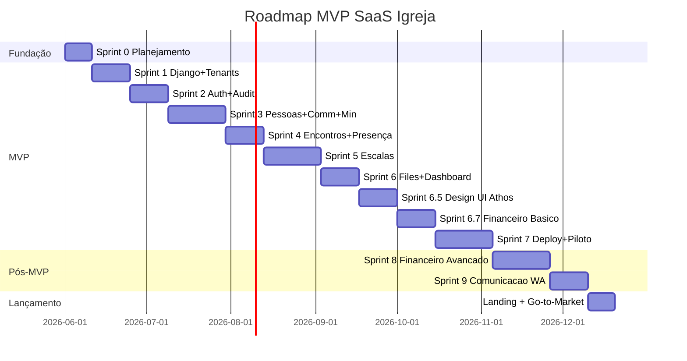

# SPRINTS — SaaS Igreja

> **Versão:** 1.0
> **Data:** 2026-05-27
> **Método:** Spec Driven Development (SDD).

Detalhamento operacional das 9 sprints do MVP (0–7, com **Sprint 6.5 — Design/UI Athos** entre a 6 e a 7). Cada task tem checkbox `[ ]`. Marcar `[x]` quando concluída.

## Regras de execução

### Governança (inviolável)

- **Nenhuma sprint começa sem autorização explícita do dono do projeto.**
- **Nenhuma task é executada sem revisão prévia.** O agente/dev nunca pula de uma task para a próxima sem o dono ter revisado e autorizado a anterior.
- **Nenhum `git commit` ou `git push` é feito pelo agente/dev externo.** Commits e pushes são feitos exclusivamente pelo dono do projeto.
- Mudanças em arquivos durante uma sprint ficam no workspace para revisão; o dono decide quando e como versionar.

### Disciplina de tasks

- Tasks são pequenas o suficiente para serem executadas, testadas e revisadas com clareza.
- Nenhuma sprint operacional (3+) fecha sem testes de tenant isolation e permissões aplicáveis (gate de segurança).
- Mudança de escopo é registrada em [`OPEN_DECISIONS.md`](OPEN_DECISIONS.md) antes de virar task.
- Definition of Done por sprint: ver [`TEST_STRATEGY.md`](TEST_STRATEGY.md) seção 9.

## Legenda

- `[ ]` task pendente
- `[x]` task concluída
- `(P0)` prioridade obrigatória; `(P1)` desejável; `(P2)` opcional

---

## Sprint 0 — Planejamento e Fundação SDD

**Status:** ✅ **CONCLUÍDA (2026-06-01)** — documentação aprovada como source of truth pelo dono.
**Objetivo:** PRD, Tech Spec, Matriz de Acesso, Estratégia de Testes e Sprints alinhados.
**Duração estimada:** 10 dias.
**Dependências:** Nenhuma.
**Riscos:** Escopo crescer no papel. Mitigação: revisão semanal.

### Tasks

#### Documentação

- [x] (P0) Criar `PRD.md` na raiz como source of truth
- [x] (P0) Criar `docs/TECH_SPEC.md` com stack, modelos, princípios
- [x] (P0) Criar `docs/ACCESS_MATRIX.md` com matriz detalhada de permissões
- [x] (P0) Criar `docs/TEST_STRATEGY.md` com estratégia de testes
- [x] (P0) Criar `docs/SPRINTS.md` com plano de sprints
- [x] (P0) Criar `docs/OPEN_DECISIONS.md` com decisões em aberto
- [x] (P0) Criar `docs/README.md` como índice da documentação
- [x] (P0) Validar PRD com líder principal do produto
- [x] (P0) Validar Tech Spec com Tech Lead → **APROVADO COM RESSALVAS** (relatório em `TECH_SPEC_VALIDATION.md`; 1 achado P0 e ressalvas P1/P2 escaladas ao dono)

#### Decisões críticas

- [x] (P0) Decidir OD-002 — MFA → **split: opt-in Sprint 2, enforcement Sprint 7**
- [x] (P0) Decidir OD-003 — Celery → **Celery + Redis no MVP desde Sprint 1**
- [x] (P0) Decidir OD-003a/OD-007 — Storage → **Cloudflare R2 desde Sprint 6**
- [x] (P0) Decidir OD-006 — VPS → **Hostinger KVM 2 (8GB, 2 vCPU, 100GB NVMe)**
- [x] (P0) Decidir OD-012 — Email → **Brevo free tier (300/dia) via `django-anymail`**
- [x] (P1) Decidir OD-004 — Membro/Pessoa tem login no MVP → **Não: Membro existe apenas como `Person`, sem login. Login de Membro fica para a Fase 2**

#### Backlog

- [x] (P0) Transcrever requisitos do PRD em backlog inicial (RF-001..101 como issues) → `docs/BACKLOG.md`
- [x] (P0) Vincular cada issue a sua sprint sugerida e papel responsável → `docs/BACKLOG.md`

#### Fundação operacional

- [x] (P0) Definir RTO 4h e RPO 24h como baseline e documentar em `PRD §20.4` e futuro `INFRA.md` → documentado em **PRD §20.4** + RNF-023 + OD-016. `INFRA.md` é entregável da Sprint 1
- [x] (P0) Decidir e documentar plataforma de CI/CD: **GitHub Actions** (default) → OD-015 (fechada) + **TECH_SPEC §12.2**
- [x] (P0) Criar template `.github/workflows/ci.yml` (Ruff, Black, pip-audit, safety, pytest com Postgres+Redis service containers) → criado (`.github/workflows/ci.yml`)
- [x] (P0) Threat model v1 (versão simples, ~1 página): atacantes considerados, superfície de ataque, mitigações principais. Vai para `docs/THREAT_MODEL.md`. Refinado na Sprint 7 → criado (`docs/THREAT_MODEL.md`)

### Critério de conclusão da Sprint 0

- [x] Documentação aprovada como source of truth (aprovada pelo dono em 2026-06-01)
- [x] Backlog inicial criado com RFs vinculados a sprints (`docs/BACKLOG.md`)
- [x] Decisões críticas de infra/stack fechadas (OD-002, OD-003, OD-003a, OD-006, OD-007, OD-012)
- [x] RTO 4h / RPO 24h definidos e documentados (PRD §20.4)
- [x] CI/CD decidido (GitHub Actions) e template `.github/workflows/ci.yml` esboçado
- [x] `THREAT_MODEL.md` v1 (1 página) publicado

---

## Sprint 1 — Fundação Django + PostgreSQL + django-tenants

**Objetivo:** projeto Django operacional com PostgreSQL e django-tenants em dev e VPS beta.
**Duração estimada:** 14 dias.
**Dependências:** Sprint 0.
**Riscos:** SQLite em dev (proibido — AP-13). Subdomínio não resolvendo em ambiente local.

### Tasks

#### Scaffold do projeto

- [x] (P0) `uv init` e configurar `pyproject.toml` com Django 5.2, django-tenants, allauth, axes, sentry-sdk, psycopg2-binary, redis, celery, weasyprint, python-decouple
- [x] (P0) Configurar Ruff e Black em `pyproject.toml`
- [x] (P0) Criar `docker-compose.yml` para dev (PostgreSQL 15 + Redis)
- [x] (P0) Criar `compose/django/Dockerfile` multi-stage
- [x] (P0) Criar estrutura `apps/` com apps vazias (`core`, `accounts`, `tenants`, `people`, `communities`, `ministries`, `gatherings`, `schedules`, `files`, `dashboard`)
- [x] (P0) Configurar `core/settings/{base,dev,prod}.py` com split
- [x] (P0) Configurar `.env.example` e adicionar `.env` em `.gitignore`

#### Models de fundação

- [x] (P0) Criar `apps/core/models.py` com `BaseModel` abstrato
- [x] (P0) Criar `apps/accounts/models.py` com `User(AbstractUser)`, `USERNAME_FIELD='email'`, `UserManager`, `roles ArrayField`, métodos `has_any_role`/`has_all_roles`, `Invite` (com `roles ArrayField`), `PlatformAdmin`, `SupportAccess`
- [x] (P0) Criar `apps/accounts/backends.py` com `EmailBackend`
- [x] (P0) Criar `apps/tenants/models.py` com `Church(TenantMixin)`, `Plan`, `Domain`
- [x] (P0) Configurar `django-tenants` em `settings/base.py` (`SHARED_APPS`, `TENANT_APPS`, `DATABASE_ROUTERS`)
- [x] (P0) Primeiro `migrate` no schema public

#### Multi-tenancy

- [x] (P0) Criar `apps/tenants/middleware.py` com `TenantMiddleware` (resolve subdomain → schema)
- [x] (P0) Configurar wildcard subdomain em hosts locais (`*.localhost`) ou usar `django-hosts`
- [x] (P0) Criar management command `create_church` para provisionar tenant em dev
- [x] (P0) Criar `apps/core/mixins.py` com `TenantRequiredMixin` (re-export do django-tenants)

#### Landing pública e design base → RELOCADOS (2026-06-05)

> Este bloco foi **dividido e movido** (a Sprint 1 entregou só a fundação técnica; a camada visual veio depois). Não são mais tasks da Sprint 1:
> - **Design base do app** (`base.html` + `tailwind.config` + paleta Athos) → **Sprint 6.5** (Design System & Experiência), Bloco 1.
> - **Landing pública** (`/`, `/sobre`, `/cadastro-igreja`) + **form de cadastro de igreja** → frente **pós-piloto "Go-to-Market — Landing pública"** (ver após a Sprint 7).
>
> **Motivo (sequenciamento):** o Piloto Athos é convite direto (não precisa de landing); o nome (**Oikonos**, OD-023) está definido mas o registro de domínio/INPI ainda é pendente, e os preços (OD-001) seguem em aberto; e a landing mostra screenshots do app — que só fica bonito após a 6.5.

#### Observabilidade

- [x] (P0) Criar endpoints `/health/` (liveness, sempre 200) e `/ready/` (readiness: Postgres + Redis, 200/503) em `apps/core/views.py`
- [x] (P0) Registrar rotas no schema `public` (sem subdomínio de tenant) → `core/urls.py` + bypass no `TenantMiddleware` (liveness não depende do banco)
- [x] (P0) Configurar EasyPanel/Cloudflare para monitorar `/ready/` → healthcheck do container no `docker-compose.yml` + runbook em `docs/MONITORING.md`; **config real do EasyPanel/Cloudflare é Sprint 7 (deploy)**

#### Performance baseline

- [x] (P0) Adicionar `nplusone` em `requirements-dev.txt` e configurar `raise_in_dev=True` no `settings/dev.py` → `pyproject.toml [dependency-groups] dev` (uv) + `NPLUSONE_RAISE=True` no `dev.py`; provado levantando `NPlusOneError` em N+1 real
- [x] (P0) Adicionar `django-debug-toolbar` em dev (sem afetar prod) → só em `dev.py` (INSTALLED_APPS/MIDDLEWARE/urls sob guard `DEBUG`); prod verificado limpo
- [x] (P0) Documentar princípio P-ARQ-09 (N+1) em `docs/TECH_SPEC.md` (já registrado) → TECH_SPEC §3 (P-ARQ-09) + §1 tabela stack + A6

### Testes mínimos da Sprint 1

- [x] (P0) `test_two_churches_distinct_schemas` (cria 2 tenants, verifica schemas distintos)
- [x] (P0) `test_tenant_middleware_resolves_by_subdomain`
- [x] (P0) `test_user_email_unique`
- [x] (P0) `test_baseModel_created_updated_at`
- [x] (P0) `test_health_endpoint_returns_200`
- [x] (P0) `test_ready_endpoint_returns_200_when_pg_and_redis_ok`
- [x] (P0) `test_ready_endpoint_returns_503_when_pg_down`
- [x] (P0) `test_ready_endpoint_returns_503_when_redis_down`

### Critério de conclusão da Sprint 1

- [x] Projeto roda localmente via `docker-compose up` → db+redis via compose; app via `runserver`; `/health/` e `/ready/` respondendo em HTTP real
- [x] Criar 2 tenants em ambiente local funciona via management command → `create_church athos` + `bethel` (schemas isolados; idempotente)
- [x] Acessar cada subdomínio retorna dados isolados → mecanismo verificado (schemas distintos + `TenantMiddleware` resolve subdomínio→schema); isolamento em **nível de linha** será validado na Sprint 3 (com views/models) via `test_tenant_isolation_matrix`
- [ ] Deploy do esqueleto no VPS beta com Cloudflare wildcard SSL → **Sprint 7 (deploy)**
- [ ] `/health/` e `/ready/` respondendo corretamente em prod → **Sprint 7 (deploy)**; em dev/local OK ✓
- [ ] CI rodando no GitHub Actions (Ruff, Black, pytest, pip-audit) e bloqueando merge se falhar → pipeline **verde localmente** (ruff/black/pip-audit/safety + 18 testes, cobertura 92,58% ≥ 80%); falta apenas o **push do dono pro GitHub** para o CI executar lá (G-03)
- [x] `nplusone` ligado em dev — qualquer N+1 quebra o teste → provado (levanta `NPlusOneError`)
- [x] `THREAT_MODEL.md` v1 publicado → `docs/THREAT_MODEL.md` (Sprint 0)

---

## Sprint 2 — Autenticação, Convites, Autorização, Auditoria, SecurityLog

**Objetivo:** fundação de segurança e identidade pronta.
**Duração estimada:** 14 dias.
**Dependências:** Sprint 1.
**Riscos:** Convite vazar token em log; CSRF/headers mal configurados em prod; matriz de permissões incompleta.

### Tasks

#### Autenticação

- [x] (P0) Configurar `django-allauth` para login por email (sem username) → allauth 65 (`ACCOUNT_LOGIN_METHODS={'email'}`); allauth/account/axes/sites em **SHARED_APPS** (TENANT-04); signup fechado (entra via Invite); URLs em `contas/`; `LOGIN_URL='account_login'` (corrige redirect que ia para `/accounts/login/` inexistente — ver TECH_SPEC §7.1)
- [x] (P0) Criar `apps/accounts/validators.py` com `PasswordPolicyValidator` (8+ chars, 1 número, 1 especial, diferente do email/nome) → registrado em `AUTH_PASSWORD_VALIDATORS`
- [x] (P0) Configurar `django-axes` (5 tentativas → lockout 15 min) → `AXES_FAILURE_LIMIT=5`, cooloff 15min, `AxesStandaloneBackend` 1º em backends; lockout por usuário+IP via `AXES_USERNAME_CALLABLE`
- [x] (P0) Implementar fluxo de recuperação de senha sem enumeração (mensagem e tempo idênticos) → allauth default + `PASSWORD_RESET_TIMEOUT=86400` (24h)
- [x] (P0) Configurar cookies seguros em `prod.py` (`SECURE_*`, `SESSION_COOKIE_*`, `CSRF_COOKIE_*`) → já em `prod.py` (Sprint 1); agora coberto por teste
- [x] (P0) Configurar headers de segurança (HSTS, X-Frame-Options, CSP, referrer-policy) → já em `prod.py`; coberto por teste (CSP é via header de template — Sprint 7/frontend)

#### MFA opt-in (decisão OD-002)

- [x] (P0) Habilitar `django-allauth` MFA TOTP (opt-in) — fluxo de setup com QR code → `allauth.mfa` em SHARED_APPS (Authenticator referencia User público, TENANT-04); `MFA_SUPPORTED_TYPES=['totp','recovery_codes']` (sem WebAuthn); telas NATIVAS do allauth sob `contas/2fa/`. Dep `django-allauth[mfa]` (qrcode+fido2)
- [x] (P0) Gerar backup codes (8 códigos de uso único) → `MFA_RECOVERY_CODE_COUNT=8` (default allauth é 10); single-use nativo (`test_mfa_backup_codes_single_use`)
- [x] (P0) View de gerenciamento de MFA na conta do usuário (ativar, desativar, regerar backup codes) → ponto de entrada pt-BR `AccountSecurityView` em `contas/seguranca/` (status + CTA) levando às telas nativas do allauth.mfa
- [ ] (P0) Templates seguindo design system → **adiado** (styling Athos consolidado na frente de frontend, como o resto da Sprint 2); telas nativas/markup mínimo por ora

#### Convites

- [x] (P0) Criar `apps/accounts/services.py` com `create_invite` (aceita lista de `roles`), `accept_invite`, `resend_invite`, `cancel_invite` → token nunca em log (só no email, RISK §170); `cancel_invite` é hard delete (model sem campo status); `resend_invite` regenera token (mata link antigo)
- [x] (P0) Criar views e templates para envio e aceite de convite (UI permite selecionar múltiplas roles) → `InviteCreate/List/Resend/Cancel` (TenantRequiredMixin+PastorRequiredMixin) sob `configuracoes/`; `InviteAcceptView` **pública** sob `contas/convite/<uuid:token>/` (sem login; barreira cross-tenant via `expected_church` + 404 no public); `InviteForm`/`AcceptInviteForm` explícitos (sem ModelForm `__all__`); styling Athos adiado
- [x] (P0) Garantir `unique_together=('church', 'email')` em `Invite` → colisão de `IntegrityError` traduzida p/ `ValidationError` amigável
- [x] (P0) Implementar expiração de 7 dias e token UUID → `_INVITE_TTL=7d`; single-use via `accepted_at`
- [x] (P0) Configurar envio de email via **Brevo free tier** + `django-anymail[brevo]` (OD-012). DKIM/SPF configurados no DNS Cloudflare → dep `django-anymail[brevo]` add; `prod.py` com backend Brevo + `ANYMAIL['BREVO_API_KEY']` via env; dev mantém console backend. **Chave real + DKIM/SPF no Cloudflare = Sprint 7**

#### Autorização (multi-role)

- [x] (P0) Implementar `RoleRequiredMixin` base em `apps/core/mixins.py`
- [x] (P0) Implementar `PastorRequiredMixin`, `LeaderOrPastorMixin`, `TreasurerOrPastorMixin` herdando de `RoleRequiredMixin`
- [x] (P0) Implementar `ScopedToCommunityMixin`, `ScopedToMinistryMixin` usando `has_any_role('pastor')` para curto-circuitar → model-agnósticos (filtro por lookup string; não importam Community/Ministry, que são Sprint 3)
- [x] (P0) Criar service `change_roles` (plural) com validação de "último Pastor" — rejeita se remoção deixaria igreja sem nenhum user com `'pastor' in roles` (RN-004) → `apps/accounts/services.py`; guarda também aplicada a `deactivate_user` (decisão conservadora)
- [x] (P0) Criar service `deactivate_user` e `reactivate_user`
- [x] (P0) View de listagem de usuários e acessos (`/configuracoes/usuarios/`) exibe roles como chips → `UserListView` (TenantRequiredMixin+PastorRequiredMixin), escopo `church=request.tenant`; template pt-BR mínimo (styling Athos adiado)

#### Platform Admin e SupportAccess (RISK-009)

- [x] (P0) Implementar `PlatformAdminWithSupportAccessMixin` em `apps/core/mixins.py` → defense-in-depth (controle PRIMÁRIO é o middleware); + `PlatformAdminRequiredMixin` (área de plataforma, espelho invertido: exige public + admin ativo)
- [x] (P0) Criar service `grant_support_access` (admin, church, justification) → cria `SupportAccess` com `expires_at = now + 4h` + `SecurityLog` → log gravado no schema da **igreja-alvo** via `schema_context` (grant roda no public, mas SecurityLog é de tenant); justification fora do payload (TENANT-07)
- [x] (P0) Criar service `revoke_support_access` → marca `ended_at` + `SecurityLog` → idempotente; log no schema da igreja-alvo
- [x] (P0) Middleware/dispatch bloqueia Platform Admin em tenant sem `SupportAccess` ativo → `PlatformAdminSupportMiddleware` (após AuditContextMiddleware); 403 com body fixo
- [x] (P0) Toda request de Platform Admin durante `SupportAccess` ativo gera `SecurityLog` (event_type=`platform_admin_access`) → middleware loga denied=True/False por request
- [x] (P0) View de admin de plataforma para conceder e revogar `SupportAccess` → `SupportAccessList/Grant/Revoke` sob `plataforma/suporte/`; `GrantSupportAccessForm`; templates pt-BR mínimos
- [x] (P0) `PlatformAdmin` exige MFA habilitado para conceder `SupportAccess` (gate de segurança) → **LIGADO na Frente 6**: `grant_support_access` chama `is_mfa_enabled(admin.user, [TOTP])`; sem MFA → `ValidationError` (nada criado), surfacado no form. Só na CONCESSÃO (enforcement amplo por uso é Sprint 7). Testes `test_grant_support_access_blocked_when_admin_has_no_mfa`/`..._allowed_when_admin_has_mfa`

#### Auditoria e SecurityLog

- [x] (P0) Criar `apps/core/models.py` com `AuditLog` (tenant_id CharField, user_id IntegerField, sem FK cross-schema) → migrado só p/ schemas de tenant (§5.9.1; ausente do public)
- [x] (P0) Criar `apps/core/models.py` com `SecurityLog` (event_type, payload JSON, ip_address)
- [x] (P0) Implementar `AuditLogMixin` para signals automáticos em `post_save`/`post_delete` → mixin abstrato + `signals.py` (ready()) + `AuditContextMiddleware` (thread-local user/IP) + helpers `record_audit`/`log_security_event` em `apps/core/audit.py`
- [x] (P0) Disparar `SecurityLog` em: login success/failure, lockout, password reset, role change, user deactivated/reactivated, mfa_enabled, mfa_disabled, support_access_granted, support_access_revoked, platform_admin_access → completo: Frentes 2 (auth/lockout/reset/role), 5 (support_access/platform_admin) e 6 (mfa_enabled/mfa_disabled via signals nativos `authenticator_added`/`removed` do allauth.mfa, só TOTP)
- [x] (P0) Configurar Sentry com `before_send` que sanitiza PII → `apps/core/sentry.py` + init guardado por `SENTRY_DSN` em `base.py` (`send_default_pii=False`)

#### TenantAdminMixin

- [x] (P0) Criar `apps/core/admin.py` com `TenantAdminMixin` que proíbe acesso ao admin padrão em produção → mixin de `ModelAdmin`: em prod (`DEBUG=False`) `has_*_permission` retornam False (curto-circuito antes do super); em dev delega ao padrão. URLs do admin tampouco montadas no ROOT_URLCONF (já não roteável) — mixin é 2ª linha
- [x] (P0) Aplicar `TenantAdminMixin` em todos os `ModelAdmin` → **vacuamente satisfeito**: nenhum `ModelAdmin` registrado na Sprint 2; mixin pronto como base obrigatória para os ModelAdmin da Sprint 3+

### Testes mínimos da Sprint 2

- [x] (P0) `test_login_email_only`
- [x] (P0) `test_login_wrong_password_does_not_leak_user_existence`
- [x] (P0) `test_password_reset_no_enumeration`
- [x] (P0) `test_password_reset_token_expires_24h`
- [x] (P0) `test_axes_lockout_after_5_failures`
- [x] (P0) `test_axes_lockout_logged_in_security_log`
- [x] (P0) `test_password_policy_min_8_chars`
- [x] (P0) `test_password_cannot_be_email_or_name`
- [x] (P0) `test_session_cookies_secure_httponly_samesite`
- [x] (P0) `test_security_headers_present_in_prod`
- [x] (P0) `test_invite_unique_per_church`
- [x] (P0) `test_accept_invite_creates_user_and_marks_accepted_at`
- [x] (P0) `test_invite_expires_after_7_days`
- [x] (P0) `test_invite_token_single_use`
- [x] (P0) `test_resend_invite_renews_expiration`
- [x] (P0) `test_role_change_audited_and_security_logged`
- [x] (P0) `test_user_multi_role_union_of_permissions` (treasurer+leader tem ambos)
- [x] (P0) `test_has_any_role_and_has_all_roles`
- [x] (P0) `test_cannot_remove_last_pastor` (validação considera multi-role)
- [x] (P0) `test_mfa_totp_opt_in_setup_and_login`
- [x] (P0) `test_mfa_backup_codes_single_use`
- [x] (P0) `test_platform_admin_blocked_without_support_access`
- [x] (P0) `test_grant_support_access_creates_4h_window_and_security_log`
- [x] (P0) `test_support_access_expired_auto_blocks`
- [x] (P0) `test_revoke_support_access_blocks_immediately`
- [x] (P0) `test_deactivate_blocks_login`
- [x] (P0) `test_list_users_scoped_by_church`
- [x] (P0) `test_auditlog_no_cross_schema_fk`
- [x] (P0) `test_auditlog_scoped_by_tenant_id`
- [x] (P0) `test_tenant_isolation_matrix` (versão inicial nas views já existentes) → `apps/core/tests/test_tenant_isolation_matrix.py`: percorre views tenant-scoped existentes (usuários/convites) — login obrigatório, 404 no schema public, e Pastor de A não vê dados de B
- [x] (P0) `test_permissions_matrix` (versão inicial para Pastor vs Leader vs Member) → `apps/core/tests/test_permissions_matrix.py`: parametrizado papel × view (Pastor 200 / Leader-Member 403 nas views só-Pastor; conta login-only libera todos)

### Critério de conclusão da Sprint 2

- [x] Bateria de testes de auth, convites, autorização, auditoria, MFA e SupportAccess passando → suíte completa 155 verdes
- [x] `pip-audit` e `safety check` sem CVEs → ambos limpos (112 pacotes; safety `check` deprecado, migrar p/ `safety scan` no CI da Sprint 7)
- [x] Cobertura de `accounts`, `core` e `tenants` ≥ 90% → agregada 98%
- [x] Pastor consegue: convidar (com múltiplas roles), aceitar, listar, alterar roles, desativar usuário
- [x] Multi-role funcional (treasurer+leader testado)
- [x] MFA opt-in disponível e testado
- [x] Platform Admin bloqueado sem SupportAccess; com SupportAccess audita toda ação
- [x] Tentativas de força bruta bloqueadas e auditadas

---

## Sprint 3 — Pessoas, Comunidades, Ministérios

**Status:** ✅ **CONCLUÍDA (2026-06-04)** — inclui a expansão OD-019 (papel Secretário, M2M multi-líder/coordenador, Gestão de Acessos com travas RISK-015). Suíte 298 verdes; cobertura people 99% / communities 100% / ministries 100%.
**Objetivo:** primeiro CRUD operacional com LGPD desde o nascimento.
**Duração estimada:** 21 dias.
**Dependências:** Sprint 2.
**Riscos:** PII em logs; importação CSV travar request; enforcement de plano esquecido.

### Tasks

#### Pessoas

- [x] (P0) Criar `apps/people/models.py` com `Person` (status TextChoices, `consent_given_at`) → Frente 1: + `anonymized_at` (necessário p/ o purge de 30 dias, RN-006) + M2M `ministries`; `email`/`phone` mantêm `null=True` (TECH_SPEC §5.4, `# noqa: DJ001`)
- [x] (P0) Criar `apps/people/services.py` com `create_person` (verifica plano e consent) → Frente 2 Bloco 1: consent (RN-005) + limite via `Plan.PLAN_LIMITS[church.plan]` (conta só ativo)
- [x] (P0) Criar `apps/people/services.py` com `update_person`, `change_status` → Frente 2 Bloco 1 (update revalida consent; whitelist de campos)
- [x] (P0) Criar `apps/people/services.py` com `anonymize_person` (soft delete + substitui PII) → Frente 2 Bloco 1: idempotente, marca `anonymized_at`, desvincula comunidade/ministérios, SecurityLog `person_anonymized` sem PII
- [x] (P0) Criar `apps/people/services.py` com `export_person_data` (JSON + CSV) → Frente 2 Bloco 1: AuditLog `export` + SecurityLog `person_exported`
- [x] (P0) Criar Celery Beat job semanal `purge_anonymized_persons` (purge físico após 30 dias) → Frente 2 Bloco 3: `apps/people/tasks.py` itera todos os tenants (schema_context), deleta anonimizadas > 30d (delete dispara AuditLog + SET_NULL); `CELERY_BEAT_SCHEDULE` estático (segunda 04:00, sem django-celery-beat)
- [x] (P0) Criar `apps/people/signals.py` com `AuditLog` em create/update/delete/export/anonymize → Frente 2 Bloco 1: **decisão** — em vez de signals.py por app, Person/Community/Ministry herdam `AuditLogMixin` (signals centralizados do core, 1º uso real) → create/update/delete automáticos (inclui o delete do purge). export = `record_audit` explícito (sem escrita no banco); anonymize = AuditLog(update) automático + SecurityLog
- [x] (P0) CRUD CBV: `PersonListView`, `PersonDetailView`, `PersonCreateView`, `PersonUpdateView` com mixins → Frente 2 Bloco 2: `TenantRequiredMixin`+`PastorRequiredMixin` (Pastor-only; escopo de Líder = Frente 3, exige vínculo Person↔User do ACCESS_MATRIX §43); mutações via service (nunca form.save), sob `pessoas/`
- [x] (P0) Form de Pessoa com `consent_given_at` obrigatório quando email/telefone preenchidos → Frente 2 Bloco 2: `PersonForm` (ModelForm fields explícitos, AP-10) + checkbox `consent_given` espelhando a regra; barreira efetiva no service (OPS-05)
- [x] (P0) Filtros (status, comunidade, ministério) e busca por nome em `PersonListView` → Frente 2 Bloco 2: filtros via querystring + busca `q` (icontains); exclui anonimizadas; paginação 25; select_related anti-N+1
- [x] (P1) Importação CSV (assíncrona Celery, AP-04) → Bloco 5a: task `import_persons_csv` (idempotente por `import_id`; consent OPS-05 + plano OPS-04 por linha) + `PersonImportView` (Pastor/Secretário) + `Person.import_id`; eager em dev/teste
- [x] (P0) View e fluxo de anonimização com confirmação dupla (OD-014) → Frente 2 Bloco 3: `PersonAnonymizeView` exige digitar o nome exato (OD-014 opção b, **FECHADA** 2026-06-04). Pastor-only
- [x] (P0) View e download de exportação de dados de Pessoa → Frente 2 Bloco 3: `PersonExportView` baixa JSON/CSV (`?format=`); AuditLog export + SecurityLog person_exported

#### Comunidades

- [x] (P0) Criar `apps/communities/models.py` com `Community` → Frente 1 (leader FK `SET_NULL`, reverse `community.members`)
- [x] (P0) **OD-019:** migrar `Community.leader` (FK) → `Community.leaders` (**M2M**, vários líderes por comunidade); ajustar `ScopedToCommunityMixin` p/ `leaders__user_id` → Bloco 2 (migração 0003; corrigi tb refs em people/views/tests)
- [x] (P0) CRUD CBV com mixins (`PastorRequiredMixin`/`LeaderOrPastorMixin` + `ScopedToCommunityMixin`); Criar/Excluir=Pastor; Listar=Pastor+Líder; Detalhe/Editar=Líder escopado; **definir líderes (M2M, 1+) só Pastor** (campo some p/ Líder) → Bloco 2 (Secretário entra no bloco de Gestão de Acessos)
- [x] (P0) Esconder menu/criação quando `Church.has_communities=False` → Bloco 2: `CommunitiesEnabledMixin` (404 em todo o módulo) + barreira no service
- [x] (P0) Service verifica `church.plan.max_communities` antes de criar → Bloco 2: `create_community` via `Plan.PLAN_LIMITS` (conta is_active)
- [x] (P0) `apps/communities/signals.py` com `AuditLog` → via `AuditLogMixin` (Frente 1); create/update/delete auto-auditados
- [x] (P0) Vincular Pessoa → Comunidade (FK `SET_NULL`) → Frente 1: FK `Person.community` (`SET_NULL`) criada e testada; vínculo via form/UI é Frente 3

#### Ministérios

- [x] (P0) Criar `apps/ministries/models.py` com `Ministry` → Frente 1 (coordinator FK `SET_NULL`, M2M reverse `ministry.members`)
- [x] (P0) **OD-019:** migrar `Ministry.coordinator` (FK) → `Ministry.coordinators` (**M2M**); ajustar `ScopedToMinistryMixin` p/ `coordinators__user_id` → Bloco 3 (migração ministries/0003)
- [x] (P0) CRUD CBV com mixins → Bloco 3: List/Detail=Pastor+Líder; Editar=Coordenador escopado; Criar/Excluir=Pastor; definir coordenadores (M2M) só Pastor
- [x] (P0) `apps/ministries/signals.py` com `AuditLog` → via `AuditLogMixin` (Frente 1)
- [x] (P0) M2M Pessoa ↔ Ministério via form → `PersonForm.ministries` (Frente 2); ministry detail lista `members`

#### Gestão de Acessos (OD-019 / RISK-015)

- [x] (P0) Adicionar `secretary` ao `User.Role` (admin sem financeiro) → Bloco 4a (migração accounts/0002)
- [x] (P0) Mixins de permissão p/ Secretário → Bloco 4a: `PastorOrSecretaryMixin` (criar) + `LeaderOrPastorMixin` inclui secretary + `ScopedTo*` curto-circuitam Pastor/Secretário; anonimizar/exportar/excluir seguem só Pastor
- [x] (P0) Tela de **Gestão de Acessos** (Pastor+Secretário): concede funções (multi-role) + escopo de grupo → Bloco 4b: `UserListView` (tela de acessos) + `UserAccessView`/`UserAccessForm` para funções+ativo (via `change_roles`/`deactivate_user` com `actor`, travas surfaçam no HTTP); escopo de grupo via telas de Comunidade/Ministério (Secretário acessa) + link; vínculo Person↔User via `PersonForm.linked_user` (Bloco 1)
- [x] (P0) **Travas (🔒):** Secretário não concede `pastor` nem desativa Pastor; ninguém auto-escalona → Bloco 4a: implementadas em `change_roles`/`deactivate_user`; concessão auditada; RN-004 intacta

### Testes mínimos da Sprint 3

- [x] (P0) `test_person_create_requires_consent_when_email_or_phone`
- [x] (P0) `test_person_create_respects_plan_max_persons`
- [x] (P0) `test_anonymize_person_replaces_pii_and_sets_inactive`
- [x] (P0) `test_anonymize_person_audited`
- [x] (P0) `test_export_person_data_returns_json_and_csv`
- [x] (P0) `test_export_person_data_audited`
- [x] (P0) `test_person_fk_set_null_after_anonymize` → Frente 2 Bloco 3 (anonimiza + purga → leader NULL)
- [x] (P1) `test_celery_beat_purge_after_30_days` → Frente 2 Bloco 3
- [x] (P0) `test_person_actions_audited` (create, update, delete) → create/update (Bloco 1) + delete via purge (Bloco 3), todos via AuditLogMixin
- [ ] (P0) `test_community_respects_plan_limit`
- [ ] (P0) `test_community_hidden_when_has_communities_false`
- [ ] (P0) `test_community_update_audited`
- [x] (P0) `test_ministry_create` → Bloco 3 (test_ministry_str/create_via_view)
- [x] (P0) `test_ministry_m2m_with_person` → coberto por `test_person_ministries_m2m` (Frente 1) + ministry.members
- [x] (P0) `test_leader_sees_only_own_community_persons` (escopo) → Frente 3 Bloco 1: vínculo `Person.user_id` (IntegerField, TENANT-04) + mixins de escopo corrigidos p/ `__user_id` (eram `__user__id`, FK proibida) + lookup configurável; PersonList/Detail/Update liberados p/ Líder escopado
- [x] (P0) `test_community_multiple_leaders` (Bloco 2) e `test_ministry_multiple_coordinators` (Bloco 3) — ambos M2M (OD-019)
- [x] (P0) `test_secretary_can_manage_but_not_finance_or_anonymize` → Bloco 4a (test_secretary_manages_people_but_not_anonymize_or_export + creates_but_cannot_delete)
- [x] (P0) `test_secretary_cannot_grant_pastor` e `test_no_self_role_escalation` (travas OD-019/RISK-015) → Bloco 4a
- [x] (P0) `test_tenant_isolation_matrix` (atualizado para novas views) → Bloco 5b: + pessoas/comunidades/ministérios em `AUTHENTICATED_TENANT_URLS` + check de vazamento de Pessoa (schema-per-tenant)
- [x] (P0) `test_permissions_matrix` (atualizado para novas views) → Bloco 5b: + papel `secretary` + views people/communities/ministries/import/user_access/convites (admin vs staff-escopado vs login-only)
- [x] (P1) `test_csv_import_idempotent` → Bloco 5a (+ consent, empty-name, status fallback, view upload/reject)

### Critério de conclusão da Sprint 3

- [x] Pastor consegue cadastrar, editar, anonimizar e exportar Pessoa
- [x] Líder consegue gerenciar Pessoas da sua comunidade (escopo via `ScopedToCommunityMixin`)
- [x] Comunidades e Ministérios criados, editados e vinculados (M2M multi-líder/coordenador, OD-019)
- [x] LGPD funcional (consentimento, anonimização com dupla confirmação OD-014, exportação)
- [x] Athos consegue cadastrar 100+ pessoas em dev sem erros (import CSV RF-033 habilita; eager em dev)
- [x] Cobertura de `people` ≥ 80%; `communities` e `ministries` ≥ 80% → 99% / 100% / 100%

---

## Sprint 4 — Encontros, Cultos, Presença

**Status:** ✅ **CONCLUÍDA (2026-06-05)** — Encontros (CRUD com escopo tipo×papel, Secretário admin) + Presença em lote (`update_or_create`, RN-009). Inclui **OD-020** (`Attendance.person on_delete=SET_NULL` por RN-007; sem auditoria por linha — aceita pelo dono). Suíte 359 verdes; cobertura `gatherings` 98%. Pendência não-bloqueante: validação manual "presença <2 min no celular com usuário real".
**Objetivo:** registrar presença em lote sem duplicação e com auditoria.
**Duração estimada:** 14 dias.
**Dependências:** Sprint 3.
**Riscos:** UX confuso na marcação em lote (testar com líder real); duplicação de Attendance.

### Tasks

#### Gathering

- [x] (P0) Criar `apps/gatherings/models.py` com `Gathering` (Type TextChoices: WORSHIP, COMMUNITY, EVENT, MEETING) — `+ created_by` (Sprint 4, TENANT-04)
- [x] (P0) Esconder tipo COMMUNITY no form quando `Church.has_communities=False` (RN-010)
- [x] (P0) CRUD CBV: `GatheringListView`, `GatheringDetailView`, `GatheringCreateView`, `GatheringUpdateView` (+ `GatheringDeleteView`, só Pastor)
- [x] (P0) Aplicar mixins de papel e escopo (Pastor/Secretário qualquer tipo; Líder cria COMMUNITY da sua; Coordenador cria EVENT/MEETING) — barreira fina em `services.create_gathering`/`allowed_types`
- [x] (P0) ~~`apps/gatherings/signals.py`~~ → `AuditLog` em create/update/delete via **`AuditLogMixin`** (signals centralizados do core, padrão Person/Community/Ministry)

#### Attendance

- [x] (P0) Criar `apps/gatherings/models.py` com `Attendance` (unique `(person, gathering)`) — `person on_delete=SET_NULL` por **OD-020** (RN-007)
- [x] (P0) Criar `apps/gatherings/services.py` com `mark_attendance_bulk` usando `update_or_create`
- [x] (P0) View de marcação em lote (checkbox por Pessoa elegível) — `AttendanceMarkView`, escopada por `can_mark_attendance` (§3.6)
- [x] (P0) Pessoas elegíveis: se `gathering.community` definido, apenas membros da comunidade; caso contrário, todas as Pessoas da igreja com status ≠ INACTIVE (`attendance_roster`)
- [ ] (P0) ~~Auditoria de cada alteração de presença~~ → **revisto em OD-020**: `Attendance` NÃO é auditada por linha (operação de alta frequência; marcação em lote geraria ruído). ⚠️ decisão do dono

### Testes mínimos da Sprint 4

- [x] (P0) `test_gathering_create` → `test_pastor_creates_worship` / `test_leader_creates_community_gathering_of_own_community`
- [x] (P0) `test_gathering_type_hidden_when_no_communities` → `test_community_type_hidden_when_no_communities`
- [x] (P0) `test_attendance_bulk_no_duplicate` (chamar 2× cria 1 registro) → `test_bulk_mark_idempotent_no_duplicate`
- [ ] (P0) ~~`test_attendance_update_audited`~~ → removido por OD-020 (sem auditoria por linha); no lugar: `test_gathering_create_audited` + `test_person_hard_delete_preserves_attendance_set_null` (RN-007)
- [x] (P0) `test_leader_marks_attendance_only_in_own_community` → `test_leader_own_community_gathering_ok` + `test_leader_foreign_gathering_404`
- [x] (P0) `test_coordinator_marks_attendance_only_in_own_ministry_events` → `test_can_mark_leader_own_creation_and_own_community` (coord = `created_by`; encontros não têm FK a ministério)
- [x] (P0) `test_tenant_isolation_matrix` (atualizado — `/encontros/` + vazamento de Gathering)
- [x] (P0) `test_permissions_matrix` (atualizado — Listar/Criar encontros)

### Critério de conclusão da Sprint 4

- [x] Pastor, Líder e Coordenador conseguem criar encontros conforme seu escopo (Secretário = admin, OD-019/decisão Sprint 4)
- [ ] Líder marca presença em lote pelo celular em <2 min (validar com usuário real) — ⚠️ validação manual (dogfooding) pendente do dono
- [x] Zero duplicação de Attendance (`unique_together` + `update_or_create`)
- [x] Cobertura de `gatherings` ≥ 80% — **98%** (suíte completa: 359 verdes)

---

## Sprint 5 — Escalas e Voluntários com Bloqueio de Conflito

**Objetivo:** escalas básicas com detecção e aprovação de exceção.
**Duração estimada:** 21 dias.
**Dependências:** Sprints 3 e 4.
**Riscos:** Regra de conflito mal especificada; "coordenador competente" ambíguo; UX de aprovação confusa.

### Tasks

#### Schedule

- [x] (P0) Criar `apps/schedules/models.py` com `Schedule` (ministry, person, gathering, role, notes)
- [x] (P0) Criar `apps/schedules/models.py` com `ScheduleConflictApproval` (schedule, approved_by_id, justification, approved_at)
- [x] (P0) Criar `apps/schedules/services.py` com `create_schedule` (valida que person pertence ao ministry via M2M)
- [x] (P0) Criar `apps/schedules/services.py` com `detect_conflict` (mesma pessoa em outro Gathering na mesma data/hora)
- [x] (P0) Criar `apps/schedules/services.py` com `approve_exception` (registra `ScheduleConflictApproval`)
- [x] (P0) `apps/schedules/signals.py` com `AuditLog` e `SecurityLog` em aprovação de exceção
  - AuditLog: receivers globais de `AuditLogMixin` (`apps/core/signals.py`). SecurityLog `schedule_exception_approved`: `post_save` de `ScheduleConflictApproval`, conectado em `SchedulesConfig.ready()`.
- [x] (P0) CRUD CBV com mixins (Coordenador escala apenas no seu ministério; Pastor escala em qualquer)
- [x] (P0) View de aprovação de exceção com form de justificativa
- [x] (P0) "Coordenador competente": `User` cujo `Person` é `coordinator` do `Schedule.ministry`

### Testes mínimos da Sprint 5

- [x] (P0) `test_schedule_create_validates_ministry_membership`
- [x] (P0) `test_schedule_conflict_blocked` (como `test_create_schedule_blocks_conflict_same_date_other_gathering`)
- [x] (P0) `test_schedule_exception_requires_competent_coordinator`
- [x] (P0) `test_schedule_exception_creates_approval_and_audits`
- [x] (P0) `test_schedule_exception_security_logged`
- [x] (P0) `test_coordinator_sees_only_own_ministry_schedules` (como `test_coordinator_sees_only_own_ministry`)
- [x] (P0) `test_tenant_isolation_matrix` (atualizado — rotas `/escalas/*` + no-leak de Schedule)
- [x] (P0) `test_permissions_matrix` (atualizado — escala: list/create staff-scoped, exceção exclui Secretário)

### Critério de conclusão da Sprint 5

- [x] Coordenador monta escala mensal sem conflito não detectado
- [x] Conflitos são bloqueados e exigem aprovação explícita
- [x] Aprovações são registradas com justificativa e auditadas
- [x] Cobertura de `schedules` ≥ 80% (97%)

---

## Sprint 6 — Arquivos/PDFs, Dashboard Mínimo, Permissões de Mídia

**Objetivo:** upload/download seguro de arquivos e dashboard básico.
**Duração estimada:** 14 dias.
**Dependências:** Sprints 2 e 3.
**Riscos:** URL pública vazando arquivo sensível; dashboard cruzando tenant; SVG XSS.

### Tasks

#### Storage (Cloudflare R2 — decisão OD-003a/OD-007)

- [x] (P0) Adicionar `django-storages[s3]` em `pyproject.toml` (já no scaffold; storages 1.14.6 + boto3)
- [ ] (P0) Configurar bucket R2 `saas-igreja-media` em conta Cloudflare — **AÇÃO DO DONO** (infra Cloudflare; `prod.py` já lê credenciais por env, preenchidas no deploy/Sprint 7)
- [x] (P0) Configurar storage no `prod.py` apontando para R2 (API `STORAGES` do Django 5.2, não o deprecado `DEFAULT_FILE_STORAGE`)
- [x] (P0) Configurar `MEDIA_URL` e credenciais R2 via `python-decouple`
- [x] (P0) Em dev: **opção A (FileSystemStorage local)** — decidido e documentado (OD-003a + comentário em `base.py`)
- [x] (P0) Path scheme por tenant: `{tenant_schema}/{model}/{object_id}/{filename}` — `apps/core/storage.py::tenant_upload_path` (+ `sanitize_filename`; 7 testes em `test_storage.py`)

#### FileAsset

- [x] (P0) Criar `apps/files/models.py` com `FileAsset` (metadados + storage_path) — conforme TECH_SPEC §5.8 (contexto via `related_model`/`related_object_id`, sem FK; TENANT-04 `uploaded_by_id`)
- [x] (P0) Criar `apps/core/validators.py` com `MagicValidator` (valida MIME via `python-magic`; `@deconstructible`)
- [x] (P0) Criar `apps/files/services.py` com `upload_file` (valida MIME, tamanho ≤10MB, tipos PDF/PNG/JPG; grava no `STORAGES['default']`)
- [x] (P0) Rejeitar SVG (vetor XSS) — `EXPLICITLY_DENIED_MIME_TYPES`
- [x] (P0) View de download autenticada com checagem por tenant + papel — **streaming pela view** (OD-021): `FileDownloadView` (`TenantRequiredMixin` + `FileDownloadRoleMixin` §3.8) + `stream_file_asset` (`FileResponse`, sem `.url()`). Cross-tenant/inexistente → 404. _Escopo fino "(autorizado)" por contexto → Bloco 4._
- [x] (P0) `apps/files/signals.py` com `AuditLog` em upload/download/delete — upload(create)/delete via `AuditLogMixin` global; download(read) via signal custom `file_downloaded`
- [x] (P0) `SecurityLog` para upload/download de arquivos sensíveis — `sensitive_file_upload` (post_save) + `sensitive_file_download` (signal de download)
- [x] (P0) View de listagem de arquivos com filtros por contexto (Person, Community, Ministry) — `FileAssetListView` + `ScopedFileQuerysetMixin` (escopo por papel; filtro `?related_model=&related_object_id=`); fecha a pendência "(autorizado)" do Bloco 3 (download agora também escopado). Templates mínimos pt-BR (`file_list.html`); aplicação do design system Athos fica para passo posterior (Sprint 7)
- [x] (P1) View de exclusão de arquivo (**apenas Pastor** — resolvido 2026-06-05 a favor da ACCESS_MATRIX §3.8, regra do mais conservador; Secretário NÃO exclui) — `FileDeleteView` (`PastorRequiredMixin`) + `file_confirm_delete.html`

#### Dashboard

- [x] (P0) Criar `apps/dashboard/services.py` com `church_metrics` (totais por status, presença último mês, comunidades/ministérios ativos) — agregação no banco (P-ARQ-09); escopo `community_ids`/`ministry_ids`, vazio = zerado (conservador)
- [x] (P0) Criar `apps/dashboard/views.py` com `DashboardPastorView` (acesso completo) — `PastorRequiredMixin`
- [x] (P0) Criar `apps/dashboard/views.py` com `DashboardLeaderView` (escopo da comunidade) — `Community.leaders__user_id`; Pastor curto-circuita p/ completo
- [x] (P0) Criar `apps/dashboard/views.py` com `DashboardCoordinatorView` (escopo do ministério) — `Ministry.coordinators__user_id`
- [x] (P1) Charts simples com Chart.js (sem biblioteca paga) — CDN + `json_script` (pessoas por situação); degrada para a tabela sem JS
- [x] (P0) Templates respeitando design system — markup mínimo pt-BR (partial `_metrics.html` + 3 páginas), **consistente com as demais telas**; aplicação do design system Athos fica para a Sprint 7 (Piloto Athos)

### Testes mínimos da Sprint 6

- [x] (P0) `test_upload_validates_mime_via_magic`
- [x] (P0) `test_upload_rejects_file_above_10mb`
- [x] (P0) `test_upload_rejects_svg`
- [x] (P0) `test_download_requires_permission`
- [x] (P0) `test_download_unauthorized_returns_404`
- [x] (P0) `test_no_permanent_public_url`
- [x] (P0) `test_delete_file_audited`
- [x] (P0) `test_file_upload_security_logged`
- [x] (P0) `test_r2_path_isolated_per_tenant` (upload em tenant A não vaza em tenant B)
- [x] (P0) ~~`test_signed_url_expires_in_60s`~~ — **N/A por OD-021** (download é streaming pela view, não URL assinada); substituído por `test_no_permanent_public_url` + `test_download_happy_path_audited`
- [x] (P0) `test_dashboard_scoped_no_leak`
- [x] (P0) `test_dashboard_leader_sees_only_own_community`
- [x] (P0) `test_dashboard_coordinator_sees_only_own_ministry`
- [x] (P0) `test_tenant_isolation_matrix` (atualizado — rotas `/arquivos/` + 3 `/painel/*`; no-leak de FileAsset)
- [x] (P0) `test_permissions_matrix` (atualizado — `_files_access` §3.8 inclui Tesoureiro; `_pastor_only` p/ dashboard completo; simplificados staff-scoped)

### Critério de conclusão da Sprint 6

- [x] Upload de PDF/PNG/JPG funcional com validação de MIME e tamanho — `upload_file` + `MagicValidator` (Bloco 2)
- [x] Download exige permissão; nenhum link público permanente — streaming via view escopada (OD-021); `test_no_permanent_public_url`
- [~] Pentest manual em URLs de download sem vazamento — **equivalente automatizado feito** (sem URL pública, 404 cross-tenant/IDOR intra-tenant, anônimo→login, escopo por papel); **pentest manual contra o R2 real fica para a Sprint 7** (dev usa FileSystemStorage)
- [x] Dashboards funcionais com escopo correto — 3 views escopadas (Bloco 5); `test_dashboard_*`
- [x] Cobertura de `files` ≥ 90%; `dashboard` ≥ 70% — **files 98% · dashboard 99%**

---

## Sprint 6.5 — Design System & Experiência (UI Athos)

**Objetivo:** transformar as telas funcionais (hoje em markup mínimo) numa **experiência que gera emoção e beleza** — acolhimento e comunidade, não "tech frio" — sem perder a robustez já testada (HTMX/Alpine, isolamento, auditoria). Mobile-first para papéis operacionais; desktop **e** mobile para papéis administrativos.
**Duração estimada:** 14 dias.
**Dependências:** Sprints 1–6 (todas as features existem). **Sem dependência de infra** — pode rodar em paralelo ao provisionamento da Sprint 7. **Deve estar pronta ANTES do Piloto Athos** (o primeiro cliente precisa ver um produto polido).
**Riscos:** estilizar quebrar fluxos HTMX/Alpine testados; CDN do Tailwind derrubar o Lighthouse; "beleza" virar inconsistência sem design system; over-design atrasar o piloto.
**Decisão de escopo (2026-06-05):** formalizada como sprint dedicada (opção 2) a pedido do dono — o trabalho de UI é grande demais para ser espremido na sprint de produção, e telas prontas são pré-requisito de um piloto que impressione.

### Princípios de Design (DS-01..DS-08)

- **DS-01 — Marca ≠ tema.** **Logo/identidade:** símbolo terracota + wordmark **OIKONOS**, **Poppins** (`oikonos_identidade_6_partes/`). **UI do app (premium, `igreja_saas_personalizado`):** primary **`#864507`** + âmbar **`#F59A17`** sobre base neutra creme (`#F8F1E8`), com gradientes/sombras/hovers suaves. A área logada usa primary/âmbar como **default temável por igreja** (`Church.accent_color`/`hot_color` + `Church.logo`, CSS vars por tenant). Igreja sem cor herda os defaults Oikonos.
- **DS-02 — Emoção com sobriedade.** Tipografia = **Poppins** (SemiBold títulos/marca; Regular corpo — identidade/TECH_SPEC §11); cantos suaves, sombras leves, microinterações Alpine discretas, e **estados ricos obrigatórios** (vazio acolhedor, loading, sucesso, erro) — a emoção mora nos detalhes, não em ornamento.
- **DS-03 — Mobile-first real.** Layout desenhado a partir de ≥360px; alvos de toque ≥44px; navegação inferior (bottom-nav) no mobile para papéis operacionais; nada de "desktop encolhido".
- **DS-04 — Acessibilidade WCAG AA.** Contraste AA, foco visível, navegação por teclado, `aria`/labels, respeito a `prefers-reduced-motion`. Beleza que exclui não serve a uma igreja.
- **DS-05 — Performance (Lighthouse mobile ≥ 90).** Tailwind **compilado e purgado** (CLI standalone, sem exigir Node/cadeia npm), não CDN; sem JS pesado; imagens/logo otimizados. (Decisão a registrar: compilado vs CDN — recomendação **compilado**.)
- **DS-06 — Não quebrar o que funciona.** HTMX (swaps, filtros, paginação) e Alpine (modais, confirmações) já testados permanecem verdes; o design é camada sobre os fluxos, não reescrita deles.
- **DS-07 — Uma fonte de verdade.** `base.html` + biblioteca de componentes parciais (``); as telas estendem/incluem — fim do markup standalone duplicado.
- **DS-08 — Inspirar sem plagiar.** Conceitos de mercado, identidade própria; **evitar verde/teal** (assinatura dos concorrentes InChurch/Eklesia). Ver `referencias/` e a direção [[design-direction-terracota]].

### Matriz de foco: persona × dispositivo (pedido do dono)

| Persona | Foco de dispositivo | Telas-chave a encantar |
|---|---|---|
| **Pastor** | **Desktop + Mobile** | Dashboard completo (KPIs+gráfico), Pessoas, Comunidades, Ministérios, Gestão de Acessos, Escalas, Arquivos, Segurança/MFA |
| **Secretário** | **Desktop + Mobile** | Pessoas (CRUD/import/anonimizar), Convites, Comunidades/Ministérios, Encontros, Arquivos |
| **Tesoureiro** | **Desktop + Mobile** | Dashboard do seu escopo, Arquivos (contexto financeiro — pós-MVP), Pessoas (leitura) |
| **Líder (Comunidade)** | **Mobile-first** | Dashboard da comunidade, Encontros + **marcar presença** (fluxo-estrela), minha escala, pessoas da comunidade |
| **Coordenador (Ministério)** | **Mobile-first** | Dashboard do ministério, escalas do ministério, **aprovação de exceção**, pessoas do ministério |
| **Voluntário escalado** (Pessoa com `Schedule`) | **Mobile-first (mínimo)** | "Minhas escalas" / "próximos encontros" (read-only) via **magic-link sem conta** (**OD-022**). **É este o "membro com acesso"** — distinto do Membro geral (OD-004, sem acesso). Ver Bloco 5. |

### Tasks

#### Bloco 1 — Fundação do Design System ✅ (commit em andamento)
- [x] (P0) Pipeline Tailwind **compilado** — **Tailwind v4 via `pytailwindcss`** (CLI standalone, sem Node). Build: `uv run tailwindcss -i static/src/input.css -o static/css/app.css --minify`. _Integração ao Docker/collectstatic do build entra no deploy (Sprint 7)._
- [x] (P0) Tokens (v4 CSS-first, `static/src/input.css` `@theme`) = **paleta premium** (`igreja_saas_personalizado`): primary `#864507` + âmbar `#F59A17` (temáveis por igreja); base neutra creme `#F8F1E8`; **Poppins**; premium (radial-gradient, cards/stat-pills com sombra, hovers, scrollbar). Logo terracota real (`static/img/oikonos-logo.png` + favicon) no header.
- [x] (P0) `templates/base.html`: head, fontes, viewport, content block, **toasts (Alpine)**, **skip-link a11y**, injeção das CSS vars do tema. Marca exibida = **Oikonos** (nome da igreja entra quando a igreja-teste for selecionada).
- [x] (P0) **Tema por tenant**: `apps/core/context_processors.py::church_theme` injeta `--accent`/`--hot`/logo da `Church` (`request.tenant`) — verificado com acento custom.
- [x] (P0) Biblioteca de componentes (`templates/components/`): `page_header`, `badge`, `empty_state`, `avatar`, `pagination`, `skeleton` + padrões botão/card/tabela/form/**modal-confirm (Alpine)** na styleguide. _(sidebar/bottom-nav por papel = Bloco 2.)_ + **styleguide dev em `/styleguide/`** (DEBUG).
- [x] (P0) Páginas de erro estilizadas (`404.html`, `403.html`, `500.html` standalone).

#### Bloco 2 — Shell de navegação por papel (desktop + mobile) ✅
- [x] (P0) Shell de layout (`app_base.html`) = **esqueleto da referência `igreja_saas_personalizado`**: **HEADER** (marca + busca + menu do usuário) + **NAV-RAIL horizontal** por papel (sublinhado no item ativo; mobile = ícone-only rolável) + **CANVAS** centralizado (max-w-1500). Ícones **Lucide**. `base.html` virou esqueleto puro (``); app estende `app_base.html`.
- [x] (P0) Navegação por papel (`components/nav.html` + tag `nav_extras.nav_link` c/ item ativo): admin (Pastor/Secretário) vê Administração (Acessos/Convites); Líder vê gestão escopada; Tesoureiro vê Arquivos; todos veem Painel/Conta — espelha ACCESS_MATRIX. Verificado (leader não vê Acessos).
- [x] (P0) Home pós-login = painel do papel: view `/` (`apps/core/views.home`) redireciona Pastor→`dashboard:pastor`, Secretário/Líder→`dashboard:leader` — **corrige o gap em que `LOGIN_REDIRECT_URL='/'` caía em 404**. Dashboards re-skinados (extend `app_base`, KPI cards + Chart.js temático).

#### Bloco 3 — Telas ADMIN (Pastor / Secretário / Tesoureiro) — desktop + mobile ✅
- [x] (P0) Dashboard completo (Pastor): stat-pills + Chart.js no acento da igreja (Bloco 2/3).
- [x] (P0) Pessoas: lista (tabela desktop / cards mobile + filtros), detalhe, form, import CSV, anonimizar (confirmação dupla — OD-014). **52 testes.**
- [x] (P0) Comunidades e Ministérios: lista/detalhe/form/excluir. **35 testes.**
- [x] (P0) Gestão de Acessos / Usuários / Convites. **105 testes (accounts).** _(SupportAccess = contexto PlatformAdmin, sem shell → fica cru por ora.)_
- [x] (P0) Segurança da conta / setup de MFA (card de status + link allauth.mfa).
- [x] (P0) Arquivos: lista/filtros/confirm-delete. **30 testes.**
- _Infra criada e reutilizada: `components/form`+`form_field`+`add_class` (forms estilizados), padrões de lista/detalhe/confirm. Telas públicas (aceite de convite/login) → Bloco 5 (Auth)._

#### Bloco 4 — Telas OPERACIONAIS (Líder / Coordenador) — mobile-first ✅
- [x] (P0) Dashboard simplificado (comunidade/ministério) em cards mobile.
- [x] (P0) **Marcar presença** — o fluxo-estrela do Líder: lista de pessoas, marcação em lote, HTMX swap, feedback imediato, otimizado para uma mão. (Tela mais usada do produto.) — `attendance_mark.html`.
- [x] (P0) Encontros: lista/detalhe mobile.
- [x] (P0) Escalas: minha escala / escalas do ministério; **aprovação de exceção** (Coordenador) com justificativa.
- [x] (P0) Pessoas no escopo (comunidade/ministério) em cards mobile.

#### Bloco 5 — Auth, polish transversal e Voluntário escalado (OD-022) ✅
- [x] (P0) Telas de autenticação (login, reset de senha, **aceite de convite**) — primeira impressão da marca; aqui a identidade pode beirar a marca Terracota. (via `templates/allauth/layouts/base.html`.)
- [x] (P0) Estados globais consistentes: vazio/erro/sucesso, toasts, skeletons de loading.
- [x] (P1) **Voluntário escalado — magic-link (OD-022):** acesso read-only "minhas escalas"/"próximos encontros", mobile, **sem conta/senha/MFA**. Distinto do Membro geral (OD-004, sem acesso). Inclui **sub-tarefa de backend** (não é só UI): gerar token assinado escopado à `Person` (TTL); view tokenizada read-only que só mostra os dados da própria pessoa; disparar o link na notificação de escala; avaliar `SecurityLog` no acesso. — `apps/schedules/tokens.py` + `volunteer_schedule.html`.
- [ ] (P2) Dark mode — **adiado (fora do MVP, ideia futura)** — não implementado, não bloqueia o fechamento.

#### Bloco 6 — QA visual, acessibilidade e performance ✅
- [x] (P0) E2E com **Playwright** dos fluxos-chave por papel (login, marcar presença mobile, criar pessoa, aprovar exceção) — `apps/e2e/test_e2e_flows.py`.
- [x] (P0) Snapshots visuais **mobile (360×640) + desktop** das telas principais.
- [x] (P0) Auditoria de acessibilidade (axe / checagens WCAG AA): contraste, foco, teclado — `apps/e2e/test_e2e_a11y.py` + `axe.min.js`.
- [x] (P0) **Lighthouse mobile ≥ 90** nas telas principais (este é o critério que estava na Sprint 7 — passa a ser entregue aqui).
- [x] (P0) Regressão: suíte existente (HTMX/Alpine flows) continua verde após a estilização.

### Testes mínimos da Sprint 6.5
- [x] (P0) `test_base_template_renders_church_theme` (CSS vars do tema da Church na resposta)
- [x] (P0) E2E Playwright: `login`, `marcar_presenca_mobile`, `criar_pessoa_desktop`, `aprovar_excecao`
- [x] (P0) Snapshot visual mobile+desktop das telas principais (sem regressão visual)
- [x] (P0) a11y (axe) sem violações críticas nas telas principais
- [x] (P0) Lighthouse mobile ≥ 90 (telas principais)
- [x] (P0) Suíte de regressão (pytest) inteira verde — fluxos HTMX/Alpine preservados

### Critério de conclusão da Sprint 6.5
- [x] `base.html` + design system + tema por igreja aplicados a **100% das telas** (zero markup mínimo restante)
- [x] Mobile-first validado nos papéis operacionais (Líder/Coordenador); desktop **e** mobile nos papéis admin (Pastor/Secretário/Tesoureiro)
- [x] **Lighthouse mobile ≥ 90** e **WCAG AA** nas telas principais
- [x] Fluxos HTMX/Alpine preservados (suíte verde) — zero regressão funcional
- [x] **Aprovação visual do dono** (preview por papel, mobile + desktop)
- [x] Voluntário escalado: magic-link read-only (OD-022) implementado e funcional no mobile

> **Sprint 6.5 fechada (commit `ec87cd5`).** Checkboxes formalizados em 2026-06-08. Único item não entregue: Dark mode (P2, adiado/fora do MVP por decisão). Navegação mobile entregue como **nav-rail horizontal ícone-only rolável** (não bottom-nav/hambúrguer) — na Sprint 6.6 a **sidebar vertical** terá no mobile **menu hambúrguer + drawer off-canvas** (decidido pelo dono 2026-06-08).

### Decisões a registrar em `OPEN_DECISIONS.md`
- **Tailwind compilado vs CDN** (recomendação: compilado, por Lighthouse/DS-05).
- ✅ **Voluntário escalado** → resolvido: **OD-022** (magic-link read-only sem conta; ≠ Membro geral/OD-004).
- ✅ **Nome do produto** = **Oikonos** (OD-023; substitui o placeholder "Comunhão") — o **wordmark/logo do produto** entra nesta sprint. Slogan e história da marca em `docs/superpowers/specs/2026-06-05-nome-produto-design.md`.

---

## Sprint 6.6 — Athos v2 (Design v2 + Home nova) — MVP · OD-028

**Objetivo:** evoluir o shell visual para a direção **"Athos v2"** (sidebar **vertical**, re-skin de todas as telas) e construir a **home nova** (calendário de agenda + próximas programações + card "Saúde do Ministério"), **antes** da 6.7 — para o Financeiro já nascer no layout definitivo, sem retrabalho.
**Posição:** **depois da 6.5** (consolida o design system) e **antes da 6.7/7**. Resolve o A/B do F7 → **OD-028 = opção A**.
**Referência visual:** `referencias/templates/igreja_saas_personalizado.html` (versionado — o pacote do Claude Design era efêmero).
**Dependências:** Sprints 1–6 + 6.5. **Sem dependência de infra.**
**Riscos:** migração de shell (horizontal→vertical) quebrar telas/fluxos HTMX; regressão de Lighthouse; over-design atrasar a 6.7.
**Recorte:** entram **F7** (shell+re-skin), **F4** (calendário/agenda na home), **F5 parcial** (`Ministry.volunteers_needed` + card GAP). **Fora:** F2 (renomear Células/Departamentos), F3 (presets de paleta), F6 (convite WhatsApp).

### Bloco 1 — Shell / base (F7 · RF-105)  *(commit `f287312`)*
- [x] (P0) Reescrever `app_base.html`: **sidebar vertical** escura (sticky ~244px) substituindo o nav-rail horizontal; preservar nav-links por papel.
- [x] (P0) **Mobile = menu hambúrguer + drawer off-canvas (decidido pelo dono 2026-06-08):** no mobile a sidebar vertical fica **escondida** e abre como **drawer deslizante da esquerda** acionado por botão hambúrguer no header (Alpine: `x-data`/`@click`, overlay com `@click.outside`/`escape`, `aria-expanded`, foco preso). **Proibido** sidebar fixa aberta no mobile (inviável navegar). Desktop (`lg+`) = sidebar sempre visível.
- [x] (P0) Tokens Tailwind v4 (`@theme`): paleta **Oikonos v2** (terra `#C2552C`/`#A8431F`, laranja `#E0892D`, âmbar `#EBB45C`, canvas `#F1EADF`) como base neutra temável por igreja. *(terra ajustada p/ `#BC5028` por WCAG AA — ver OD/relatório Bloco 1)*
- [x] (P0) Tipografia: **Inter** (corpo) + **Poppins** (display/marca) + `tabular-nums` em KPIs/números (TECH_SPEC §11 atualizado).
- [x] (P0) Re-skin dos componentes do design system (sidebar/navbar/card/badge/table) no visual v2.
- [x] (P0) Migração sem quebrar telas existentes; mobile-first ≥ 360px; WCAG AA; Lighthouse mobile ≥ 90 (mantém gate da 6.5).

### Bloco 2 — Backend da home + F5 (RF-102/103/104)
- [x] (P0) `Ministry.volunteers_needed` (PositiveIntegerField, default 0) + migração. *(migration 0004; form/admin atualizados)*
- [x] (P0) Service/queryset da home (agregado no banco, **P-ARQ-09**, zero N+1): próximos `Gathering` (futuros, escopados por papel); dias do mês com evento (marcadores do calendário); GAP por ministério (**voluntários atuais = membros `Person.ministries`** × `volunteers_needed`, OD-029). *(`dashboard.services`: `upcoming_gatherings`/`event_days`/`ministry_volunteer_gaps`)*
- [x] (P0) Escopo por papel (3 camadas: view/service/queryset); `TenantRequiredMixin`. *(`HomeView` em `/inicio/`; GAP escopado por `coordinators__user_id`)*

### Bloco 3 — Home nova / Frontend — **PIVÔ p/ design igreja-athos-dashboard (OD-030)**
> **Pivô (2026-06-09, revisão do dono):** a home virou o **painel "Painel Oikonos"** (design premium), shell flutuante (sidebar arredondada + topbar em card). **Calendário (RF-102) saiu da home → vai para Encontros** (código mantido). Commit `b019a6d`.
- [x] (P0) Calendário expansível (Alpine) + troca de mês HTMX + clique no dia → fragmentos `HomeCalendarView`/`HomeDayView` (`/inicio/calendario/`, `/inicio/dia/<data>/`). *Construído; **desligado da home** (OD-030) — wiring em Encontros pendente.*
- [x] (P0) Card **"Próximas programações"** (Gathering futuros). *(home.html, `upcoming_gatherings`)*
- [x] (P0) Card **"Saúde do Ministério" = GAP de voluntários** (OD-029). *(card escuro: % preenchido + barras por ministério; `ministry_health`)*
- [x] (P0) Painel "Painel Oikonos" no visual v3: KPIs com **sparkline real** (`home_growth_series`), seções sem backend = **"Em breve"**; shell flutuante; estados vazios. **`/` renderiza a home** (rewire feito).

### Bloco 4 — Matrizes / docs / fechamento
- [x] (P0) `test_tenant_isolation_matrix` (+`/`, `/inicio/calendario/`, `/inicio/dia/`) e `test_permissions_matrix` (+home/fragmentos = login-only) atualizados.
- [x] (P0) `ACCESS_MATRIX.md §3.9` atualizada (Painel Oikonos por papel + Saúde do Ministério + nota OD-030); PRD RF-102/103 e OD-030 registrados.
- [x] (P0) Gate de cobertura (dashboard+ministries **99%**) ✅; **regressão completa verde: 544 passed** (apps sem e2e); matrizes **132 passed**.

### Testes mínimos da Sprint 6.6
- [x] (P0) `test_ministry_volunteer_gap` (GAP = atuais × `volunteers_needed`) *(Bloco 2)*
- [x] (P0) `test_home_upcoming_gatherings_scope` (próximas programações escopadas por papel, sem vazamento) *(Bloco 2)*
- [x] (P0) `test_calendar_event_days` (dias marcados = dias com `Gathering` do mês/tenant) *(Bloco 2)*
- [ ] (P0) E2E Playwright (mobile 360×640): **abrir o menu hambúrguer** → drawer desliza, navegar, fechar (overlay/escape); desktop = sidebar fixa visível *(pendente — browser; "voltamos ajustando")*
- [~] (P0) ~~E2E calendário na home~~ → **N/A: calendário saiu da home (OD-030)**; revalidar quando wirar em Encontros
- [ ] (P0) a11y (axe) sem violações críticas na home v3; **Lighthouse mobile ≥ 90** *(pendente — browser)*
- [x] (P0) Suíte de regressão inteira verde (zero regressão no re-skin) — **544 passed** (apps sem e2e)
- [x] (P0) `test_tenant_isolation_matrix` / `test_permissions_matrix` atualizados e verdes — **132 passed**

### Critério de conclusão da Sprint 6.6
- [x] Shell flutuante (sidebar arredondada + topbar em card) re-skin v3 em **100% das telas** (verificado: 9 telas renderizam o shell)
- [x] Tipografia **Inter + Poppins + `tabular-nums`** aplicada; paleta **Oikonos v2** temável por igreja
- [x] Home nova ("Painel Oikonos"): KPIs reais + próximas programações + Saúde do Ministério (GAP), escopados e sem vazamento cross-tenant *(calendário movido p/ Encontros — OD-030)*
- [ ] **Lighthouse mobile ≥ 90** e **WCAG AA**; ~~suíte verde~~ ✅ (544) *(Lighthouse/axe pendentes — browser)*
- [ ] **Aprovação visual do dono** *(pendente)*
- [x] Docs atualizadas (PRD RF-102/103, OD-028/029/**030**, ACCESS_MATRIX §3.9; TECH_SPEC §11 já na 6.6/Bloco 1)

---

## Sprint 6.7 — Financeiro Básico (`apps/finance`) — MVP · OD-024(a)

**Objetivo:** dar **tesouraria básica** à igreja **dentro do MVP** — o produto **nasceu de uma necessidade financeira**, então financeiro é gênese, não add-on. O **piloto Athos entra com financeiro**.
**Posição:** **depois da 6.5 (Design)** — usa o design system; **antes da 7 (Deploy+Piloto)**.
**Dependências:** Sprints 1–6 + 6.5. **Riscos:** escopo crescer além do "básico"; LGPD de dado financeiro.
**Recorte (decidido OD-024):** básico aqui; avançado (recibo PDF, conciliação, relatório p/ assembleia, doação online) → **Sprint 8**.

### Tasks
- [x] (P0) `apps/finance` (tenant): **`Category`** (`kind` entrada/saída = fonte da verdade) + **`Transaction`** (categoria FK `PROTECT`, data, valor `Decimal(12,2)`, descrição, `payment_method`), `contributor` **FK→`Person` `SET_NULL`** (dízimo/LGPD). Migration `0001`. *(Bloco 1)*
- [x] (P0) Service layer: `create_transaction` (+`created_by`, recusa valor ≤0); **`balance`** (entradas−saídas) e **`totals_by_category`** por período/categoria — agregação no banco (P-ARQ-09). *(Bloco 1)*
- [x] (P0) **Ativar papel `treasurer`**: CBVs escopadas **Pastor + Tesoureiro** (`FinanceBaseMixin` = `TreasurerOrPastorMixin`+`TenantRequiredMixin`) + CRUD lançamentos/categorias; nav "Financeiro" (pastor/treasurer). *(Bloco 2)*
- [x] (P0) **Página Financeiro + Dashboard** (design `financeiro.html`, dados reais): KPIs entradas/saídas/**saldo** + dizimistas; totais por categoria; extrato filtrável; filtro pt-BR `brl`. *(Bloco 2)*
- [x] (P0) **Exportar CSV** dos lançamentos (audita `export`). *(Bloco 2)*
- [x] (P0) LGPD + `AuditLog`: models herdam `AuditLogMixin` (lançamentos auditados); `contributor` `SET_NULL`; isolamento de tenant (TENANT_APPS). *(Bloco 1 — base; nav/escopo na 2)*

### Testes mínimos
- [x] (P0) `test_treasurer_scope` (Pastor+Tesoureiro acessam; demais 403) *(Bloco 2)*
- [x] (P0) `test_transaction_create_and_balance` (saldo = entradas − saídas) *(Bloco 1)*
- [x] (P0) `test_contribution_person_set_null` (LGPD: purge da Pessoa preserva o lançamento) *(Bloco 1)*
- [x] (P0) `test_finance_dashboard_totals` (KPIs corretos por período/categoria) *(Bloco 2)*
- [x] (P0) `test_finance_export_csv` *(Bloco 2)*
- [x] (P0) `test_tenant_isolation_matrix` / `test_permissions_matrix` (atualizados com `/financeiro/*`) *(Bloco 3 — 165 passed; +não-vazamento de lançamentos)*

### Critério de conclusão
- [x] Tesoureiro lança entrada/saída, categoriza, vê **saldo e dashboard**, exporta CSV — tudo escopado e auditado; matrizes verdes (165); cobertura `finance` **93%** (gate ✅); regressão completa **591 passed**. *(ACCESS_MATRIX §3.11.) Pendente leve: aprovação visual do dono.*

> **Sprint 6.7 — gates técnicos FECHADOS** (2026-06-10). Bloco 1 commit `e5078f2`, Bloco 2 `cef57a0`; Bloco 3 (matrizes + ACCESS_MATRIX) **a versionar**.

---

## Sprint 7 — Deploy Beta, Backup, Restore, Hardening, Piloto Athos

**Objetivo:** entrar em produção controlada com piloto Athos.
**Duração estimada:** 21 dias.
**Dependências:** Sprints 1–6 + **Sprint 6.5 (Design UI Athos) concluída antes do Piloto Athos** (o primeiro cliente precisa ver o produto polido).
**Riscos:** Restore não testado; MFA não obrigatório para Pastor; Sentry vazando PII; VPS subdimensionado.

> **Nota de escopo:** a estilização das telas e o critério **Lighthouse mobile ≥ 90** saíram desta sprint e passaram para a **Sprint 6.5 — Design System & Experiência (UI Athos)**. Aqui ficam Deploy, Backup/Restore, Hardening, MFA enforce, Monitoramento, Docs operacionais e o Piloto.

### Tasks

#### Deploy

- [ ] (P0) Provisionar Hostinger KVM 2 (OD-006) e instalar EasyPanel Free
- [ ] (P0) Configurar Cloudflare Free com SSL wildcard `*.saasigreja.com`
- [ ] (P0) Configurar `compose/production.yml` com Gunicorn + Celery + Redis + Postgres + Sentry
- [ ] (P0) Configurar variáveis de ambiente em EasyPanel (sem secrets no repo)
- [ ] (P0) Deploy inicial e smoke test (criar tenant, login, criar pessoa)

#### Backup e Restore

- [ ] (P0) Configurar cron diário com `pg_dump` no VPS
- [ ] (P0) Configurar upload offsite para storage S3-compatible (OD-007: Cloudflare R2 ou Backblaze B2)
- [ ] (P0) Configurar retenção de 30 dias com rotação automática
- [ ] (P0) Criar `docs/RESTORE.md` com runbook detalhado
- [ ] (P0) Realizar primeiro teste de restore em ambiente isolado
- [ ] (P0) Registrar resultado do teste em log operacional
- [ ] (P0) Backup separado para volume `/media`

#### Hardening

- [ ] (P0) Threat model formal (`docs/THREAT_MODEL.md`)
- [ ] (P0) Implementar `MFARequiredForRoleMiddleware` que força MFA para usuários com `'pastor' in roles`, `'secretary' in roles` (OD-019) e para `PlatformAdmin` (login sem MFA configurado → redireciona para setup; login com MFA configurado → exige TOTP)
- [ ] (P0) Comunicar Pastors ativos sobre MFA obrigatório (gracias period de 7 dias se houver usuários existentes)
- [ ] (P0) Configurar Sentry com `before_send` que sanitiza email/telefone
- [ ] (P0) Configurar Sentry com tag `tenant_id` em todos os eventos
- [ ] (P0) Verificar headers de segurança em produção (HSTS, X-Frame, CSP)
- [ ] (P0) Verificar cookies em produção (Secure, HttpOnly, SameSite)
- [ ] (P0) Executar `pip-audit` e `safety check` no ambiente final

#### Monitoramento

- [ ] (P0) Configurar alerta no Sentry para erros 5xx
- [ ] (P0) Configurar alerta de CPU/RAM no VPS
- [ ] (P0) Documentar `docs/INFRA.md` com topologia e contatos

#### Documentação operacional

- [ ] (P0) Criar `docs/INFRA.md` com VPS, EasyPanel, Cloudflare, storage
- [ ] (P0) Criar `docs/RESTORE.md` com procedimento e teste mensal
- [ ] (P0) Criar `docs/THREAT_MODEL.md` com atacantes considerados
- [ ] (P1) Criar `docs/INCIDENT_RESPONSE.md` com notificação LGPD
- [ ] (P1) Criar `docs/PRIVACY_POLICY.md` com modelo por igreja

#### Piloto Athos

- [ ] (P0) Provisionar tenant para Athos (`athos.saasigreja.com`)
- [ ] (P0) Criar Pastor inicial e enviar convite
- [ ] (P0) Acompanhar primeiro cadastro de 100+ pessoas
- [ ] (P0) Acompanhar primeiro registro de presença pelo Líder
- [ ] (P0) Coletar feedback inicial em sessão de 1h

### Testes mínimos da Sprint 7

- [ ] (P0) `test_backup_cron_documented` (smoke)
- [ ] (P0) `test_mfa_enforced_for_pastor_role` (login redireciona para setup se sem MFA)
- [ ] (P0) `test_mfa_enforced_for_platform_admin`
- [ ] (P0) `test_member_or_leader_does_not_require_mfa` (apenas Pastor e PlatformAdmin)
- [ ] (P0) `test_sentry_no_pii` (verifica `before_send`)
- [ ] (P0) `test_sentry_tags_tenant`
- [ ] (P0) `test_security_headers_present_in_prod` (smoke em prod)
- [ ] (P0) `test_platform_admin_access_requires_support_log`
- [ ] (P0) Restore manual testado e registrado

### Critério de conclusão da Sprint 7

- [ ] Ambiente beta em produção com Athos rodando
- [ ] Backup diário funcionando com sucesso (verificado por 7 dias consecutivos)
- [ ] Restore testado em ambiente isolado e documentado
- [ ] Athos com 100+ pessoas cadastradas
- [ ] Zero vazamentos cross-tenant em testes
- [ ] MFA obrigatório para Pastor e Platform Admin
- [ ] Threat model formal aprovado
- [ ] 100% das views autenticadas com `TenantRequiredMixin`
- [ ] ~~Lighthouse mobile ≥ 90 nas telas principais~~ → **movido para a Sprint 6.5** (UI Athos); aqui só se confirma que o build de produção preserva o score

---

## Sprint 8 — Financeiro Avançado (`apps/finance`) — pós-piloto · OD-024(b)

**Objetivo:** completar a tesouraria **sobre o financeiro básico já entregue na Sprint 6.7**. **Depois** do Piloto Athos.
**Dependências:** Sprints 1–7 + 6.7. **Riscos:** escopo grande; LGPD; gateway de pagamento; carga de VPS (OD-006).
**Detalhe operacional:** alto nível — vira tasks quando autorizado (G-01). _Lançamentos/categorias/saldo/dashboard/CSV/Tesoureiro já vieram na 6.7._

### Tasks (alto nível) — só o que NÃO está no básico
- [ ] (P0) **Recibos formais** (PDF) de contribuições/lançamentos.
- [ ] (P0) **Conciliação** bancária + **fechamento mensal**.
- [ ] (P0) **Relatório contábil para assembleia** (balancete completo, exportável).
- [ ] (P1) **Doação online** (giving) — exige **decisão de gateway** (Pix/Mercado Pago/Asaas; **Stripe proibido**) → futura OD.
- [ ] (P1) Relatórios avançados / categorias hierárquicas / centros de custo.

### Testes mínimos
- [ ] `test_receipt_pdf_generated`, `test_reconciliation_closes_month`, `test_assembly_report_totals`, (`test_online_giving_*` se gateway decidido); matrizes atualizadas.

### Critério de conclusão
- [ ] Recibo + conciliação + relatório para assembleia funcionais; (doação online se gateway decidido); cobertura no gate; matrizes verdes.

---

## Sprint 9 — Comunicação / WhatsApp via Evolution API — pós-piloto · OD-025

**Objetivo:** mensagens **transacionais opt-in** via WhatsApp (canal #1 da igreja BR, DOR #5). **Depois** da Sprint 8.
**Dependências:** Sprints 1–8. **Riscos:** ToS/ban (Baileys não-oficial), LGPD, infra (sessão por tenant + VPS), reliability — ver **OD-025**.

### Tasks (alto nível)
- [ ] (P0) `apps/messaging` (tenant): `MessageTemplate`, `MessageLog`, `Consent` (opt-in/opt-out por `Person`/canal).
- [ ] (P0) Integração **Evolution API** (self-hosted): sessão/número **por tenant** (pareamento QR); envio via **fila Celery**.
- [ ] (P0) Casos transacionais: lembrete de escala, confirmação de encontro/presença, recibo de contribuição (liga com `finance`).
- [ ] (P0) **LGPD:** consentimento obrigatório por canal; opt-out respeitado; auditoria; **sem disparo em massa** (trava).
- [ ] (P0) Infra: Evolution no `compose/production.yml`; **upgrade de VPS** (OD-006); monitoramento de sessão.

### Testes mínimos
- [ ] `test_message_requires_consent`, `test_mass_send_blocked`, `test_opt_out_respected`, `test_message_audited`.

### Critério de conclusão
- [ ] Lembrete de escala enviado via WhatsApp **com consentimento**; opt-out funciona; auditado; Cloud API oficial segue fora.

---

## Lançamento público — Landing + Go-to-Market

**Quando:** **depois das Sprints 8 (Financeiro) e 9 (WhatsApp)** — no **lançamento público** o produto já tem **financeiro + WhatsApp + design Athos**, então o **slogan e a landing podem contar a história completa**. **O MVP/piloto NÃO tem divulgação de marca** (Athos é convite direto) — por isso o slogan é **do lançamento**, não do MVP.
**Slogan/posicionamento:** ver `docs/superpowers/specs/2026-06-05-nome-produto-design.md` (Oikonos, OD-023). Como o lançamento tem tudo, o slogan pode liderar com os diferenciais reais: **seguro/LGPD + financeiro + unificado célula-tradicional + WhatsApp + feito-pro-Brasil**.
**Marca:** Terracota & Âmbar fixa (≠ tema neutro do app); reaproveita o pipeline Tailwind compilado da Sprint 6.5.

### Tasks
- [ ] (P1) Landing de venda completa (marca **Terracota & Âmbar fixa**, Fraunces/Inter): hero + proposta de valor + funcionalidades + app/mobile + planos + prova social + CTA + rodapé. Base no protótipo aprovado-para-revisão `referencias/prototipos/landing_terracota_v1.html`.
- [ ] (P1) Páginas públicas `/`, `/sobre` no schema `public`.
- [ ] (P2) Form de **cadastro de igreja (self-service)** `/cadastro-igreja` — **só** se o modelo de aquisição deixar de ser convite direto. Hoje o signup público está **fechado** (`allauth is_open_for_signup=False`); abrir self-service é decisão de produto à parte.
- [ ] (P2) **Alternativa antecipável (opcional, a qualquer momento):** landing **"em breve" / waitlist** mínima (1 tela: hero + captura de e-mail), barata, para começar a juntar interesse **antes** da landing completa.

### Dependências
- **Nome do produto** = **Oikonos** (OD-023) — registrar domínio/INPI antes da landing; **OD-001** (preços) para a seção de planos.
- **Sprints 6.5, 8 e 9** concluídas — no lançamento o produto já tem **design + financeiro + WhatsApp**, então o slogan/landing contam a história completa.

---

## Visão consolidada

## Gate de segurança entre sprints

Nenhuma sprint operacional (3+) é marcada como pronta sem:

- [ ] `test_tenant_isolation_matrix` aplicável passando
- [ ] `test_permissions_matrix` aplicável passando
- [ ] Auditoria das ações sensíveis ativa e testada
- [ ] `pip-audit` + `safety check` sem CVEs novas
- [ ] Cobertura por app respeitando o gate de [`TEST_STRATEGY.md`](TEST_STRATEGY.md)
